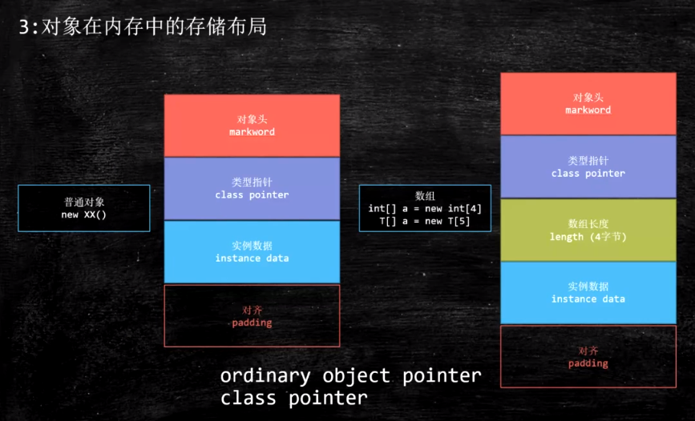

1、对象在内存中的存储布局

与synchronize相关

markword：存储关于锁的信息，长度是8个字节（64位=8字节）

class pointer：存放类型指针，指向属于哪个类，长度4个字节（开启jvm压缩，原始8字节）

instance data：存放实例数据，即对象new出来的东西

padding：补齐数据，对象长度必须能被8整除（17字节要补齐到24字节，补齐数据7字节）


PS：压缩指针相关：

java -XX:+PrintCommandLineFlags -version 查看

```java
// 压缩类型指针UseCompressedClassPointers（64位8字节压缩-->4字节）
// 压缩普通对象指针UseCompressedOops
-XX:G1ConcRefinementThreads=4 -XX:GCDrainStackTargetSize=64 -XX:InitialHeapSize=267303168 -XX:MaxHeapSize=4276850688 -XX:+PrintCommandLineFlags -XX:ReservedCodeCacheSize=251658240 -XX:+SegmentedCodeCache -XX:+UseCompressedClassPointers -XX:+UseCompressedOops -XX:+UseG1GC -XX:-UseLargePagesIndividualAllocation
java version "11" 2018-09-25
```




```java
// new空一个对象的存储布局：Object object = new Object();
java.lang.Object object internals:
OFFSET SIZE TYPE             DESCRIPTION VALUE
   // markword
   0    4   (object header)  01 00 00 00 (00000001 00000000 00000000 00000000) (1)
   // markword
   4    4   (object header)  00 00 00 00 (00000000 00000000 00000000 00000000) (0)
   // class pointer
   8    4   (object header)  e5 01 00 f8 (11100101 00000001 00000000 11111000) (-134217243)
   12   4   (loss due to the next object alignment)
Instance size: 16 bytes
Space losses: 0 bytes internal + 4 bytes external = 4 bytes total
```

给new的对象加上锁后的存储布局

```java
// synchronized (object) {}
java.lang.Object object internals:
OFFSET SIZE TYPE DESCRIPTION  VALUE
  0     4   (object header)   b8 f4 f1 02 (10111000 11110100 11110001 00000010) (49411256)
  4     4   (object header)   00 00 00 00 (00000000 00000000 00000000 00000000) (0)
  8     4   (object header)   e5 01 00 f8 (11100101 00000001 00000000 11111000) (-134217243)
  12    4   (loss due to the next object alignment)
Instance size: 16 bytes
Space losses: 0 bytes internal + 4 bytes external = 4 bytes total
```

面试题：

1、Object object = new Object()在内存中占用几个字节？开启或者未开启指针压缩时候占多少？16字节

2、对象在内存中的内存布局？