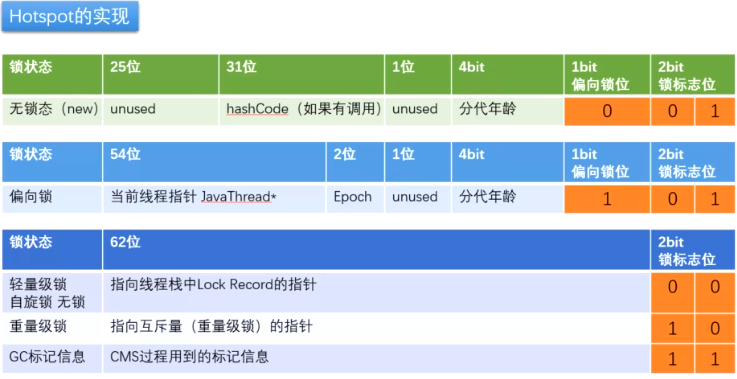

##### 1、锁的上升

无锁状态---偏向锁状态---轻量级锁状态（自旋锁，自适应自旋）---重量级锁状态

synchronize优化过程与markword相关

用markword中最低的三维代表所状态，1位是偏向锁位，两位是普通锁位

**锁上升过程：**

* 1、无锁

Object object = new Object()；刚开始new出来一个对象是无锁状态

锁标志位：001

* 2、偏向锁

有一个线程使用该对象，无锁状态变成偏向锁，对象头里用54位存储当前线程指针JavaThread*

* 3、轻量级锁（自旋锁）

发生任意竞争时，偏向锁转化为轻量级锁，线程在自己线程栈中生成LockRecord，用CAS操作将markword设置为指向为这个线程的LR的指针，使用62位存储，设置成功的获得锁

* 4、重量级锁

锁竞争加剧导致：1.6前有线程自旋超过10次（-XX:PreBlockSpin修改），或自旋线程超过CPU核数一半，1.6后用自适应自旋AdapativeSelfSpinning，JVM自己控制

线程向内核申请锁资源，用户态切换内核态，获得锁，再回到用户态

*具体过程：向操作系统申请资源，linux mutex，CPU从3级-0级系统调用，线程挂起，进入等待队列，等待操作系统调度，然后再映射回用户空间，每个重量级锁，下面对应一个队列，线程放入这个队列里wait*


##### 2、markword的存储




##### 3、四种锁的定义

```shell
## 锁的等级（状态）
锁主要存在四中
状态，依次是：无锁状态、偏向锁状态、轻量级锁状态、重量级锁状态，
随着竞争的激烈而逐渐升级。注意锁可以升级不可降级，这种策略是为了提高获得锁和释放锁的效率。

## 偏向锁
是指一段同步代码一直被一个线程所访问，那么该线程会自动获取锁。降低获取锁的代价。其中识别是不是同一个线程一只获取锁的标志是在上面提到的对象头Mark Word（标记字段）中存储的。
## 轻量级锁
是指当锁是偏向锁的时候，被另一个线程所访问，偏向锁就会升级为轻量级锁，其他线程会通过自旋的形式尝试获取锁，不会阻塞，提高性能。
## 重量级锁
是指当锁为轻量级锁的时候，另一个线程虽然是自旋，但自旋不会一直持续下去，当自旋一定次数的时候，还没有获取到锁，就会进入阻塞，该锁膨胀为重量级锁。重量级锁会让其他申请的线程进入阻塞，性能降低。这时候也就成为了原始的Synchronized的实现。
```

