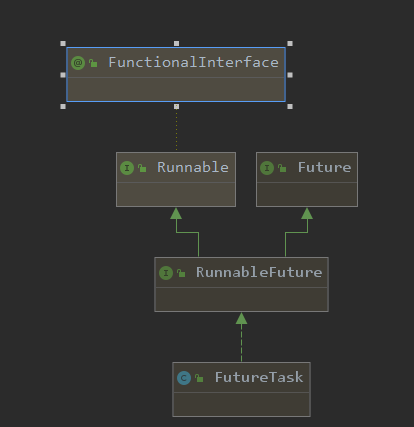

一、继承Thread类

```java
// 通过继承Thread类实现自定义线程类
public class MyThread extends Thread {
	// 线程体
    @Override
    public void run() {
        System.out.println("Thread");
    }
}
```

二、实现Runnable接口

扩展性好

支持多线程共享资源的场景

```java
public class RunnableThread implements Runnable {
    //线程体
    @Override
    public void run() {
        System.out.println("RunnableThread");
    }
}
```

三、实现Callable接口

扩展性好

支持多线程共享资源的场景

具备返回值以及可以抛出受检查异常

```java
Task task = new Task();
// 或者 Future<Integer> result = executor.submit(task);
FutureTask<Integer> result = new FutureTask<Integer>(task);

// 第一种方式 使用ExecutorService
ExecutorService executor = Executors.newCachedThreadPool();
executor.submit(result);
executor.shutdown();
//第二种方式，使用Thread
/*
Thread thread = new Thread(result);
thread.start();
*/
System.out.println("task运行结果" + result.get());
```

四、FutureTask




```java
// 源码
state的状态变化可以有四种方式   
/** 
* NEW=0            新建
* COMPLETING=1     执行中
* NORMAL=2         正常
* EXCEPTIONAL=3    异常
* CANCELLED=4      取消
* INTERRUPTING=5   中断中
* INTERRUNPED=6    被中断
* Possible state transitions:
* NEW -> COMPLETING -> NORMAL 正常完成的流程set()
* NEW -> COMPLETING -> EXCEPTIONAL 出现异常的流程setException()
* NEW -> CANCELLED 被取消cancel(false)
* NEW -> INTERRUPTING -> INTERRUPTED  被中断cancel(true)
*/
public void run() {
	if (state != NEW ||
		!UNSAFE.compareAndSwapObject(this, runnerOffset,
									 null, Thread.currentThread()))
		return;
	try {
		Callable<V> c = callable;
		if (c != null && state == NEW) {
			V result;
			boolean ran;
			try {
				result = c.call();
				ran = true;
			} catch (Throwable ex) {
				result = null;
				ran = false;
				setException(ex);
			}
			if (ran)
				set(result);
		}
	} finally {
		// runner must be non-null until state is settled to
		// prevent concurrent calls to run()
		runner = null;
		// state must be re-read after nulling runner to prevent
		// leaked interrupts
		int s = state;
		if (s >= INTERRUPTING)
			handlePossibleCancellationInterrupt(s);
	}
}
```

