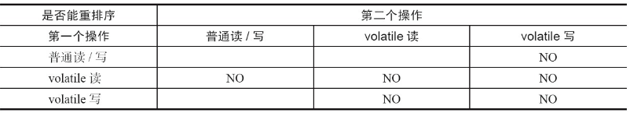

volatile的内存语义

volatile写的内存语义如下。当写一个volatile变量时，JMM会把该线程对应的本地内存中的共享变量值刷新到主内存。

volatile读的内存语义如下。当读一个volatile变量时，JMM会把该线程对应的本地内存置为无效。线程接下来将从主内存中读取共享变量。

为了实现volatile的内存语义，编译器在生成字节码时，会在指令序列中插入内存屏障来禁止特定类型的处理器重排序。

