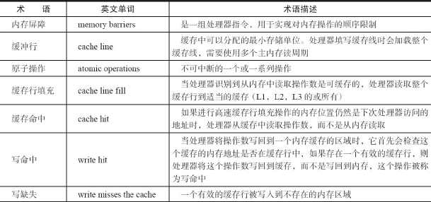

依赖于JVM的实现和CPU的指令。


##### volatile的应用

比synchronized的使用和执行成本更低，因为它不会引起线程上下文的切换和调度。

（1）可见性

指当一个线程修改一个共享变量时，另外一个线程能读到这个修改的值


（2）volatile的定义与实现原理

CPU的术语定义：



Java代码如下：

```java
volatile Singleton instance = new Singleton(); // instance是volatile变量
```

转变成汇编代码：

```java
0x01a3de1d: movb $0×0,0×1104800(%esi);
0x01a3de24: lock addl $0×0,(%esp);
```

volatile的两条实现原则：

```
volatile修饰的共享变量进行写操作的时候会多出第二行汇编代码，Lock前缀的指令在多核处理器下会引发：

1）Lock前缀指令会引起处理器缓存回写到内存。
	Lock前缀指令导致在执行指令期间，声言处理器的LOCK#信号。在多处理器环境中，LOCK#信号确保在声言该信号期间，处理器可以独占任何共享内存[2]。但是，在最近的处理器里，LOCK＃信号一般不锁总线，而是锁缓存，毕竟锁总线开销的比较大。在8.1.4节有详细说明锁定操作对处理器缓存的影响，对于Intel486和Pentium处理器，在锁操作时，总是在总线上声言LOCK#信号。但在P6和目前的处理器中，如果访问的内存区域已经缓存在处理器内部，则不会声言LOCK#信号。相反，它会锁定这块内存区域的缓存并回写到内存，并使用缓存一致性机制来确保修改的原子性，此操作被称为“缓存锁定”，缓存一致性机制会阻止同时修改由两个以上处理器缓存的内存区域数据。

2）一个处理器的缓存回写到内存会导致其他处理器的缓存无效。
	IA-32处理器和Intel 64处理器使用MESI（修改、独占、共享、无效）控制协议去维护内部缓存和其他处理器缓存的一致性。在多核处理器系统中进行操作的时候，IA-32和Intel 64处理器能嗅探其他处理器访问系统内存和它们的内部缓存。处理器使用嗅探技术保证它的内部缓存、系统内存和其他处理器的缓存的数据在总线上保持一致。例如，在Pentium和P6 family处理器中，如果通过嗅探一个处理器来检测其他处理器打算写内存地址，而这个地址当前处于共享状态，那么正在嗅探的处理器将使它的缓存行无效，在下次访问相同内存地址时，强制执行缓存行填充。
```


（3）volatile的使用优化

```java
/** 队列中的头部节点 */
private transient final PaddedAtomicReference<QNode> head;
/** 队列中的尾部节点 */
private transient final PaddedAtomicReference<QNode> tail;
static final class PaddedAtomicReference <T> extends AtomicReference T> {
    // 使用很多4个字节的引用追加到64个字节
    Object p0, p1, p2, p3, p4, p5, p6, p7, p8, p9, pa, pb, pc, pd, pe;
    PaddedAtomicReference(T r) {
        super(r);
    }
} 
public class AtomicReference <V> implements java.io.Serializable {
    private volatile V value;
    // 省略其他代码
｝
```

1）追加字节提高并发编程的效率：

英特尔的部分处理器的L1、L2或L3缓存的高速缓存行是64个字节宽，不支持部分填充缓存行。

如果队列的头节点和尾节点都不足64字节的话，处理器会将它们都读到同一个高速缓存行中。

在多处理器下每个处理器都会缓存同样的头、尾节点，当一个处理器试图修改头节点时，会将整个缓存行锁定。

在缓存一致性机制的作用下，会导致其他处理器不能访问自己高速缓存中的尾节点。

队列的入队和出队操作需要不停修改头节点和尾节点，在多处理器的情况下会严重影响到队列的入队和出队效率。

使用追加到64字节的方式，避免头节点和尾节点加载到同一个缓存行，使头、尾节点在修改时不会互相锁定。

2）哪些场景不能使用volatile变量时都追加到64字节？

·缓存行非64字节宽的处理器。如P6系列和奔腾处理器，它们的L1和L2高速缓存行是32个字节宽。

·共享变量不会被频繁地写。使用追加字节的方式需要处理器读取更多的字节到高速缓冲区，这本身会带来一定的性能消耗，如果共享变量不被频繁写的话，锁的几率也非常小，就没必要通过追加字节的方式来避免相互锁定。

**不过这种追加字节的方式在Java 7下可能不生效，因为Java 7变得更加智慧，它会淘汰或重新排列无用字段，需要使用其他追加字节的方式。**


##### synchronized的实现原理与应用

（1）使用形式

```
·对于普通同步方法，锁是当前实例对象。
·对于静态同步方法，锁是当前类的Class对象。
·对于同步方法块，锁是Synchonized括号里配置的对象。
```


（2）原理

JVM规范中，Synchonized的实现原理，JVM基于进入和退出Monitor对象来实现方法同步和代码块同步。代码块同步是使用monitorenter和monitorexit指令实现的

monitorenter指令是在编译后插入到同步代码块的开始位置，monitorexit是插入到方法结束处和异常处，

JVM要保证每个monitorenter必须有对应的monitorexit与之配对


（3）Java对象头

synchronized用的锁是存在Java对象头里的。

java对象头长度：


Java对象头里的Mark Word里默认存储对象的HashCode、分代年龄和锁标记位。

32位JVM的Mark Word的默认存储结构：


Mark Word的状态变化：


Mark Word的存储结构（64位虚拟机下是64bit）：


（4）锁的升级与对比

Java SE 1.6为了减少获得锁和释放锁带来的性能消耗，引入了“偏向锁”和“轻量级锁”：

锁一共有4种状态，级别从低到高依次是：无锁状态、偏向锁状态、轻量级锁状态和重量级锁状态

锁可以升级但不能降级


##### 原子操作的实现原理

（1）原子（atomic）：本意是“不能被进一步分割的最小粒子”，而原子操作（atomic operation）意
为“不可被中断的一个或一系列操作”。

cpu术语：


（2）处理器如何实现原子操作


