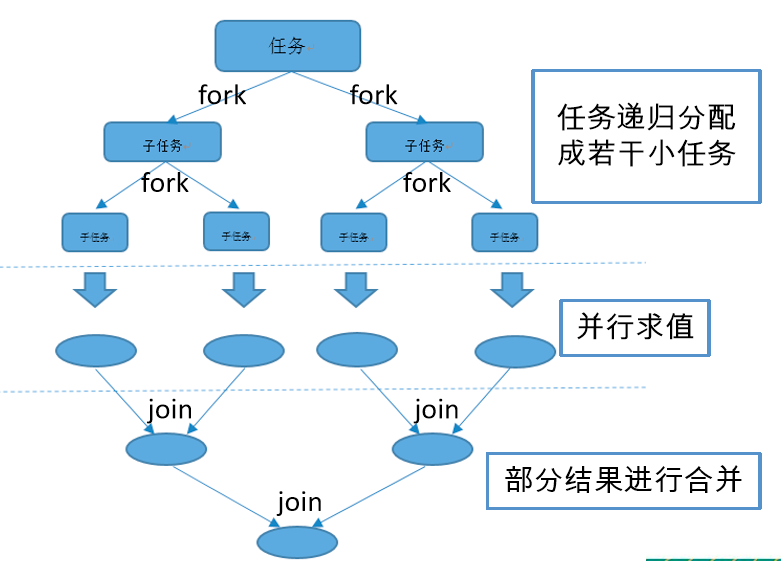
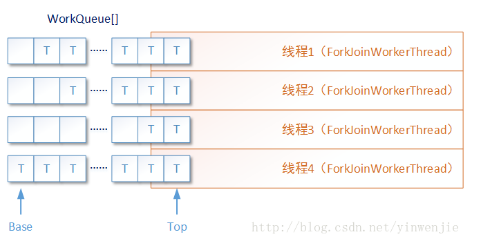

```java
// 推荐
ForkJoinPool commonPool =  ForkJoinPool.commonPool();
```


1、ForkJoinPool执行的任务就是Future的实现类ForkJoinTask、执行线程就是ForkJoinWorkerThread。

2、ForkJoinPool 的每个工作线程都维护着一个工作队列（WorkQueue），这是一个双端队列（Deque），里面存放的对象是任务（ForkJoinTask）。


**Fork/Join框架：(分治算法思想）**

使用分治法(Divide-and-Conquer Algorithm)来解决问题

将一个大任务，Fork(拆分)为小任务，再通过Join(合并)




ForkJoinPool能够使用数量有限的线程来完成非常多的具有父子关系的任务，比如使用4个线程来完成超过200万个任务


**工作窃取模式**

当一个工作线程的队列里暂时没有任务时，它会随机从其他工作线程的队列的尾部获取一个任务




```java
// fork()：将新创建的子任务放入当前线程的work queue队列中,开启一个新线程（或是重用线程池内的空闲线程），将任务交给该线程处理。
public final ForkJoinTask<V> fork() {
    Thread t;
    // 如果当前线程是ForkJoinWorkerThread,将任务压入该线程的任务队列
    if ((t = Thread.currentThread()) instanceof ForkJoinWorkerThread)
        ((ForkJoinWorkerThread)t).workQueue.push(this);
    else
        // 否则调用common池的externalPush方法入队
        ForkJoinPool.common.externalPush(this);
    return this;
}
// join()：等待该任务的处理线程处理完毕，获得返回值。4种任务状态：已完成（NORMAL）、被取消（CANCELLED）、信号（SIGNAL）和出现异常（EXCEPTIONAL）
public final V join() {
    int s;
    // 调用doJoin方法阻塞等待的结果不是NORMAL,说明有异常或取消.报告异常
    if ((s = doJoin() & DONE_MASK) != NORMAL)
        reportException(s);
    // 等于NORMAL,正常执行完毕,返回原始结果
    return getRawResult();
}
```


- 任务状态
   1）当状态完成时，为负数，表示正常完成、取消或者异常
   2）阻塞等待的任务设置了SIGNAL
- 内部提交
   fork——直接加入到当前线程的workQueue中
   invoke——提交任务等待任务完成并获取结果（当前线程执行）
   join——等待任务完成并获取结果，尝试在当前线程中开始执行。
- 任务类型
   RecursiveAction——不返回结果的计算
   RecursiveTask——返回结果
   CountedCompleter——已完成的操作触发其他操作


**Fork/Join框架实现**

继承RecursiveTask 或者 RecursiveAction

RecursiveTask是有返回值的，RecursiveAction 则没有


执行ForkJoinTask：

execute(异步，不返回结果)/invoke(同步，返回结果)/submit(异步，返回结果)。