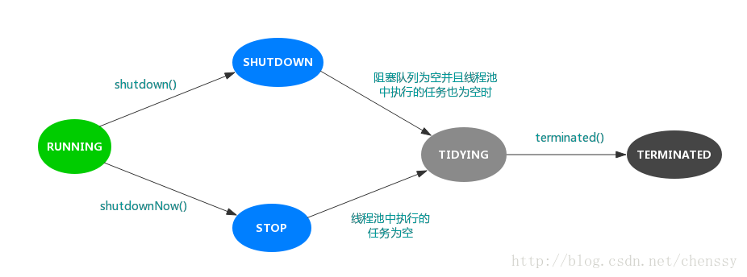

###### 一、初始化参数

```java
/**
corePoolSize：核心线程数，与它相关的配置：allowCoreThreadTimeOut（默认为false），
allowCoreThreadTimeOut为false时，核心线程会一直存活，哪怕是一直空闲着。
allowCoreThreadTimeOut为true时，核心线程空闲时间超过keepAliveTime时会被回收。

maximumPoolSize：最大线程数，当池中的线程达到最大，此时添加任务将会采用拒绝策略，默认的拒绝策略是抛出一个运行时错误（RejectedExecutionException）。值得一提的是，当初始化时用的工作队列为LinkedBlockingDeque时，这个值将无效。

keepAliveTime：存活时间，当非核心空闲超过这个时间将被回收，同时空闲核心线程是否回收受allowCoreThreadTimeOut影响。

unit：keepAliveTime的单位。

workQueue：任务队列，常用有三种队列，即SynchronousQueue,LinkedBlockingDeque（无界队列）,ArrayBlockingQueue（有界队列）。

threadFactory：线程工厂，ThreadFactory是一个接口，用来创建worker。通过线程工厂可以对线程的一些属性进行定制。默认直接新建线程。

RejectedExecutionHandler：也是一个接口，只有一个方法，当线程池中的资源已经全部使用，添加新线程被拒绝时，会调用RejectedExecutionHandler的rejectedExecution法。
默认是抛出一个运行时异常。
 */
public ThreadPoolExecutor(int corePoolSize, int maximumPoolSize, long keepAliveTime,
          TimeUnit unit, BlockingQueue<Runnable> workQueue, ThreadFactory threadFactory,
          RejectedExecutionHandler handler) {}
```

合理配置线程池的大小

```java
/**
 * Nthreads=CPU数量
 * Ucpu=目标CPU的使用率，0<=Ucpu<=1
 * W/C=任务等待时间与任务计算时间的比率
 */
// 线程数量: Nthreads = Ncpu*Ucpu*(1+W/C)
```


###### 二、workQueue任务队列

**直接提交队列、有界任务队列、无界任务队列、优先任务队列；**

```java
一般是 先进先出 的方式进出

// 直接提交队列：SynchronousQueue，没有容量，提交的任务不会被保存，总是会马上提交执行
// 线程数量小于maximumPoolSize，则尝试创建新的进程；大于maximumPoolSize，执行handler拒绝策略。
new ThreadPoolExecutor(1, 2, 1000, TimeUnit.MILLISECONDS, new SynchronousQueue<Runnable>(),Executors.defaultThreadFactory(), new ThreadPoolExecutor.AbortPolicy());

// 有界的任务队列：ArrayBlockingQueue
（1）线程数量达到corePoolSize时，加入到等待队列；
（2）线程数量大于ArrayBlockingQueue初始化的容量，则继续创建线程；
（3）线程数量大于maximumPoolSize，则执行拒绝策略。

// 无界的任务队列：LinkedBlockingQueue
maximumPoolSize参数无效，最大线程数量就是corePoolSize，大于corePoolSize，进入队列等待

// 优先任务队列：PriorityBlockingQueue
特殊的无界队列，PriorityBlockingQueue队列可以自定义规则根据任务的优先级顺序先后执行
```


###### 三、拒绝策略

四种拒绝策略：

```shell
## ThreadPoolExecutor.AbortPolicy：
处理器会在拒绝后抛出一个运行异常RejectedExecutionException。

## ThreadPoolExecutor.CallerRunsPolicy：
线程会调用它直接的execute来运行这个任务。这种方式提供简单的反馈控制机制来减缓新任务提交的速度。

## ThreadPoolExecutor.DiscardPolicy：
不予任何处理，无法执行的任务将被简单得删除掉。

## ThreadPoolExecutor.DiscardOldestPolicy：
如果executor没有处于终止状态，在工作队列头的任务将被删除，然后会重新执行（可能会再次失败，这会导致重复这个过程）。
```


###### 四、线程池五种状态：

**Running, SHUTDOWN, STOP, TIDYING, TERMINATED。**

```java
**RUNNING（状态值-1，高3位值是111）:** 接收新任务并处理队列中的任务

**SHUTDOWN（状态值0，高3位值是000）:** 不接收新任务但会处理队列中的任务。

**STOP（状态值1，高3位值是001）:** 不接收新任务，不处理队列中的任务，并中断正在处理的任务

**TIDYING（状态值2，高3位值是010）:** 所有任务已终止，workerCount为0，处于TIDYING状态的线程将调用钩子方法terminated()。

**TERMINATED（状态值3，高3位值是011）:** terminated()方法完成
/*
变量ctl，记录了“线程池中的任务数量”和“线程池的状态”两个信息。
32 bit位，高3位表示"线程池状态"，低29位表示"线程池中的任务数量"。
*/
private final AtomicInteger ctl = new AtomicInteger(ctlOf(RUNNING, 0));
```




###### 五、ThreadPoolExecutor扩展

三个接口实现的

**1、beforeExecute：线程池中任务运行前执行**

**2、afterExecute：线程池中任务运行完毕后执行**

**3、terminated：线程池退出后执行**

```java
ExecutorService pool = new ThreadPoolExecutor() {
	// beforeExecute()、afterExecute()和terminated()的实现，我们对线程池中线程的运行状态进行了监控
	protected void beforeExecute(Thread t, Runnable r) {
		System.out.println("准备执行：" +  t.getName());
	}
	protected void afterExecute(Runnable r, Throwable t) {
		System.out.println("执行完毕：" + t.getMessage());
	}
	protected void terminated() {
		System.out.println("线程池退出");
	}
};
```


###### 六、常见四种线程池

newCachedThreadPool

newFixedThreadPool

newSingleThreadExecutor

newScheduledThreadPool


###### 七、ScheduledExecutorService 和 Timer 的区别：

Timer：内部只有一个线程，多个任务会顺序执行，这样延迟时间和循环时间就会出现问题。

ScheduledExecutorService：是线程池，在对延迟任务和循环任务要求严格的时候考虑使用

```java
// 延时任务
ScheduledExecutorService.schedule(new Runnable() {}, 1, TimeUnit.SECONDS);
 
// 循环任务，按照上一次任务的发起时间计算下一次任务的开始时间
ScheduledExecutorService.scheduleAtFixedRate(new Runnable() {}, 1, 1, TimeUnit.SECONDS);
 
// 循环任务，以上一次任务的结束时间计算下一次任务的开始时间
ScheduledExecutorService.scheduleWithFixedDelay(new Runnable() {},1,1, TimeUnit.SECONDS);
```


###### 八、Woker

```java
   /**
     * Woker主要维护着运行task的worker的中断控制信息，以及其他小记录。这个类拓展AbstractQueuedSynchronizer
     * 而来简化获取和释放每一个任务执行中的锁。这可以防止中断那些打算唤醒正在等待其他线程任务的任务，而不是
     * 中断正在运行的任务。我们实现一个简单的不可重入锁而不是ReentrantLo，因为我们不想当其调用setCorePoolSize
     * 这样的方法的时候能获得锁。
     */
    //worker主要是对进行中的任务进行中断控制，顺带着对其他行为进行记录
private final class Worker extends AbstractQueuedSynchronizer implements Runnable {
	/**
	 * This class will never be serialized, but we provide a
	 * serialVersionUID to suppress a javac warning.
	 */
	private static final long serialVersionUID = 6138294804551838833L;
	/** Thread this worker is running in.  Null if factory fails. */
	//正在跑的线程，如果是null标识factory失败
	final Thread thread;
	/** Initial task to run.  Possibly null. */
	//初始化一个任务以运行
	Runnable firstTask;
	/** Per-thread task counter */
	//每个线程计数
	volatile long completedTasks;
	/**
	 * Creates with given first task and thread from ThreadFactory.
	 * @param firstTask the first task (null if none)
	 * 用给定的first task和从threadFactory创建
	 */
	Worker(Runnable firstTask) {
		setState(-1); // inhibit interrupts until runWorker
		this.firstTask = firstTask;
		this.thread = getThreadFactory().newThread(this);
	}
	/** Delegates main run loop to outer runWorker  */
	//主要调用了runWorker
	public void run() {
		runWorker(this);
	}
	// Lock methods
	//
	// The value 0 represents the unlocked state.
	// The value 1 represents the locked state.
	// 锁方法
	//
	protected boolean isHeldExclusively() {
		return getState() != 0;
	}
	//尝试获取锁
	protected boolean tryAcquire(int unused) {
		if (compareAndSetState(0, 1)) {
			setExclusiveOwnerThread(Thread.currentThread());
			return true;
		}
		return false;
	}
	//尝试释放锁
	protected boolean tryRelease(int unused) {
		setExclusiveOwnerThread(null);
		setState(0);
		return true;
	}

	public void lock()        { acquire(1); }
	public boolean tryLock()  { return tryAcquire(1); }
	public void unlock()      { release(1); }
	public boolean isLocked() { return isHeldExclusively(); }

	void interruptIfStarted() {
		Thread t;
		if (getState() >= 0 && (t = thread) != null && !t.isInterrupted()) {
			try {
				t.interrupt();
			} catch (SecurityException ignore) {
			}
		}
	}
}
```

