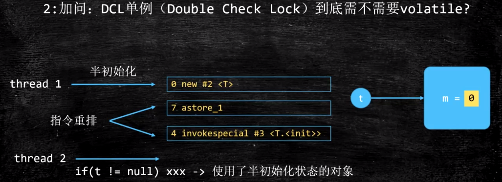
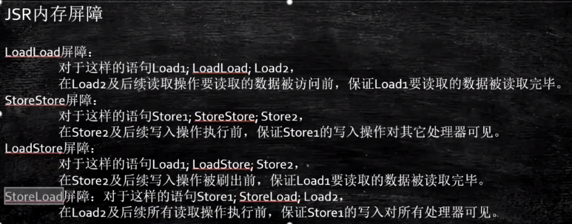
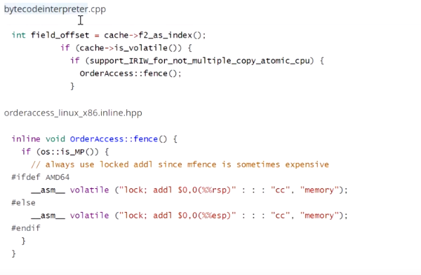
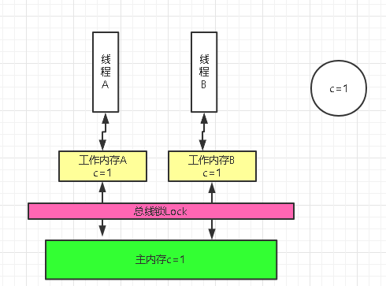

##### 1、保证线程可见性

可见性：一个线程修改一个共享变量时，另外一个线程能读到这个修改的值

LOCK指令：

1）Lock前缀指令会引起处理器缓存回写到内存。

2）一个处理器的缓存回写到内存会导致其他处理器的缓存无效。

##### 2、不能保证原子性

原子性：不可分割，完整的操作


##### 3、防止指令重排

问题：DCL（double check lock）单例需不需要加volatile



​		没有加volatile，会导致指令重排，半初始化状态的对象被使用


**volatile如何解决指令重排序**

1、volatile i

2、ACC_VOLATILE（class字节码）

3、JVM的内存屏障：屏障两边的指令不能重排



```
StoreStoreBarrier	  LoadLoadBarrier
volatile写操作			volatile读操作
StoreLoadBarrier	  LoadStoreBarrier
```

4、hotspot实现



5、乱序执行


## 硬件缓存不一致方案

**1）总线Lock#锁**。锁定总线的开销比较大，在缓存更新内存后，其他的cpu都会被锁定住，禁止与内存通信，这样开销就大了。



**2）MESI协议**。这是缓存一致性协议的具体实现，它通过嗅探技术识别哪个cpu想修改主内存缓存行信息，如果该缓存行是共享的，先将该缓存行刷新到主内存，再设置其他cpu的高速缓存的缓存行无效，但频繁的嗅探其他cpu想修改的共享数据，也会导致总线风暴。


##### 指令重排

指令重排序是为了优化指令，提高程序运行效率。包括编译器重排序和运行时重排序

JVM规范规定，指令重排序可以在不影响单线程程序执行结果前提下进行。

```shell
#### new Object()
memory = allocate();   //1：分配对象的内存空间
ctorInstance(memory);  //2：初始化对象
instance = memory;     //3：设置instance指向刚分配的内存地址

#### 经过指令重排序
memory = allocate();   //1：分配对象的内存空间
instance = memory;     //3：设置instance指向刚分配的内存地址
                       //注意，此时对象还没有被初始化！
ctorInstance(memory);  //2：初始化对象
```


系统底层如何实现数据一致性

1、MESI如果能解决，使用MESI

2、如果不能，就锁总线


系统底层如何保证有序性

1、sfence mfence Ifence等系统原语（内存屏障）

2、锁总线


#### volatile

（1）实现原理

```shell
1、基于内存屏障（Memory Barrier），禁止重排序。

## 内存屏障，是一个 CPU 指令
为了提高执行性能，编译器和处理器会对指令进行重排序
JMM 为了保证在不同的编译器和 CPU 上有相同的结果，通过插入特定类型的内存屏障来禁止特定类型的编译器重排序和处理器重排序

## 特性
1）一个线程修改了某个变量的值，这新值对其他线程来说是立即可见的。基于内存屏障来实现（实现可见性）
2）禁止进行指令重排序。（实现有序性）
3）只能保证对单次读/写的原子性。i++ 这种操作不能保证原子性。（原子性）

## 内存语义
1）当线程对volatile变量进行写操作时，会将修改后的值刷新回主内存
2）当线程对volatile变量进行读操作时，会先将自己工作内存中的变量置为无效，之后再通过主内存拷贝新值到工作内存中使用。

```

      

（2）happens-before原则：

```shell
## 即：JMM具有先天的有序性，即不需要通过任何手段就可以得到保证的有序性。
1.程序次序规则：在一个单独的线程中，按照程序代码书写的顺序执行。
2.锁定规则：一个unlock操作happen—before后面对同一个锁的lock操作。
3.volatile变量规则：对一个volatile变量的写操作happen—before后面对该变量的读操作。
4.线程启动规则：Thread对象的start()方法happen—before此线程的每一个动作。
5.线程终止规则：线程的所有操作都happen—before对此线程的终止检测，可以通过Thread.join()方法结束、Thread.isAlive()的返回值等手段检测到线程已经终止执行。
6.线程中断规则：对线程interrupt()方法的调用happen—before发生于被中断线程的代码检测到中断时事件的发生。
7.对象终结规则：一个对象的初始化完成（构造函数执行结束）happen—before它的finalize()方法的开始。
8.传递性：如果操作A happen—before操作B，操作B happen—before操作C，那么可以得出A happen—before操作C。
```

（3）Synchronized与volatile区别

```gfm
1.volatile只能修饰变量，而synchronized可以修改变量，方法以及代码块
2.volatile在多线程中不会存在阻塞问题，synchronized会存在阻塞问题
3.volatile能保证数据的可见性，但不能完全保证数据的原子性，synchronized即保证了数据的可见性也保证了原子性
4.volatile解决的是变量在多个线程之间的可见性，而sychroized解决的是多个线程之间访问资源的同步性
```

（4）应用场景

```shell
## 使用条件
访问变量不需要加锁（加锁的话使用volatile就没必要了）
对变量的写操作不依赖于当前值。
该变量没有包含在具有其他变量的不变式中。

只有在状态真正独立于程序内其他内容时才能使用 volatile。
```

（5）应用

```java
## 双重检查（double-checked）
class Singleton {
    private volatile static Singleton instance;
    public static Singleton getInstance() {
        if (instance == null) {
            syschronized(Singleton.class) {
                if (instance == null) {
                    instance = new Singleton();
                }
            }
        }
        return instance;
    } 
}
```

