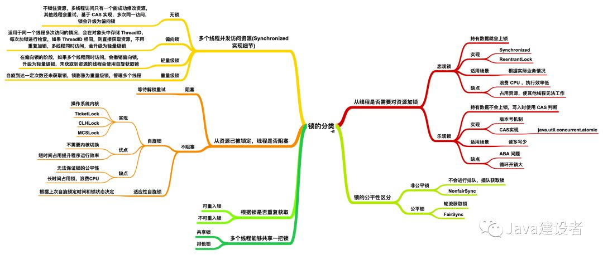

#### 1、锁的类型

- 线程是否需要对资源加锁： `悲观锁` 和 `乐观锁`
- 资源已被锁定，线程是否阻塞： `自旋锁`
- 多个线程并发访问资源， Synchronized 可以分： `无锁`、`偏向锁`、 `轻量级锁` 和 `重量级锁`
- 锁的公平性：`公平锁` 和 `非公平锁`
- 锁是否重复获取： `可重入锁` 和 `不可重入锁`
- 从那个多个线程能否获取同一把锁分为 `共享锁` 和 `排他锁`

独享锁/共享锁

```powershell
## 独享锁是指该锁一次只能被一个线程所持有。 (ReentrantLock、 Synchronized)
## 共享锁是指该锁可被多个线程所持有。 (ReadWriteLock)
独享锁与共享锁是通过AQS来实现的
```

乐观锁/悲观锁

```powershell
## 乐观锁/悲观锁不是指具体类型的锁，而是看待并发的角度。

## 悲观锁认为存在很多并发更新操作，总会采取加锁操作，直到资源被释放，如果不加锁一定会有问题
Synchronized 和 ReentrantLock 等独占锁(排他锁)是一种悲观锁思想的实现

## 乐观锁认为不存在很多的并发更新操作，读不加锁，写先判断是否被修改。实现方案：版本号机制，CAS实现
乐观锁的实现方案一般来说有两种：版本号机制 和 CAS实现。
适用于多读的应用类型,例子：atomic包使用CAS实现
```

可重入锁

```powershell
## 可重入锁又名递归锁，是指同一个线程在外层方法获取锁的时候，在进入内层方法会自动获取锁
ReentrantLock和Synchronized都是可重入锁。可重入锁可一定程度避免死锁
锁的可重入性标明了锁是针对线程分配方式而不是针对方法
```

公平锁/非公平锁

```powershell
## 公平锁是指多个线程按照申请锁的顺序来获取锁。
## 非公平锁是指多个线程获取锁的顺序并不是按照申请锁的顺序。有可能会造成饥饿现象。
ReentrantLock通过构造函数指定该锁是否是公平锁，默认是非公平锁
Synchronized是一种非公平锁
```

自旋锁

```powershell
## 自旋锁是指尝试获取锁的线程不会阻塞，而是采用循环的方式尝试获取锁。
好处是减少上下文切换（不需要做内核态和用户态之间的切换），缺点是一直占用CPU资源。

## 自旋锁的开启
JDK1.6中-XX:+UseSpinning开启；-XX:PreBlockSpin=10 为自旋次数；
JDK1.7后，去掉此参数，由jvm控制；
```

分段锁

```powershell
## 分段锁是一种锁的设计，并不是一种具体的锁。
ConcuttentHashMap就是通过分段锁实现高效的并发操作。
```

读写锁：按照数据库事务隔离特性的类比读写锁，在访问统一个资源（一个文件）的时候，使用读锁来保证多线程可以同步读取资源。ReadWriteLock是一个读写锁，通过readLock()获取读锁，通过writeLock()获取写锁。

可中断锁：可中断是指锁是可以被中断的，Synchronized内置锁是不可中断锁，ReentrantLock可以通过lockInterruptibly方法中断显性锁。例如线程B在等待等待线程A释放锁，但是线程B由于等待时间太久，可以主动中断等待锁。




→ 锁
CAS、乐观锁与悲观锁、数据库相关锁机制、分布式锁、偏向锁、轻量级锁、重量级锁、monitor、
锁优化、锁消除、锁粗化、自旋锁、可重入锁、阻塞锁、死锁


cas无锁概念、乐观锁和悲观锁

#### 3、死锁

什么是死锁
死锁如何解决