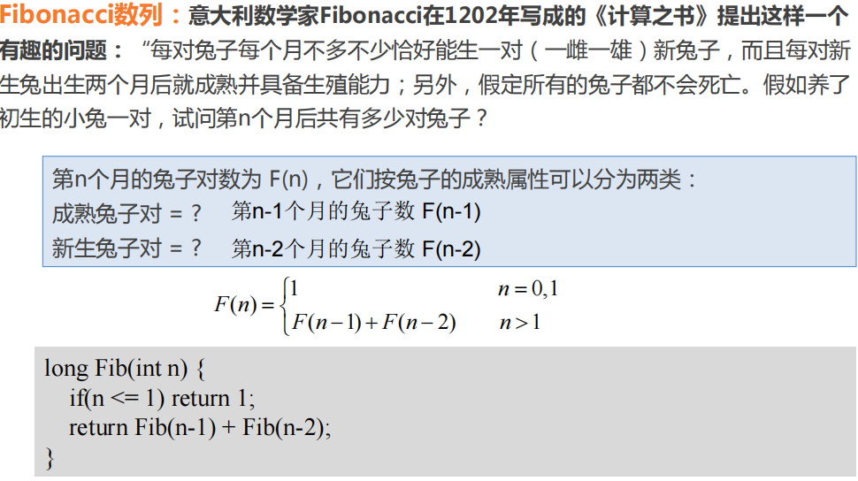
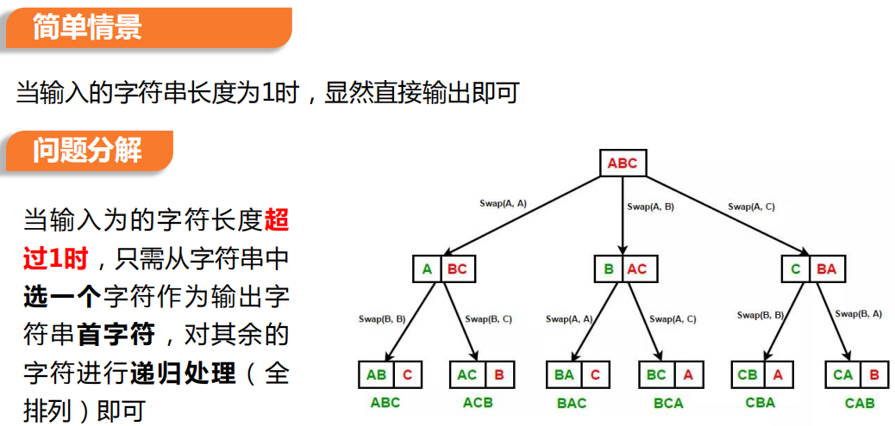
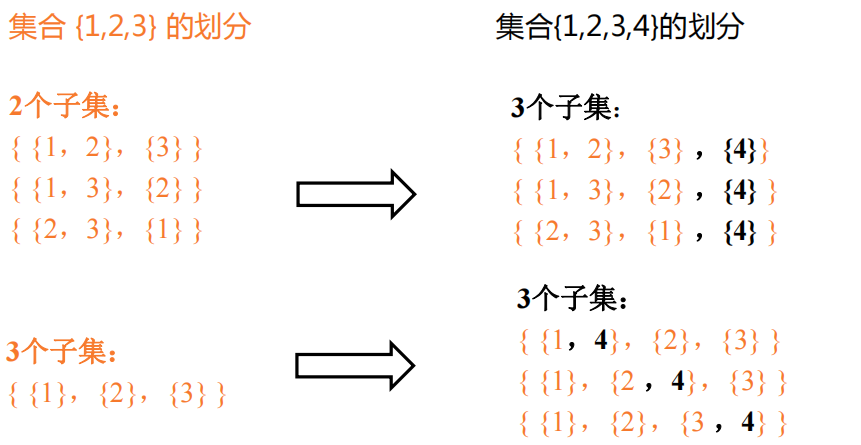
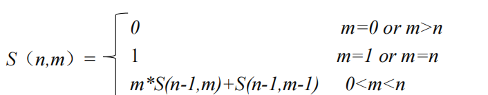

一、递归三要素

**1. 递归终止条件** 递归需要一个明确的**临界点**，程序一旦到达了这个临界点，就不用继续往下递归，**防止无限递归**

**2. 终止处理办法** 在递归的临界点对应一种简单的情景，这种情景下，应当**直接**给出问题的解决方案

**3. 递归处理方法** 递归问题必须可以分解为若干个规模较小、与原问题 **形式相同** 的子问题，这些子问题可以用 **相同的思路** 来解决，并且合并得到原问题答案。


二、Fibonacci数列




三、递归与循环

1. 递归也是一种**特殊的迭代****，**但是在迭代前不知道还要迭代多少次

2. 递归函数一定**有参数**，且参数会在迭代的过程中步步逼近某个值

3. 递归函数中一定有处理终点，而这个点就是递归出口


四、全排列问题

问题：输出该字符串的全排列，排列的先后顺序不影响结果

输入：ABC

输出：ABC ACB BAC BCA CAB CBA



```c++
void permutations(string str, int i, int n) {
    if (i == n - 1) { // 递归出口
    	cout << str << endl;
    	return; 
    }
    // 递归处理长度大于 1 的字符串
    for (int j = i; j < n; j++) {
        // 交换当前第一个字符与其它位置字符
        swap(str[i], str[j]); // STL 函数
        // 递归处理子串str[i+1, n-1]
        permutations(str, i + 1, n);
        // 还原到输入字符串str的顺序
        swap(str[i], str[j]);
	}
}
```


五、Stirling数

给定正整数*n* 和 *m*，计算出*n*个元素的集合{1,2,…,*n* }可以划分为多少个不同的由 *m* 个**非空子集**构成的集合。


$$
𝑆(𝑛, 𝑚) = 𝑚 ∗ 𝑆(𝑛 − 1, 𝑚) + 𝑆(𝑛 − 1, 𝑚 − 1)
$$


```c++
long S (int n, int m){
    if((m==n) ‖ i(m==1)) 
    	return 1;
    if((m>n) ‖ (m==0)) 
    	return 0;
    return m*S(n-1,m)+S(n-1,m-1);
}
```

