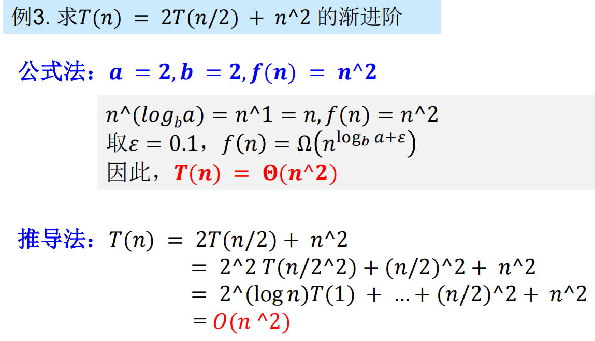

【Master定理】

设 a≥ 1和b≥ 1是常数，𝑓(𝑛)是定义在非负整数上的一个确定的非负函数，𝑇(𝑛)也是定义在非负整数上的一个非负函数，且满足递归方程：𝑇(𝑛) = 𝑎𝑇 (𝑛/𝑏) + 𝑓(𝑛)，如果𝑓(𝑛)符合下述三类条件，𝑇(𝑛)的渐近复杂度为：

① 若对于某常数𝜀 > 0,有𝑓 (𝑛) = 𝑂(𝑛log𝑏 𝑎−𝜀)，则
$$
𝑻 (𝒏) = 𝚯(𝒏𝐥𝐨𝐠𝒃 𝒂)
$$
② 若𝑓 (𝑛) = 𝜃 𝑛log𝑏 𝑎 ，则
$$
𝑻 (𝒏) = 𝚯(𝒏𝐥𝐨𝐠𝒃 𝒂 ∙ 𝐥𝐨𝐠 𝒏)
$$
③ 若其常数𝜀 > 0，有𝑓 (𝑛) = Ω(𝑛log𝑏 𝑎+𝜀)，且对于某常数𝑐 > 1和所有充分大的正整数𝑛有𝑎𝑓 𝑛Τ𝑏 ≤ 𝑐𝑓 𝑛 , 则
$$
𝑻 (𝒏) = 𝚯(𝒇(𝒏))
$$
