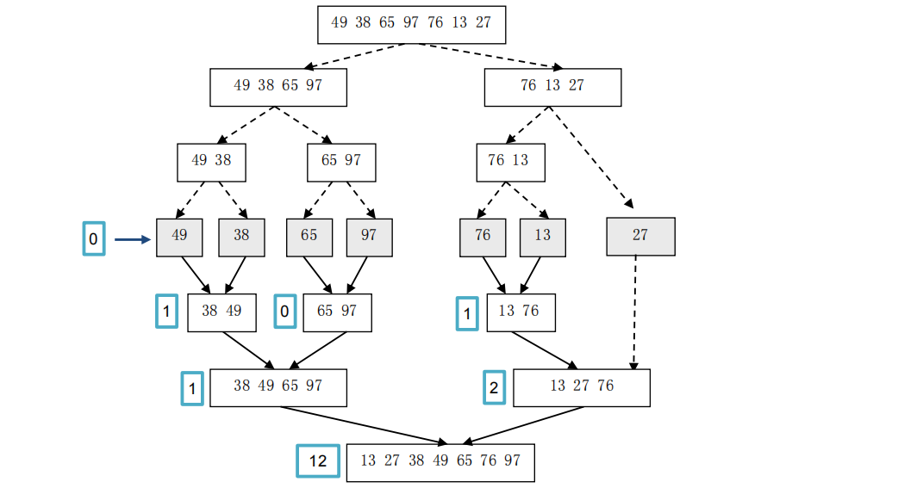
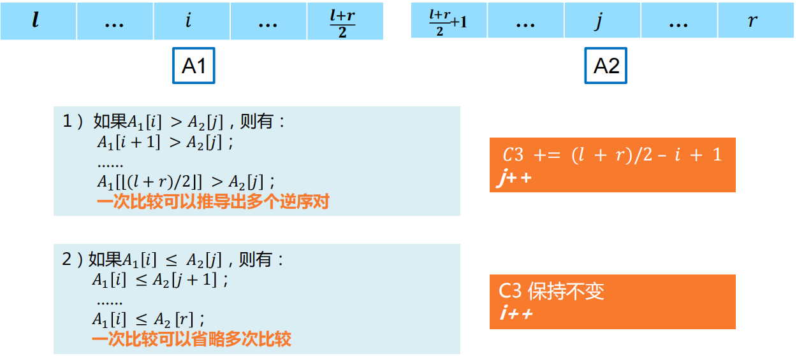

#### 逆序对问题

**问题描述：**设𝐴[1, ⋯ , 𝑛]是一个包含𝑛个不同非负整数的数组。如果在𝑖 < 𝑗的情况下， 有𝐴 𝑖 > 𝐴[𝑗]，则（𝐴 𝑖 ，𝐴[𝑗]）就称为A中的一个逆序对。例如，数组（3，1，4， 5，2）的“逆序对”有<3,1>、<3,2>、<4,2>、<5,2>共4个。

**输入：**每个测试用例包括两行，第一行输入整数的个数*n*，𝑛 ≤ 10000，第二行输入𝑛个整数，数与数之间用空格隔开。最后一行输入-1，表示输入结束。


逆序对问题算法演示



逆序对合并两个数组



代码：

```java
int a[LEN], temp[LEN];

//合并有序数列，并在合并时计算逆序对
int mergeCountInversions(int a[], int left, int mid, int right)
{
	int count = 0;
	//归并到临时数组中
	int i = left, j = mid + 1;
    // 左右数组求逆序对
	for (int k = left; k <= right; k++) {
		if ((j > right) || (i <= mid) && (a[i] <= a[j]))
			temp[k] = a[i++];
		else {
			temp[k] = a[j++];
			count += mid - i + 1;//计算逆序对数
		}
	}

	// 拷贝回数组a， 左右数组合并成一个新的数组，并重新排列
	for (int i = left; i <= right; i++)
		a[i] = temp[i];

	return count;
}

//通过归并排序计算逆序对
int countInversions_mergeSort(int a[], int left, int right)
{
	if (left < right) {
		int mid = left + (right - left) / 2;
		//当前数组内的逆序对数等于两个子数组的逆序对数加上归并时计算出的逆序对数
		return countInversions_mergeSort(a, left, mid) // 左分
			+ countInversions_mergeSort(a, mid + 1, right)// 右分
			+ mergeCountInversions(a, left, mid, right);// 合
	}
	else
		return 0;
}
```

