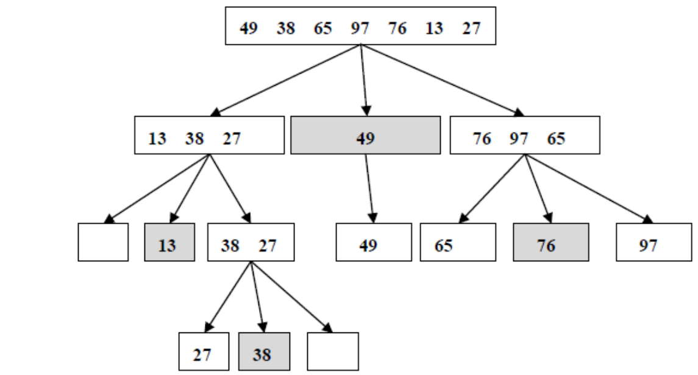
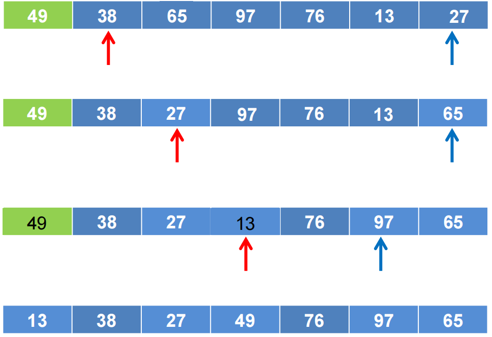

#### 快速排序

**任务描述：**任意给定一包含n个整数的集合，把n个整数按升序排列。

**输入：**每测试用例包括两行，第一行输入整数个数，第二行输入n个整数，数与数之间用空格隔开。最后一行包含-1，表示输入结束。


快速排序算法示意图：



快速排序划分子程序：




程序：

```java
public static void quickSort(int[] arr, int start, int end) {
        if (start >= end)
            return;

        int mid = arr[end];
        int left = start;
        int right = end - 1;

        while (left < right) {
            while (arr[left] <= mid && left < right) {
                left++;
            }
            while (arr[right] >= mid && left < right) {
                right--;
            }
            swap(arr, left, right);
        }

        if (arr[left] >= arr[end]) {
            swap(arr, left, end);
        } else {
            left++;
        }
        quickSort(arr, start, left - 1);
        quickSort(arr, left + 1, end);

        print(arr);
    }
    private static void swap(int[] arr, int x, int y) {
        int temp = arr[x];
        arr[x] = arr[y];
        arr[y] = temp;
    }
}
```

