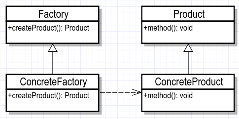
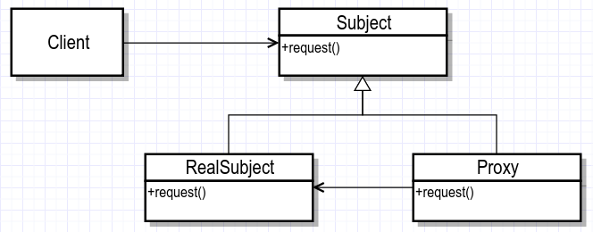

#### 设计模式

##### 1、23 种设计模式

```
创建型模式：单例模式、抽象工厂模式、建造者模式、工厂模式、原型模式。

结构型模式：适配器模式、桥接模式、装饰模式、组合模式、外观模式、享元模式、代理模式。

行为型模式：模版方法模式、命令模式、迭代器模式、观察者模式、中介者模式、备忘录模式、解释器模式（Interpreter 模式）、状态模式、策略模式、职责链模式(责任链模式)、访问者模式。
```

##### 2、设计模式的六大原则

```powershell
开闭原则（Open Close Principle）
里氏代换原则（Liskov Substitution Principle）
依赖倒转原则（Dependence Inversion Principle）
接口隔离原则（Interface Segregation Principle）
迪米特法则（最少知道原则）（Demeter Principle）
合成复用原则（Composite Reuse Principle）
```


##### 3、设计模式

###### （1）单例模式

单例的七种写法：

懒汉——线程不安全、懒汉——线程安全、饿汉、饿汉——变种、静态内部类、枚举、双重校验锁

```java
// 特点
单例类只有一个实例
单例类必须自己创建自己的唯一的实例
单例类必须给所有的其他对象提供这一实例

// 饿汉模式
// 适用于一个类中的成员属性较少，且占用的内存资源不多的场景
// 饿汉式的单例设计模式可以保证多个线程下的唯一实例，getInstance方法性能也比较高，但是无法进行懒加载
public class EagerSingleton {
    private Singleton(){}
    private static EagerSingleton instance = new EagerSingleton();
    public static EagerSingleton getInstance() {
        return instance;
    }
}

// 懒加载模式
// 在使用类实例的时候再创建，避免类初始化时提前创建，但会导致多线程环境中被多次初始化，无法保证实例的唯一性
private static LazySingleton instance = null;
public static LazySingleton getInstance(){
    if (instance == null){
        instance = new LazySingleton();
    }
    return instance;
}

// 懒汉式+同步方法
// 既满足懒加载又百分百保证instance实例唯一性，但synchronized的排他性导致getInstance()只能在同一时刻被一个线程访问，性能低下
private static LazySynSingleton instance = null;
public static synchronized LazySynSingleton getInstance(){
    if (instance == null){
        instance = new LazySynSingleton();
    }
    return instance;
}

// Double-Check
// 既满足懒加载，也保证了instance实例唯一性，也提供了高效的数据同步策略，但是在多线程情况下优肯引起空指针异常（JVM运行时指令重排和Happens-Before规则，conn和instance之间的实例化顺序并无前后关系的约束，可能instance先被实例化，而conn和socket并未完成实例化，导致使用conn时null异常）
private static LazyDoubleCheckSingleton instance = null;
public static LazyDoubleCheckSingleton getInstance() {
    if (instance == null) {
        synchronized(LazyDoubleCheckSingleton.class) {
            if (null == instance) {
                instance = new LazyDoubleCheckSingleton();
            }
        }
    }
    return instance;
}

// Volatile+Double-Check
// 可满足多线程下的单例、懒加载以及获得实例的高效性
private volatile static LazyVolatileSingleton instance = null;

// Holder方式(最好的，使用广泛)
// Holder方式借助了类加载的特点，在类初始化时不创建HolderSingleton实例，当Holder被主动应用时会创建HolderSingleton实例，HolderSingleton实例的创建过程在java程序编译器收集到init()方法中，该方法又是同步方法可以保证内存的可见性、JVM指令的顺序性和原子性
public class HolderSingleton {
    private HolderSingleton(){};
    private static class Holder {
        private static HolderSingleton instance = new HolderSingleton();
    }
    public static HolderSingleton getInstance() {
        return Holder.instance;
    }
}

// 枚举方式
// 枚举不允许被继承，线程安全，且只能被实例化一次，但不能懒加载
public enum EnumSingleton {
    INSTANCE;
    EnumSingleton() {
        初始化；
    }
    public static EnumSingleton getInstance() {
        return INSTANCE;
    }
}
```


###### （2）工厂模式

定义：一个用于创建对象的接口，让子类决定实例化哪个类。工厂方法使一个类的实例化延迟到其子类。



- Product：抽象产品类。
- ConcreteProduct：具体产品类，实现 Product 接口。
- Factory：抽象工厂类，内部方法返回一个 Product 类型的对象。
- ConcreteFactory：具体工厂类，返回 ConcreteProduct 实例。

```java
工厂模式：简单工厂模式、工厂方法模式、抽象工厂模式
// 简单工厂模式
// 增加子类或者删除子类对象的创建都需要在简单工厂类中进行修改，耦合性高,违背开-闭原则
interface Data {void create();}
class DataA implements Data {
	public void create(){System.out.println("create A");}
}
class DataB implements Data {
	public void create(){System.out.println("create B");}
}
class EasyFactory {
	static Data creatData(String name) {
        Data data = null;
        switch (name) {
            case "A":data = new DataA();break;
            case "B":data = new DataB();break;
        }
        return data;
    }
}
public class Example {
	public static void main(String[] args) {
		EasyFactory.creatData('A').create();
	}
}

// 工厂方法模式
// 把简单工厂的内部逻辑判断转移到了客户端代码来进行,增加一个产品类，需要增加对应的工厂类，开发量增加
interface Factory {Data createData();}
public class FactoryA implements Factory {
    public Data createData() {return new DataA();}
}
public class FactoryB implements Factory {
    public Data createData() {return new DataB();}
}
interface Data {void create();}
class DataA implements Data {
	public void create(){System.out.println("create A");}
}
class DataB implements Data {
	public void create(){System.out.println("create B");}
}
public class FactoryClient {
    public static void main(String[] args) throws Exception {
        // 使用反射机制实例化工厂对象，因为字符串是可以通过变量改变的
        Factory a = (Factory) Class.forName("com.FactoryA").newInstance();
        // 通过工厂对象创建相应的实例对象
        a.createData().create();
    }
}

// 抽象工厂模式
// 抽象工厂是实现不止一个接口，可以生产多个产品的，工厂模式只能生产一个产品
public abstract class AbstractFactory {// 抽象工厂类
    public abstract A createA();
    public abstract B createB();
    public abstract C createC();
}
public class DefaultFactory extends AbstractFactory{// 具体工厂类，A,B,C是抽象类，
    public A createA() {return new AA();}
    public B createB() {return new BB();}
    public C createC() {return new CC();}
}
public class Test {
    public static void main(String[] args) {
        AbstractFactory f = new DefaultFactory();
        A v = f.createA();
        v.run();
    }
}

（1）创建抽象工厂
public abstract class ComputerFactory {
    public abstract <T extends Computer> T createComputer(Class<T> clz);
}
（2）具体工厂
public class GDComputerFactory extends ComputerFactory {
    @Override
    public <T extends Computer> T createComputer(Class<T> clz) {
        Computer computer;
        String className = clz.getName();
        try {
            computer = Class.forName(className).newInstance();
        } catch (Exception e) {
            e.printStackTrace();
        }
        return (T) computer;
    }
}
```


###### （3）代理模式

定义：为其他对象提供一种代理以控制对这个对象的访问

分类：静态代理、动态代理



- Subject：抽象主题类，声明真是主题与代理的共同接口方法。
- RealSubject：真实主题类，代理类所代表的真实主题。客户端通过代理类间接地调用真实主题类的方法。
- Proxy：代理类，持有对真实主题类的引用，在其所实现的接口方法种调用真实主题类种相应的接口方法执行。
- Client：客户端类。

按使用范围分类：

> - 远程代理：为一个对象在不同的地址空间提供局部代表，这样系统可以将 Server 部分的实现隐藏。
> - 虚拟代理：使用一个代理对象表示一个十分耗费资源的对象，并在真正需要时才创建。
> - 安全代理：用来控制真实对象访问时的权限。一般用于真实对象有不同的访问权限时。
> - 智能指引：当调用真实的对象时，代理处理另外一些事，比如计算真实对象的引用计数，当该对象没有引用时，可以自动释放它；或者访问一个实际对象时，检查是否已经能够锁定它，以确保其他对象不能改变它。

优点：

> - 真实主题类就是实现实际的业务逻辑，不用关心其他非本职的工作。
> - 真实主题类随时都会发生变化，但是因为它实现了公共的接口，所有代理类可以不做任何修改就能够使用。
> - 可以不用动原来类的逻辑，再次增加一些功能，符合开闭原则。真正的业务还是交给被代理对象处理的

```java
// 静态代理
public interface Subject() { void request();}// 抽象主题类
public class RealSubject implements Subject {// 真实主题类
    @Override
    public void request() {System.out.println("request");}
}
public class Proxy implements Subject {// 代理类
    private Subject subject;
    public Purchasing(Subject subject) { this.subject = subject;}
    @Override
    public void request() { Subject.request();}
}
public class Client {// 客户端类
    public static void main(String[] args) {
        Subject realSubject = new RealSubject();
        Subject subject = new Proxy(realSubject);
        Subject.request();
    }
}
// 动态代理
// 运行的时候，通过jvm中的反射进行动态创建对象，生成字节码对象(构造方法参数 InvocationHandler h类型)，传入由我们实现InvocationHandler接口的对象，通过反射创建代理对象
// 需要实现 InvocationHandler接口
public class DynamicPurchasing implements InvocationHandler {
    private Object obj;
    public DynamicPurchasing(Object obj) {
        this.obj = obj;
    }
    @Override
    public Object invoke(Object proxy, Method method, Object[] args) throws Throwable {
        Object result = method.invoke(obj, args);
        if("request".equals(method.getName())) {
            System.out.println("request");
        }
        return result;
    }
}
public class Client {
    public static void main(String[] args) {
        Subject realSubject = new RealSubject();
        DynamicPurchasing dynamicPurchasing = new DynamicPurchasing(realSubject);
        Subject purchasing = (Subject) Proxy.newProxyInstance(realSubject.getClass.getClassLoader(),
            new Class[]{Subject.class}, dynamicPurchasing);
        purchasing.buy();
    }
}
```


###### （4）观察者模式

定义：对象间一种一对多的依赖关系，当一个对象改变状态时，则所有依赖于它的对象都会得到通知并被自动更新


- Subject：抽象主题（抽象被观察者）。抽象主题角色把所有观察者对象保存在一个集合里，每个主题都可以有任意数量的观察者。抽象主题提供接口，可以添加或者删除观察者对象。
- ConcreteSubject：具体主题（具体被观察者）。该角色将有关状态存入具体观察者对象，在具体主题的内部状态发生改变时，给所有注册过的观察者发送通知。
- Observer：抽象观察者，是观察者的抽象类。它定义了一个更新接口，使得在得到主题更改通知时更新自己。
- ConcreteObserver：具体观察者，实现抽象观察者定义的更新接口，以便在得到主题更改通知时更新自身的状态。

```java
public interface Observer {
    public void update(String message);
}
public class WeixinUser implements Observer {
    private String name;
    public WeixinUser(String name) {
        this.name = name;
    }
    @Override
     public void update(String message) {
        System.out.println(name + "-" + message);
     }
}
public interface Subject {
    public void attach(Observer observer);
    public void detach(Observer observer);
    public void notify(String message);
}
public class SubscriptionSubject implements Subject {
    private List<Observer> weixinUserList = new ArrayList<Observer>();
    @Override
    public void attach(Observer observer) {
        weixinUserList.add(observer);
    }
    @Override
    public void detach(Observer observer) {
        weixinUserList.remove(observer);
    }
    @Override
    public void notify(String message) {
        for(Observer observer : weixinUserList) {
            observer.update(message);
        }
    }
}
public class Client {
    public static void main(String[] args) {
        SubscriptionSubject subject = new SubscriptionSubject();
        WeixinUser user1 = new WeixinUser("xiaoming");
        WeixinUser user2 = new WeixinUser("xiaohua");
        subject.attach(user1);
        subject.attach(user2);
        subject.notify("专栏更新");
    }
}
```


工厂模式、适配器模式、策略模式、模板方法模式、观察者模式、外观模式、代理模式等必会

**→ 不用 synchronized 和 lock，实现线程安全的单例模式**

**→ 实现 AOP**

**→ 实现 IOC**

**→ nio 和 reactor 设计模式**


