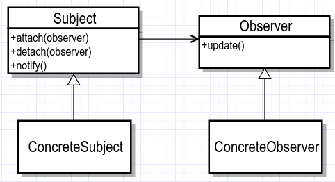

关系模式（11种）


###### （1）策略模式

**意图：**定义一系列的算法,把它们一个个封装起来, 并且使它们可相互替换。

**主要解决：**在有多种算法相似的情况下，使用 if...else 所带来的复杂和难以维护。

**何时使用：**一个系统有许多许多类，而区分它们的只是他们直接的行为。

**如何解决：**将这些算法封装成一个一个的类，任意地替换。

**关键代码：**实现同一个接口。

**优点：** 1、算法可以自由切换。 2、避免使用多重条件判断。 3、扩展性良好。

**缺点：** 1、策略类会增多。 2、所有策略类都需要对外暴露。


**角色：**

抽象策略角色： 这个是一个抽象的角色，通常情况下使用接口或者抽象类去实现。对比来说，就是我们的Comparator接口。

具体策略角色： 包装了具体的算法和行为。对比来说，就是实现了Comparator接口的实现一组实现类。 

环境角色：内部会持有一个抽象角色的引用，给客户端调用。


###### （2）模板方法模式


###### （3）观察者模式

定义：对象间一种一对多的依赖关系，当一个对象改变状态时，则所有依赖于它的对象都会得到通知并被自动更新



- Subject：抽象主题（抽象被观察者）。抽象主题角色把所有观察者对象保存在一个集合里，每个主题都可以有任意数量的观察者。抽象主题提供接口，可以添加或者删除观察者对象。
- ConcreteSubject：具体主题（具体被观察者）。该角色将有关状态存入具体观察者对象，在具体主题的内部状态发生改变时，给所有注册过的观察者发送通知。
- Observer：抽象观察者，是观察者的抽象类。它定义了一个更新接口，使得在得到主题更改通知时更新自己。
- ConcreteObserver：具体观察者，实现抽象观察者定义的更新接口，以便在得到主题更改通知时更新自身的状态。

```java
public interface Observer {
    public void update(String message);
}
public class WeixinUser implements Observer {
    private String name;
    public WeixinUser(String name) {
        this.name = name;
    }
    @Override
     public void update(String message) {
        System.out.println(name + "-" + message);
     }
}
public interface Subject {
    public void attach(Observer observer);
    public void detach(Observer observer);
    public void notify(String message);
}
public class SubscriptionSubject implements Subject {
    private List<Observer> weixinUserList = new ArrayList<Observer>();
    @Override
    public void attach(Observer observer) {
        weixinUserList.add(observer);
    }
    @Override
    public void detach(Observer observer) {
        weixinUserList.remove(observer);
    }
    @Override
    public void notify(String message) {
        for(Observer observer : weixinUserList) {
            observer.update(message);
        }
    }
}
public class Client {
    public static void main(String[] args) {
        SubscriptionSubject subject = new SubscriptionSubject();
        WeixinUser user1 = new WeixinUser("xiaoming");
        WeixinUser user2 = new WeixinUser("xiaohua");
        subject.attach(user1);
        subject.attach(user2);
        subject.notify("专栏更新");
    }
}
```


