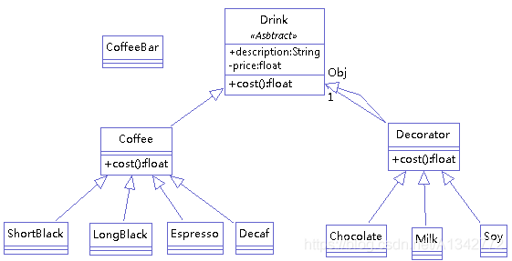
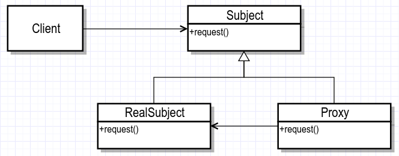

结构模式（7种）适配器模式、装饰器模式、代理模式、外观模式、桥接模式、组合模式、享元模式。


###### （1）适配器模式（Adapter Pattern）

定义： 适配器模式将某个类的接口转换成客户端期望的另一个接口表示，目的是消除由于接口不匹配所造成的类的兼容性问题。

**主要分为三类：**类的适配器模式、对象的适配器模式、接口的适配器模式

**解决的问题**：原本由于接口不兼容而不能一起工作的那些类可以在一起工作


```
应用场景：

类适配器模式：当希望将一个类转换成满足另一个新接口的类时，可以使用类的适配器模式，创建一个新类，继承原有的类，实现新的接口即可。

对象适配器模式：当希望将一个对象转换成满足另一个新接口的对象时，可以创建一个Wrapper类，持有原类的一个实例，在Wrapper类的方法中，调用实例的方法就行。

接口适配器模式：当不希望实现一个接口中所有的方法时，可以创建一个抽象类Wrapper，实现所有方法，我们写别的类的时候，继承抽象类即可。
```


```java
public interface USB {
    void showPPT();
}
public interface VGA {
    void projection();
}
public class USBImpl implements USB{
       @Override
       public void showUSB() {
              System.out.println("USB内容演示");
       }
}
public class VGAImpl implements VGA{
       @Override
       public void showVGA() {
              System.out.println("VGA内容演示");
       }
}
// 类适配器模式
public class AdapterUSB2VGA extends USBImpl implements VGA {
       @Override
       public void showVGA() {
              super.showUSB();
       }
}
// 对象适配器模式
public class AdapterUSB2VGA implements VGA {
       USB u = new USBImpl();
       @Override
       public void showVGA() {
              u.showUSB();
       }
}
```


###### （2）装饰者模式(Decorator Pattern)

**定义：**动态的将新功能附加到对象上。在对象功能扩展方面，它比继承更有弹性。

​	装饰者和被装饰者之间必须是一样的类型,也就是要有共同的超类。继承并不是实现方法的复制,而是实现类型的匹配。装饰者模式的理念,我们可以在任何时候,实现新的装饰者增加新的行为。

**角色：**

Component（被装饰对象的基类）：定义一个对象接口，可以给这些对象动态地添加职责。

ConcreteComponent（具体被装饰对象）：定义一个对象，可以给这个对象添加一些职责。

Decorator（装饰者抽象类）：维持一个指向Component实例的引用，定义一个与Component接口一致的接口。

ConcreteDecorator（具体装饰者）：具体的装饰对象，给内部持有的具体被装饰对象，增加具体的职责。



**装饰模式的优点：**把类中的装饰功能从类中搬移去除，这样可以简化原有的类；

```java
// 被装饰对象的基类Component
public abstract class Drink {
    public String description = "";
    private float price = 0f;
    public void setDescription(String description) {
        this.description = description;
    }
    public String getDescription() {
        return description + "-" + this.getPrice();
    }
    public float getPrice() {
        return price;
    }
    public void setPrice(float price) {
        this.price = price;
    }
    public abstract float cost();
}
// ConcreteComponent（具体被装饰对象）
public class Coffee extends Drink {
    @Override
    public float cost() {
        return super.getPrice();
    }
}
// Decorator（装饰者抽象类）
public class Decorator extends Drink {
    private Drink Obj;
    public Decorator(Drink Obj) {
        this.Obj = Obj;
    }
    @Override
    public float cost() {
        return super.getPrice() + Obj.cost();
    }
    @Override
    public String getDescription() {
        return super.description + "-" + super.getPrice() + "&&" + Obj.getDescription();
    }
}
// ConcreteDecorator（具体装饰者）
public class Milk extends Decorator {
    public Milk(Drink Obj) {
        super(Obj);
        super.setDescription("Milk");
        super.setPrice(2.0f);
    }
}
```

###### （3）代理模式

**定义：**代理模式给某一个对象提供一个代理对象，并由代理对象控制对原对象的引用。通俗讲即生活中的中介。

**代理模式分为三类：**1. 静态代理 2. 动态代理 3. CGLIB代理

**作用：**中介隔离作用、开闭原则，增加功能



按使用范围分类：

```
- 远程代理：为一个对象在不同的地址空间提供局部代表，这样系统可以将 Server 部分的实现隐藏。
- 虚拟代理：使用一个代理对象表示一个十分耗费资源的对象，并在真正需要时才创建。
- 安全代理：用来控制真实对象访问时的权限。一般用于真实对象有不同的访问权限时。
- 智能指引：当调用真实的对象时，代理处理另外一些事，比如计算真实对象的引用计数，当该对象没有引用时，可以自动释放它；或者访问一个实际对象时，检查是否已经能够锁定它，以确保其他对象不能改变它。
```

优点：

- 真实主题类就是实现实际的业务逻辑，不用关心其他非本职的工作。

- 真实主题类随时都会发生变化，但是因为它实现了公共的接口，所有代理类可以不做任何修改就能够使用。

- 可以不用动原来类的逻辑，再次增加一些功能，符合开闭原则。真正的业务还是交给被代理对象处理的

**静态代理：**

- Subject：抽象主题类，声明真是主题与代理的共同接口方法。
- RealSubject：真实主题类，代理类所代表的真实主题。客户端通过代理类间接地调用真实主题类的方法。
- Proxy：代理类，持有对真实主题类的引用，在其所实现的接口方法种调用真实主题类种相应的接口方法执行。
- Client：客户端类。

```java
// 静态代理
// 优点：可以做到在符合开闭原则的情况下对目标对象进行功能扩展。
// 缺点：代理对象与目标对象要实现相同的接口，我们得为每一个服务都得创建代理类，工作量太大，不易管理。同时接口一旦发生改变，代理类也得相应修改。
public interface Subject() { void request();}// 抽象主题类
public class RealSubject implements Subject {// 真实主题类
    @Override
    public void request() {System.out.println("request");}
}
public class Proxy implements Subject {// 代理类
    private Subject subject;
    public Purchasing(Subject subject) { this.subject = subject;}
    @Override
    public void request() { Subject.request();}
}
public class Client {// 客户端类
    public static void main(String[] args) {
        Subject realSubject = new RealSubject();
        Subject subject = new Proxy(realSubject);
        Subject.request();
    }
}

```

**动态代理：**

优点：减少了对业务接口的依赖，降低了耦合度。

```java
// 动态代理
// 运行的时候，通过jvm中的反射进行动态创建对象，生成字节码对象(构造方法参数 InvocationHandler h类型)，传入由我们实现InvocationHandler接口的对象，通过反射创建代理对象
// 需要实现 InvocationHandler接口

/**
 * 动态代理实现：
Java.lang.reflect.Proxy类可以直接生成一个代理对象

Proxy.newProxyInstance(ClassLoader loader, Class<?>[] interfaces, InvocationHandler h)生成一个代理对象
参数1:ClassLoader loader 代理对象的类加载器 一般使用被代理对象的类加载器
参数2:Class<?>[] interfaces 代理对象的要实现的接口 一般使用的被代理对象实现的接口
参数3:InvocationHandler h (接口)执行处理类

InvocationHandler中的invoke(Object proxy, Method method, Object[] args)方法：调用代理类的任何方法，此方法都会执行
参数3.1:代理对象(慎用)
参数3.2:当前执行的方法
参数3.3:当前执行的方法运行时传递过来的参数
 */
public class DynamicPurchasing implements InvocationHandler {
    private Object obj;
    public DynamicPurchasing(Object obj) {
        this.obj = obj;
    }
    @Override
    public Object invoke(Object proxy, Method method, Object[] args) throws Throwable {
        Object result = method.invoke(obj, args);
        if("request".equals(method.getName())) {
            System.out.println("request");
        }
        return result;
    }
}
public class Client {
    public static void main(String[] args) {
        Subject realSubject = new RealSubject();
        DynamicPurchasing dynamicPurchasing = new DynamicPurchasing(realSubject);
        Subject purchasing = (Subject) Proxy.newProxyInstance(realSubject.class.getClassLoader(),
            new Class[]{Subject.class}, dynamicPurchasing);
        purchasing.buy();
    }
}
```

**CGLIB代理：**

`CGLIB 原理`：动态生成一个要代理类的子类，子类重写要代理的类的所有不是final的方法。在子类中采用方法拦截的技术拦截所有父类方法的调用，顺势织入横切逻辑。它比使用java反射的JDK动态代理要快。

`CGLIB 底层`：使用字节码处理框架ASM，来转换字节码并生成新的类。不鼓励直接使用ASM，因为它要求你必须对JVM内部结构包括class文件的格式和指令集都很熟悉。

`CGLIB缺点`：对于final方法，无法进行代理

CGLIB代理总结： **CGLIB创建的动态代理对象比JDK创建的动态代理对象的性能更高，但是CGLIB创建代理对象时所花费的时间却比JDK多得多。所以对于单例的对象，因为无需频繁创建对象，用CGLIB合适，反之使用JDK方式要更为合适一些。同时由于CGLib由于是采用动态创建子类的方法，对于final修饰的方法无法进行代理。**

```java
// 建立拦截器
// 参数：Object为由CGLib动态生成的代理类实例，Method为上文中实体类所调用的被代理的方法引用，Object[]为参数值列表，MethodProxy为生成的代理类对方法的代理引用。
// 返回：从代理实例的方法调用返回的值。
public Object intercept(Object object, Method method, Object[] args, MethodProxy methodProxy) throws Throwable {
    System.out.println("CglibProxy start");
    Object result = methodProxy.invoke(object, args);
    System.out.println("CglibProxy end");
    return result;
}
// 生成动态代理类
public class CglibProxy implements MethodInterceptor {
    private Object target;
    public Object getInstance(final Object target) {
        this.target = target;
        // Enhancer类是CGLib中的一个字节码增强器，它可以方便的对你想要处理的类进行扩展
        Enhancer enhancer = new Enhancer();
        enhancer.setSuperclass(this.target.getClass());
        enhancer.setCallback(this);
        return enhancer.create();
    }
    public Object intercept(Object object, Method method, Object[] args, MethodProxy methodProxy) throws Throwable {
        System.out.println("CglibProxy start");
        Object result = methodProxy.invoke(object, args);
        System.out.println("CglibProxy end");
        return result;
    }
}
```

