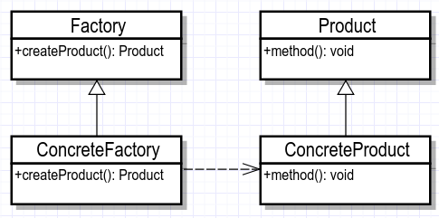
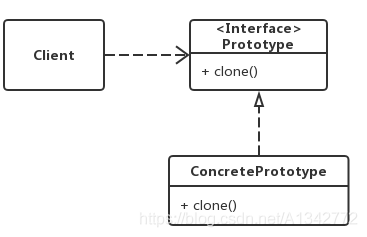

创建模式（5种）工厂方法模式、抽象工厂模式、单例模式、建造者模式、原型模式。


###### （1）单例模式

单例的七种写法：

懒汉——线程不安全、懒汉——线程安全、饿汉、饿汉——变种、静态内部类、枚举、双重校验锁

```java
// 特点
单例类只有一个实例
单例类必须自己创建自己的唯一的实例
单例类必须给所有的其他对象提供这一实例

// 饿汉模式
// 适用于一个类中的成员属性较少，且占用的内存资源不多的场景
// 饿汉式的单例设计模式可以保证多个线程下的唯一实例，getInstance方法性能也比较高，但是无法进行懒加载
public class EagerSingleton {
    private Singleton(){}
    private static EagerSingleton instance = new EagerSingleton();
    public static EagerSingleton getInstance() {
        return instance;
    }
}

// 懒加载模式
// 在使用类实例的时候再创建，避免类初始化时提前创建，但会导致多线程环境中被多次初始化，无法保证实例的唯一性
private static LazySingleton instance = null;
public static LazySingleton getInstance(){
    if (instance == null){
        instance = new LazySingleton();
    }
    return instance;
}

// 懒汉式+同步方法
// 既满足懒加载又百分百保证instance实例唯一性，但synchronized的排他性导致getInstance()只能在同一时刻被一个线程访问，性能低下
private static LazySynSingleton instance = null;
public static synchronized LazySynSingleton getInstance(){
    if (instance == null){
        instance = new LazySynSingleton();
    }
    return instance;
}

// Double-Check
// 既满足懒加载，也保证了instance实例唯一性，也提供了高效的数据同步策略，但是在多线程情况下优肯引起空指针异常（JVM运行时指令重排和Happens-Before规则，conn和instance之间的实例化顺序并无前后关系的约束，可能instance先被实例化，而conn和socket并未完成实例化，导致使用conn时null异常）
private static LazyDoubleCheckSingleton instance = null;
public static LazyDoubleCheckSingleton getInstance() {
    if (instance == null) {
        synchronized(LazyDoubleCheckSingleton.class) {
            if (null == instance) {
                instance = new LazyDoubleCheckSingleton();
            }
        }
    }
    return instance;
}

// Volatile+Double-Check
// 可满足多线程下的单例、懒加载以及获得实例的高效性
private volatile static LazyVolatileSingleton instance = null;

// Holder方式(最好的，使用广泛)
// Holder方式借助了类加载的特点，在类初始化时不创建HolderSingleton实例，当Holder被主动应用时会创建HolderSingleton实例，HolderSingleton实例的创建过程在java程序编译器收集到init()方法中，该方法又是同步方法可以保证内存的可见性、JVM指令的顺序性和原子性
public class HolderSingleton {
    private HolderSingleton(){};
    private static class Holder {
        private static HolderSingleton instance = new HolderSingleton();
    }
    public static HolderSingleton getInstance() {
        return Holder.instance;
    }
}

// 枚举方式
// 枚举不允许被继承，线程安全，且只能被实例化一次，但不能懒加载
public enum EnumSingleton {
    INSTANCE;
    EnumSingleton() {
        初始化；
    }
    public static EnumSingleton getInstance() {
        return INSTANCE;
    }
}
```


###### （2）工厂模式

定义：一个用于创建对象的接口，让子类决定实例化哪个类。工厂方法使一个类的实例化延迟到其子类。



- Product：抽象产品类。
- ConcreteProduct：具体产品类，实现 Product 接口。
- Factory：抽象工厂类，内部方法返回一个 Product 类型的对象。
- ConcreteFactory：具体工厂类，返回 ConcreteProduct 实例。

```java
工厂模式：简单工厂模式、工厂方法模式、抽象工厂模式
// 简单工厂模式
// 增加子类或者删除子类对象的创建都需要在简单工厂类中进行修改，耦合性高,违背开-闭原则
interface Data {void create();}
class DataA implements Data {
	public void create(){System.out.println("create A");}
}
class DataB implements Data {
	public void create(){System.out.println("create B");}
}
class EasyFactory {
	static Data creatData(String name) {
        Data data = null;
        switch (name) {
            case "A":data = new DataA();break;
            case "B":data = new DataB();break;
        }
        return data;
    }
}
public class Example {
	public static void main(String[] args) {
		EasyFactory.creatData('A').create();
	}
}

// 工厂方法模式
// 把简单工厂的内部逻辑判断转移到了客户端代码来进行,增加一个产品类，需要增加对应的工厂类，开发量增加
interface Factory {Data createData();}
public class FactoryA implements Factory {
    public Data createData() {return new DataA();}
}
public class FactoryB implements Factory {
    public Data createData() {return new DataB();}
}
interface Data {void create();}
class DataA implements Data {
	public void create(){System.out.println("create A");}
}
class DataB implements Data {
	public void create(){System.out.println("create B");}
}
public class FactoryClient {
    public static void main(String[] args) throws Exception {
        // 使用反射机制实例化工厂对象，因为字符串是可以通过变量改变的
        Factory a = (Factory) Class.forName("com.FactoryA").newInstance();
        // 通过工厂对象创建相应的实例对象
        a.createData().create();
    }
}

// 抽象工厂模式
// 抽象工厂是实现不止一个接口，可以生产多个产品的，工厂模式只能生产一个产品
public abstract class AbstractFactory {// 抽象工厂类
    public abstract A createA();
    public abstract B createB();
    public abstract C createC();
}
public class DefaultFactory extends AbstractFactory{// 具体工厂类，A,B,C是抽象类，
    public A createA() {return new AA();}
    public B createB() {return new BB();}
    public C createC() {return new CC();}
}
public class Test {
    public static void main(String[] args) {
        AbstractFactory f = new DefaultFactory();
        A v = f.createA();
        v.run();
    }
}

（1）创建抽象工厂
public abstract class ComputerFactory {
    public abstract <T extends Computer> T createComputer(Class<T> clz);
}
（2）具体工厂
public class GDComputerFactory extends ComputerFactory {
    @Override
    public <T extends Computer> T createComputer(Class<T> clz) {
        Computer computer;
        String className = clz.getName();
        try {
            computer = Class.forName(className).newInstance();
        } catch (Exception e) {
            e.printStackTrace();
        }
        return (T) computer;
    }
}
```


###### （3）生成器模式（建造者模式）

优点：

将一个对象分解为各个组件

将对象组件的构造封装起来

可以控制整个对象的生成过程

缺点：

对不同类型的对象需要实现不同的具体构造器的类，这可能回答大大增加类的数量

定义：封装一个复杂对象构造过程，并允许按步骤构造。

* 区别工厂模式：

生成器模式构建对象的时候，对象通常构建的过程中需要多个步骤；

工厂模式构建对象的时候通常就只有一个步骤，调用一个工厂方法就可以生成一个对象。

* 包括四种角色：

（1）产品(Product)：具体生产器要构造的复杂对象；

（2）抽象生成器(Bulider)：抽象生成器是一个接口，该接口除了为创建一个Product对象的各个组件定义了若干个方法之外，还要定义返回Product对象的方法；

（3）具体生产器(ConcreteProduct)：实现Builder接口的类，具体生成器将实现Builder接口所定义的方法；

（4）指挥者(Director)：指挥者是一个类，该类需要含有Builder接口声明的变量。指挥者的职责是负责向用户提供具体生成器，即指挥者将请求具体生成器类来构造用户所需要的Product对象，如果所请求的具体生成器成功地构造出Product对象，指挥者就可以让该具体生产器返回所构造的Product对象。

```java
// 抽象生成器(Bulider)
public abstract class ComputerBuilder {
    protected Computer computer;
    public Computer getComputer() {
        return computer;
    }
    public void buildComputer() {
        computer = new Computer();
        System.out.println("生成了一台电脑！！！");
    }
    public abstract void buildMaster();
    public abstract void buildScreen();
    public abstract void buildKeyboard();
    public abstract void buildMouse();
    public abstract void buildAudio();
}
// 具体生产器(ConcreteBuilder)
public class HPComputerBuilder extends ComputerBuilder {
    @Override
    public void buildMaster() {
        computer.setMaster("i7,16g,512SSD,1060");
    }
    @Override
    public void buildScreen() {
        computer.setScreen("1080p");
    }
    @Override
    public void buildKeyboard() {
        computer.setKeyboard("cherry 青轴机械键盘");
    }
    @Override
    public void buildMouse() {
        computer.setMouse("MI 鼠标");
    }
    @Override
    public void buildAudio() {
        computer.setAudio("飞利浦 音响");
    }
}
// 指挥者(Director)
public class Director {
   
    private ComputerBuilder computerBuilder;
    public void setComputerBuilder(ComputerBuilder computerBuilder) {
        this.computerBuilder = computerBuilder;
    }
   
    public Computer getComputer() {
        return computerBuilder.getComputer();
    }
   
    public void constructComputer() {
        computerBuilder.buildComputer();
        computerBuilder.buildMaster();
        computerBuilder.buildScreen();
        computerBuilder.buildKeyboard();
        computerBuilder.buildMouse();
        computerBuilder.buildAudio();
    }

```


###### （4）原型模式

定义：通过复制现有实例来创建新的实例，无需知道相应类的信息。

角色：

Client：使用者

Prototype：接口（抽象类），声明具备clone能力，例如java中得Cloneable接口

ConcretePrototype：具体的原型类



* 深拷贝和浅拷贝

浅复制：将一个对象复制后，基本数据类型的变量都会重新创建，而引用类型，指向的还是原对象所指向的。

深复制：将一个对象复制后，不论是基本数据类型还有引用类型，都是重新创建的。简单来说，就是深复制进行了完全彻底的复制，而浅复制不彻底。clone明显是深复制，clone出来的对象是是不能去影响原型对象的


**原型模式的本质就是clone，可以解决构建复杂对象的资源消耗问题，能再某些场景中提升构建对象的效率；还有一个重要的用途就是保护性拷贝，可以通过返回一个拷贝对象的形式，实现只读的限制。**

```java
/**
 * 序列化方式深拷贝（需要Object继承Serializable）
 * @param t
 * @return
 * @throws IOException
 * @throws ClassNotFoundException
 */
public static Object serializationDeepCopy(Object t) throws IOException, ClassNotFoundException {
    //通过序列化方法实现深拷贝
    ByteArrayOutputStream bos = new ByteArrayOutputStream();
    ObjectOutputStream oos = new ObjectOutputStream(bos);
    oos.writeObject(t);
    oos.flush();
    ObjectInputStream ois = new ObjectInputStream(new ByteArrayInputStream(bos.toByteArray()));
    return ois.readObject();
}
/**
 * 具体原型（Concrete Prototype）
 */
public class ConcretePrototypeA implements Cloneable, Serializable {
    public String name;
    public double length;
    ConcretePrototypeA(String name, double length){
        this.name = name;
        this.length = length;
    }
    public Object clone() throws CloneNotSupportedException {
        ConcretePrototypeA object = (ConcretePrototypeA) super.clone();
        return object;
    }
    public String toString() {
        return name + ", " + length;
    }
}
```


