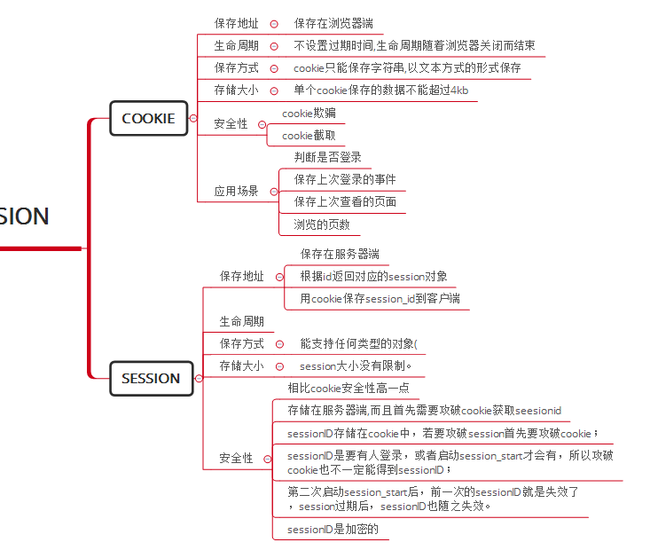
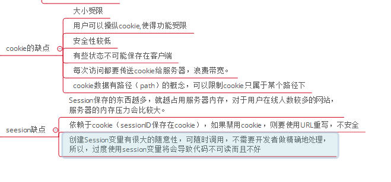
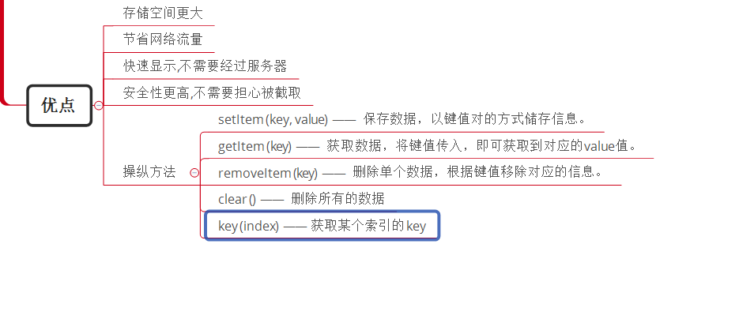

#### cookie与session的异同点

#### 获取cookie的方法

#### cookie与seesion的缺点

#### WebStorage

* WebStorage的目的是克服由cookie所带来的一些限制，当数据需要被严格控制在客户端时，不需要持续的将数据发回服务器。

* WebStorage两个主要目标：

（1）提供一种在cookie之外存储会话数据的路径。

（2）提供一种存储大量可以跨会话存在的数据的机制。

* HTML5的WebStorage提供了两种API：localStorage（本地存储）和sessionStorage（会话存储）。

##### 优点

