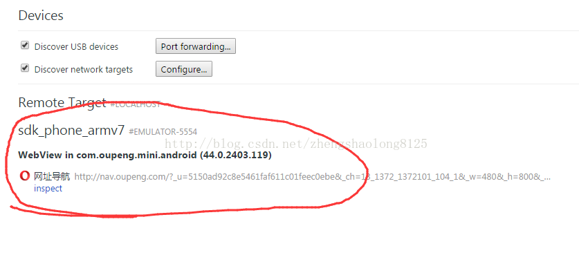

#### 1.通过id定位元素

resrouce-id属性是id：


```
WebElement element = driver.findElement(By.id("com.oupeng.mini.android:id/search_engine_title"));
```

#### 2.通过name定位元素

text属性是name


```
WebElement element = driver.findElement(By.name("百度一下或输入网址"));
```

 

#### 3.通过ClassName定位元素

class属性是classname


```
    WebElement element = driver.findElement(By.ClassName("android.widget.TextView"));
```

 

#### 4.通过xpath定位

Appium对于xpath定位执行效率是比较低的，一般情况下尽量不用这个定位方式。

```
    WebElement element = driver.findElement(By.xpath("//android.widget.TextView[@index='1']"));
```

#### 5.通过AccessibilityId定位元素


```
WebElement element = driver.findElementByAccessibilityId("打开标签");
```

#### 6.通过AndroidUiAutomator定位元素

AndroidUIAutomator是一个强有力的元素定位方式，它是通过Android UIAutomator类库去找元素，可以选择id、name、className作为传入的字符串

```
WebElement element =driver.findElementByAndroidUIAutomator("new UiSelector().resourceId(\"com.oupeng.mini.android:id/search_engine_title")");
```


##### web应用元素定位 

使用chrome-devtools

（1）在PC浏览器地址栏输入：chrome://inspect/#devices

（2）在移动端打开一个网页，如下图

（3）点击”inspect”，弹出一个新窗口，如图：


（4）可以看到手机屏幕上的页面已经PC机上显示，可以看到手机wap页面源码以及UI界面。

如果DevTools窗口打开后是一片空白的，是由于被墙的缘故。

在hosts文件中加入以下内容：64.233.162.83  chrome-devtools-frontend.appspot.com

保存之后，在CMD中输入：ipconfig /flushdns，然后再重新打开就可以了，操作方式和google浏览器中一样，点击探针去探元素


通过name定位：

```
WebElement element = driver.findElement(By.name(“word”));
```

 

##### chrome F12模式

打开PC chrome浏览器，点击F12，点击toggle device toolbar,刷新下网页就可以实现了，可以切换设备型号及屏幕的大小。


##### 定位混合应用元素

混合应用是原生APP+webview组成的，可以简单的理解为一个原生app的外壳，内部全是html页面。在处理这样的app的定位的时候 需要先定位原生APP上的按钮或者链接，然后点击按钮或者链接，然后经过appium提供的方法，进入webview页面，通过之前介绍的定位工具和方法进行元素定位了。如果说你的android版本小于4.4，那么你需要使用Selendroid模式来作为测试引擎，在测试初始化的时候需要设置该capability。如果你的android版本大于等于4.4，那么Appium作为测试引擎，然后通过chromedriver来处理webview。如果你使用的是APPIUM测试引擎，调试WebView需要满足安卓系统版本为Android 4.4+已上，并且需要在你的APP内配置相应的代码，在WebView类中调用静态方法setWebContentsDebuggingEnabled，如下：

```java
if (Build.VERSION.SDK_INT >=Build.VERSION_CODES.KITKAT) {
WebView.setWebContentsDebuggingEnabled(true);
}
```

进入webview的操作：

```java
// 这里使用driver.getContextHandles();获取app的handles，原生应用会有一个handle，webview也会有一个handle
Set<String> contexts = driver.getContextHandles();
for(String cotext:contexts) {
    System.out.println(context);
// 会打印出  NATIVE_APP（原生app handle）和WEBVIEW_com.example.testapp(webview的 handle)
}
// 进入webview中
driver.context((String) contexts.toArray()[1]);
//操作webview中的内容
```

