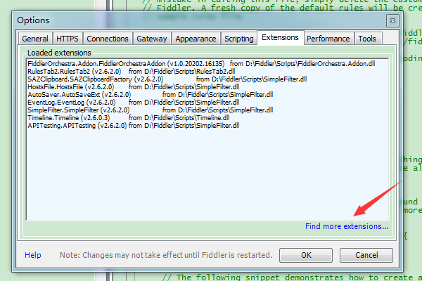
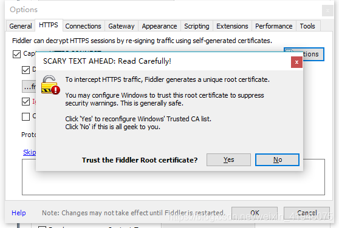
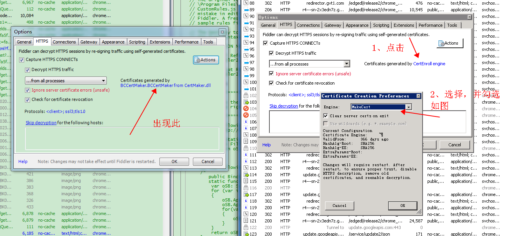

**一、安装证书fiddlercentmarker**

1、下载fiddlercentmarker.exe,安装好后点击确认，重启fiddler（记得重启）

下载地址：https://www.telerik.com/fiddler/add-ons

插件名称：CertMaker for iOS and Android

2、导出证书到本地电脑，在Toos–>HTTPS–>actions–>trust root certificate

3、如图操作

