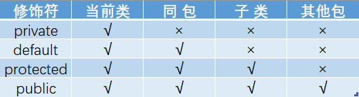

**Java运算**

与（&）、非（~）、或（|）、异或（^）

**Java基本数据类型图**


```shell
## Math.round函数
Math.round(11.5)的返回值是 12，Math.round(-11.5)的返回值是-11。四舍五入的原理是在参数上加 0.5 然后进行下取整。
## float f=3.4
3.4 是双精度数，需要强制类型转换float f =(float)3.4; 或者写成 float f =3.4F;
## short s1 = 1; s1 = s1 + 1
short s1 = 1; s1 = s1 + 1;由于 1 是 int 类型，因此 s1+1 运算结果也是 int型
short s1 = 1; s1 += 1;可以正确编译
```

**访问修饰符图**



**IO对象分类结构图**


**String**

```shell
##1、特性
不变性、常量池优化、final
##2、String 类是 final 类，不可以被继承
##3、String str="i"与 String str=new String(“i”)一样吗？
	不一样，因为内存的分配方式不一样。String str="i"的方式，java 虚拟机会将其分配到常量池中；而 String str=new String(“i”) 则会被分到堆内存中
##4、String s = new String(“xyz”);创建了几个字符串对象
	两个对象，一个是静态区的"xyz"，一个是用new创建在堆上的对象。
##5、字符串反转？
	使用 StringBuilder 或者 stringBuffer 的 reverse() 方法。
```

**反射**

```java
//方式一(通过建立对象)
Student stu = new Student();
Class classobj1 = stu.getClass();
System.out.println(classobj1.getName());
//方式二（所在通过路径-相对路径）
Class classobj2 = Class.forName("fanshe.Student");
System.out.println(classobj2.getName());
//方式三（通过类名）
Class classobj3 = Student.class;
System.out.println(classobj3.getName());

应用：
①我们在使用JDBC连接数据库时使用Class.forName()通过反射加载数据库的驱动程序；
②Spring框架也用到很多反射机制，最经典的就是xml的配置模式。

Spring 通过 XML 配置模式装载 Bean 的过程：
1) 将程序内所有 XML 或 Properties 配置文件加载入内存中; 
2)Java类里面解析xml或properties里面的内容，得到对应实体类的字节码字符串以及相关的属性信息; 
3)使用反射机制，根据这个字符串获得某个类的Class实例; 
4)动态配置实例的属性
```

**hashCode（）与equals（）**

```
hashCode（）与equals（）的相关规定：
1、如果两个对象相等，则hashcode一定也是相同的
2、两个对象相等,对两个equals方法返回true
3、两个对象有相同的hashcode值，它们也不一定是相等的
4、综上，equals方法被覆盖过，则hashCode方法也必须被覆盖
5、hashCode()的默认行为是对堆上的对象产生独特值。如果没有重写hashCode()，则该class的两个对象无论如何都不会相等（即使这两个对象指向相同的数据）。
```

**==与equals的区别**

```
1. ==是判断两个变量或实例是不是指向同一个内存空间 equals是判断两个变量或实例所指向的内存空间的值是不是相同
2. ==是指对内存地址进行比较 equals()是对字符串的内容进行比较
3. ==指引用是否相同 equals()指的是值是否相同
```

