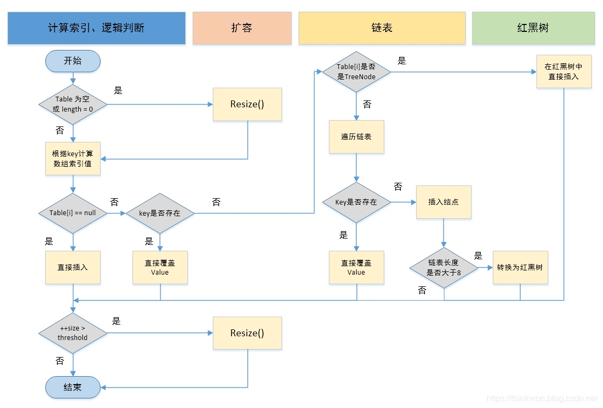

围绕：

HashMap 实现原理？

如何扩容，为什么是 2 的幂？

线程安全性：线程不安全

hash算法？


put过程：

1、利用key的hashCode 计算hash确定元素在数组中的下标

2、hash相同的key，(1)key相同，覆盖原始值；(2)key不同（hash冲突），放入链表中

3、链表长度>8转红黑树

```shell
## 1.8相对于1.7：
1、处理hash冲突的方式变化，当一条链表太长（>8个）时，转化为红黑树保存，提高hash冲突时的查找速度，也就提升了几个主要的方法的速度。
2、hashseed相关的都去掉了，Node（就是Entry）的hash又变回final了。
3、一些方法、类的名称的变化，比如Entry变成Node。
4、Map接口1.8新增了几个普通的方法，完善了Map的操作。
5、函数式编程、Stream相关的方法。
6、链表添加时，新节点会放在链表末尾，而不是像1.6/1.7一样放在头部；扩容操作也会尽量保证扩容后还在同一条链表上的节点之间的相对顺序不变。
7、修复之前的一些小问题，加上其他的一些小改动。
```

基本参数

```java
/** 初始容量initCapacity，容量必须是2^n形式的数*/
static final int DEFAULT_INITIAL_CAPACITY = 1 << 4; // aka 16
/** 负载因子loadFactor*/
static final float DEFAULT_LOAD_FACTOR = 0.75f;
/** hash桶最大数量（table数组的最大长度），size超过此数量之后无法再扩容了*/
static final int MAXIMUM_CAPACITY = 1 << 30;
/** The bin count threshold for using a tree rather than list for a bin 红黑树变化*/
static final int TREEIFY_THRESHOLD = 8;
/** 如果一棵红黑树的节点减少到这个值，那么就把它退化为链表保存 */
static final int UNTREEIFY_THRESHOLD = 6;
/** 转化为红黑树的另一个条件。table的长度不足这个值时，不转化为红黑树，改为扩容一次 */
static final int MIN_TREEIFY_CAPACITY = 64;

// transient关键字标记的成员变量不参与序列化过程
// 底层的hash桶数组，长度必须是2^n，容量不足时可以扩容
transient Node<K,V>[] table;
// K-V对的数量。注意，为了兼容size方法才使用int，HashMap的实际size可能会大于Integer.MAX_VALUE，理论上long类型才是比较好的值，实际中大多数int型也够用
transient int size;
// 大多数实现类都有的modCount
transient int modCount;
// 扩容阈值，一般值为table.length*loadFactor，不能扩容时使用Integer.MAX_VALUE来表示后续永远不会扩容
int threshold;
// 加载因子，注意，此值可以大于1
final float loadFactor;
// keySet values继承使用AbstractMap的父类的属性
transient Set<Map.Entry<K,V>> entrySet;
```


数据结构

数组+链表（红黑树）

```java
// 1.8结构
static class Node<K,V> implements Map.Entry<K,V> {// 命名优化
    final int hash;// hash是final的
    final K key;
    V value;
    Node<K,V> next;
}
// 1.7结构
// Entry就一个变化，hash值不再是final的
static class Entry<K,V> implements Map.Entry<K,V> {
    final K key;
    V value;
    Entry<K,V> next;
    int hash; // 就这一个改变，hash不再是final的，扩容时可以重新计算hash值
}
```

hash计算

```java
// hash 函数大概的作用就是：高16bit不变，低16bit和高16bit做了一个异或，目的是减少碰撞
static final int hash(Object key) {// 简单的移位异或
    int h;
    return (key == null) ? 0 : (h = key.hashCode()) ^ (h >>> 16);
}// 进行异或操作，高16bit补0，一个数和0异或不变
```

扩容

1、增加了红黑树情况的处理；

2、节点迁移方式有变化，尽量保证相对顺序。

1.6和1.7：遍历链表，一个个重新添加到新链表的头部，这样会颠倒原来链表中节点之间的相对顺序；

1.8：根据节点迁移后的位置，按照原来的相对顺序，分为两队，然后一队整个添加一次，保留原来链表中节点之间的相对顺序。

* 扩容：哈希表中的条目数量超过loadFactor和当前容量capcity的乘积threshold时，哈希表会扩容为两倍的大小，并且进行重新散列

* 负载因子的考量：空间开销，查找成本，减少扩容次数


容量计算

```java
// 求不小于cap的，满足2^n的数中最小的那个，即大于输入参数且最近的2的整数次幂的数
// 这个方法的原型就是Integr.highestOneBit，1.7的版本中用过
static final int tableSizeFor(int cap) {
    // >>>表示无符号右移，也叫逻辑右移，即若该数为正，则高位补0，而若该数为负数，则右移后高位同样补0
    int n = cap - 1;
    n |= n >>> 1;
    n |= n >>> 2;// n=n|(n>>>2)=1000100|0010001=1010101
    n |= n >>> 4;// n=n|(n>>>4)=1000000|0000100=1000100
    n |= n >>> 8;
    n |= n >>> 16;
    return (n < 0) ? 1 : (n >= MAXIMUM_CAPACITY) ? MAXIMUM_CAPACITY : n + 1;
}

// 1.7时候的hash计算
// 多了个hashSeed，以及对String的特别处理
// null 依然视为hash = 0，总是放在index = 0的hash桶中
final int hash(Object k) {
    int h = hashSeed;
    if (0 != h && k instanceof String) {
        return sun.misc.Hashing.stringHash32((String) k);
    }
    h ^= k.hashCode();
    // This function ensures that hashCodes that differ only by
    // constant multiples at each bit position have a bounded
    // number of collisions (approximately 8 at default load factor).
    h ^= (h >>> 20) ^ (h >>> 12);
    return h ^ (h >>> 7) ^ (h >>> 4);
}
static int indexFor(int h, int length) {
    // assert Integer.bitCount(length) == 1 : "length must be a non-zero power of 2";
    return h & (length-1);
}
```

JDK1.8主要解决或优化了一下问题：

1. resize 扩容优化
2. 引入了红黑树，目的是避免单条链表过长而影响查询效率，红黑树算法请参考
3. 解决了多线程死循环问题，但仍是非线程安全的，多线程时可能会造成数据丢失问题。

| 不同                     | JDK 1.7                                                      | JDK 1.8                                                      |
| ------------------------ | ------------------------------------------------------------ | ------------------------------------------------------------ |
| 存储结构                 | 数组 + 链表                                                  | 数组 + 链表 + 红黑树                                         |
| 初始化方式               | 单独函数：`inflateTable()`                                   | 直接集成到了扩容函数`resize()`中                             |
| hash值计算方式           | 扰动处理 = 9次扰动 = 4次位运算 + 5次异或运算                 | 扰动处理 = 2次扰动 = 1次位运算 + 1次异或运算                 |
| 存放数据的规则           | 无冲突时，存放数组；冲突时，存放链表                         | 无冲突时，存放数组；冲突 & 链表长度 < 8：存放单链表；冲突 & 链表长度 > 8：树化并存放红黑树 |
| 插入数据方式             | 头插法（先讲原位置的数据移到后1位，再插入数据到该位置）      | 尾插法（直接插入到链表尾部/红黑树）                          |
| 扩容后存储位置的计算方式 | 全部按照原来方法进行计算（即hashCode ->> 扰动函数 ->> (h&length-1)） | 按照扩容后的规律计算（即扩容后的位置=原位置 or 原位置 + 旧容量） |


```java
// jdk1.8版本的扩容
final Node<K,V>[] resize() {
    Node<K,V>[] oldTab = table;// 原数组
    int oldCap = (oldTab == null) ? 0 : oldTab.length;// 原始长度
    int oldThr = threshold;// 源阈值
    int newCap, newThr = 0;
    // 下面两个if用于计算几个field的新值，看着复杂些是因为这里有处理第一次初始化时的情况，以及cap/threshold溢出的情况
    if (oldCap > 0) {
        if (oldCap >= MAXIMUM_CAPACITY) {// 如果大于int max
            threshold = Integer.MAX_VALUE;
            return oldTab;
        }
        else if ((newCap = oldCap << 1) < MAXIMUM_CAPACITY 
                 && oldCap >= DEFAULT_INITIAL_CAPACITY)// 16 < 原阈值 < int/2
            newThr = oldThr << 1; // double threshold 负数继续左移位可能会变成0，然后在下面的if中处理
    }
    else if (oldThr > 0) // initial capacity was placed in threshold
        newCap = oldThr;
    else {               // zero initial threshold signifies using defaults
        newCap = DEFAULT_INITIAL_CAPACITY;
        newThr = (int)(DEFAULT_LOAD_FACTOR * DEFAULT_INITIAL_CAPACITY);
    }
    if (newThr == 0) {
        float ft = (float)newCap * loadFactor;
        newThr = (newCap < MAXIMUM_CAPACITY && ft < (float)MAXIMUM_CAPACITY ?
                  (int)ft : Integer.MAX_VALUE);
    }
    threshold = newThr;
    @SuppressWarnings({"rawtypes","unchecked"})
    Node<K,V>[] newTab = (Node<K,V>[])new Node[newCap]; // 新建数组
    table = newTab;
    if (oldTab != null) { // oldTab不为null表示是扩容，否则就是初始化，初始化时直接执行return
        for (int j = 0; j < oldCap; ++j) {
            Node<K,V> e;
            if ((e = oldTab[j]) != null) {
                oldTab[j] = null;
                if (e.next == null)
                    newTab[e.hash & (newCap - 1)] = e; // 这里的处理和1.6、1.7的indexFor一样
                else if (e instanceof TreeNode)// 处理红黑树这种情况，放在后面说
                    ((TreeNode<K,V>)e).split(this, newTab, j, oldCap); 
                else { // preserve order，保留原来节点在链表中的相对顺序，和1.6/1.7版本不一样
                    Node<K,V> loHead = null, loTail = null; // lo = low，表示低位0
                    Node<K,V> hiHead = null, hiTail = null; // hi = high，表示高位1
                    Node<K,V> next;
                    do { // 这个do-while中先把要迁移的节点根据它们迁移后的位置，按照原来在一条链表上的相对顺序，分为两队，然后一次性把一队整个放在新的hash桶中，这样就能保留节点之间的相对顺序
                        next = e.next;
                        if ((e.hash & oldCap) == 0) { // 原来二进制从右往左数第n位（从0开始）是低位0的所有Node，按照相对顺序依次在lo这条链表的尾部append
                            if (loTail == null)
                                loHead = e;
                            else
                                loTail.next = e;
                            loTail = e;
                        }
                        else { // 原来二进制从右往左数第n位（从0开始）是高位1的所有Node，按照相对顺序依次在hi这条链表的尾部append
                            if (hiTail == null)
                                hiHead = e;
                            else
                                hiTail.next = e;
                            hiTail = e;
                        }
                    } while ((e = next) != null);
                    if (loTail != null) { // 第n位（从0开始）是低位0的所有Node，它们重新散列后在数组中的newIndex = oldIndex，保持不变
                        loTail.next = null;
                        newTab[j] = loHead;
                    }
                    if (hiTail != null) { // 第n位（从0开始）是高位1的所有Node，它们重新散列后在数组中的newIndex = oldIndex + oldCapacity
                        hiTail.next = null;
                        newTab[j + oldCap] = hiHead;
                    }
                }
            }
        }
    }
    return newTab;
}
```


```java
// 1.7 扩容
// resize 修复了threshold过早地变为Integer.MAX_VALUE的问题，其余跟1.6一致
void resize(int newCapacity) {
    Entry[] oldTable = table;
    int oldCapacity = oldTable.length;
    if (oldCapacity == MAXIMUM_CAPACITY) { // 此时数组才是真正不能扩容了
        threshold = Integer.MAX_VALUE;
        return;
    }
 
    Entry[] newTable = new Entry[newCapacity];
    transfer(newTable, initHashSeedAsNeeded(newCapacity));
    table = newTable;
    threshold = (int)Math.min(newCapacity * loadFactor, MAXIMUM_CAPACITY + 1);
    // 上面这行代码，可以避免1.6可能发生的因为newCapacity * LoadFacotr大于Integer.MAX_VALUE，导致后续本来还可以扩容，但是无法进入resize方法的问题
}
 
// 多一个真正的rehash的判断，其余跟1.6的一致
void transfer(Entry[] newTable, boolean rehash) {
    int newCapacity = newTable.length;
    for (Entry<K,V> e : table) {
        while(null != e) {
            Entry<K,V> next = e.next;
            if (rehash) { // 为true就要进行真正的rehash
                e.hash = null == e.key ? 0 : hash(e.key);
            }
            int i = indexFor(e.hash, newCapacity);
            e.next = newTable[i];
            newTable[i] = e;
            e = next;
        }
    }
}
```

putVal方法执行流程图



其他方法
```java
①.判断键值对数组table[i]是否为空或为null，否则执行resize()进行扩容；
②.根据键值key计算hash值得到插入的数组索引i，如果table[i]==null，直接新建节点添加，转向⑥，如果table[i]不为空，转向③；
③.判断table[i]的首个元素是否和key一样，如果相同直接覆盖value，否则转向④，这里的相同指的是hashCode以及equals；
④.判断table[i]是否为treeNode，即table[i] 是否是红黑树，如果是红黑树，则直接在树中插入键值对，否则转向⑤；
⑤.遍历table[i]，判断链表长度是否大于8，大于8的话把链表转换为红黑树，在红黑树中执行插入操作，否则进行链表的插入操作；遍历过程中若发现key已经存在直接覆盖value即可；
⑥.插入成功后，判断实际存在的键值对数量size是否超多了最大容量threshold，如果超过，进行扩容。

public V put(K key, V value) {
    return putVal(hash(key), key, value, false, true);
}
// put的变化：
1、添加红黑树变换的情况；
2、新添加的Node放在链表的尾部；
3、put判断是否扩容时的处理跟1.6一样，先添加Node再判断，跟1.7的不一样。
/**  Implements Map.put and related methods */
// onlyIfAbsent，key不存在才put，存在了什么也不做，也不会更改value，除非旧的value为null
// evict，区分是初始化构建还是普通的put
final V putVal(int hash, K key, V value, boolean onlyIfAbsent,  boolean evict) { 
    Node<K,V>[] tab; Node<K,V> p; int n, i;
    if ((tab = table) == null || (n = tab.length) == 0) // 处理table的初始化
        n = (tab = resize()).length;
    if ((p = tab[i = (n - 1) & hash]) == null) // hash桶为空，直接放进去就行
        tab[i] = newNode(hash, key, value, null);
    else {
        Node<K,V> e; K k;
        if (p.hash == hash 
            &&  ((k = p.key) == key || (key != null && key.equals(k)))) // 碰见“相等”的key
            e = p;
        else if (p instanceof TreeNode) // 红黑树节点就使用红黑树的方式进行添加
            e = ((TreeNode<K,V>)p).putTreeVal(this, tab, hash, key, value);
        else {
            for (int binCount = 0; ; ++binCount) {
                if ((e = p.next) == null) {
                    p.next = newNode(hash, key, value, null); // 添加在链表的末尾
                    if (binCount >= TREEIFY_THRESHOLD - 1) // -1 for 1st ，-1是链表的第一个，7就是链表的第8个，把第9个添加到链表后，变换为红黑树（treeifyBin里面判断第二个条件）
                        treeifyBin(tab, hash);
                    break;
                }
                if (e.hash == hash &&  ((k = e.key) == key || (key != null && key.equals(k)))) // 碰见“相等”的key
                    break;
                p = e;
            }
        }
        if (e != null) { // existing mapping for key
            V oldValue = e.value;
            if (!onlyIfAbsent || oldValue == null)
                e.value = value;
            afterNodeAccess(e);  // 留给子类LinkedHashMap实现的方法
            return oldValue;
        }
    }
    ++modCount;
    if (++size > threshold) // 扩容这里跟1.6的一样，是先把Node添加进去，再判断是否扩容，跟1.7的不一样
        resize();
    afterNodeInsertion(evict); // 留给子类LinkedHashMap实现的方法
    return null;
}
public void putAll(Map<? extends K, ? extends V> m) {
    putMapEntries(m, true);
}
public V remove(Object key) {
    Node<K,V> e;
    return (e = removeNode(hash(key), key, null, false, true)) == null ?  null : e.value; 
}
```


```java
// 1.7方法
public V put(K key, V value) {
    if (table == EMPTY_TABLE) { // 考虑还未真正初始化的情况
        inflateTable(threshold);// 初始化
    }
    if (key == null)// 判断key是否为null
        return putForNullKey(value);
    int hash = hash(key);
    int i = indexFor(hash, table.length);// 计算位置
    for (Entry<K,V> e = table[i]; e != null; e = e.next) {// 理论上查找是O(1)
        Object k;
        if (e.hash == hash && ((k = e.key) == key || key.equals(k))) {// 判断是否有相同key
            V oldValue = e.value;
            e.value = value;
            e.recordAccess(this);// 此方法HashMap中是空方法，留给子类实现
            return oldValue;// 返回旧值
        }
    }
    modCount++;
    addEntry(hash, key, value, i);// 执行添加操作
    return null;
}
private V putForNullKey(V value) {// 插入key为null，放在index = 0的hash桶中
    for (Entry<K,V> e = table[0]; e != null; e = e.next) {
        if (e.key == null) {
            V oldValue = e.value;
            e.value = value;
            e.recordAccess(this);
            return oldValue;// 返回旧值
        }
    }
    modCount++;
    addEntry(0, null, value, 0);// 执行添加操作
    return null;
}
// 在Entry链的头部插入新的节点，并检查是否需要扩容
/** 1.7跟1.6有些区别
 1、走实用主义，扩容多了个条件。当添加的节点是hash桶的第一个节点时，一定不扩容，所以会出现size > threshold的情况。
 2、几步的操作顺序不一样。jdk1.6的是先把节点添加到链表中，再判断是否扩容；1.7这里是先判断是否扩容，扩容完再把节点添加到链表中。
*/
void addEntry(int hash, K key, V value, int bucketIndex) {
    if ((size >= threshold) && (null != table[bucketIndex])) {// 判断是否需要扩容
        resize(2 * table.length);// 扩大2倍
        hash = (null != key) ? hash(key) : 0;
        bucketIndex = indexFor(hash, table.length);
    }
    createEntry(hash, key, value, bucketIndex);
}
void createEntry(int hash, K key, V value, int bucketIndex) {
    Entry<K,V> e = table[bucketIndex];
    table[bucketIndex] = new Entry<>(hash, key, value, e);// 先把新的节点添加进去
    size++;
}
// putAll
public void putAll(Map<? extends K, ? extends V> m) {
    int numKeysToBeAdded = m.size();
    if (numKeysToBeAdded == 0)
        return;
 
    if (table == EMPTY_TABLE) { // 考虑还未真正初始化的情况
        inflateTable((int) Math.max(numKeysToBeAdded * loadFactor, threshold));
    }
 
    // 跟1.6的一样，稍微保守些，多判断下
    if (numKeysToBeAdded > threshold) {
        int targetCapacity = (int)(numKeysToBeAdded / loadFactor + 1);
        if (targetCapacity > MAXIMUM_CAPACITY)
            targetCapacity = MAXIMUM_CAPACITY;
        int newCapacity = table.length;
        while (newCapacity < targetCapacity)
            newCapacity <<= 1;
        if (newCapacity > table.length)
            resize(newCapacity);
    }
 
    for (Map.Entry<? extends K, ? extends V> e : m.entrySet())
        put(e.getKey(), e.getValue());
}
// 移除
public V remove(Object key) {
    Entry<K,V> e = removeEntryForKey(key);
    return (e == null ? null : e.value);
}
 
final Entry<K,V> removeEntryForKey(Object key) {
    if (size == 0) { // 考虑还未真正初始化的情况
        return null;
    }
    int hash = (key == null) ? 0 : hash(key);
    int i = indexFor(hash, table.length);
    Entry<K,V> prev = table[i];
    Entry<K,V> e = prev;
 
    while (e != null) {
        Entry<K,V> next = e.next;
        Object k;
        if (e.hash == hash && ((k = e.key) == key || (key != null && key.equals(k)))) {
            modCount++;
            size--;
            if (prev == e)
                table[i] = next;
            else
                prev.next = next;
            e.recordRemoval(this);
            return e;
        }
        prev = e;
        e = next;
    }
 
    return e;
}
 
public void clear() {
    modCount++;
    Arrays.fill(table, null); // 就是循环赋值
    size = 0;
}
```

关于红黑树

红黑树是一种自平衡的二叉搜索树，额外多五个性质
    性质1：节点是红色或黑色
    性质2：根节点是黑色
    性质3：NIL节点（null、空节点）是黑色的
    性质4：每个红色节点的两个子节点都是黑色（从每个NIL节点到根的所有路径上不能有两个连续的红色节点）
    性质5：从任一节点到其每个叶子的所有路径都包含相同数目的黑色节点

```java
// 把原来链表上的普通节点转化为树节点，用双向链表保存
final void treeifyBin(Node<K,V>[] tab, int hash) {
    int n, index; Node<K,V> e;
    if (tab == null || (n = tab.length) < MIN_TREEIFY_CAPACITY)
        resize();
    else if ((e = tab[index = (n - 1) & hash]) != null) {
        TreeNode<K,V> hd = null, tl = null; // hd = head, tl = tail
        do {
            TreeNode<K,V> p = replacementTreeNode(e, null); // “构造”方法
            if (tl == null)
                hd = p;
            else {
                p.prev = tl;
                tl.next = p;
            }
            tl = p;
        } while ((e = e.next) != null);
        if ((tab[index] = hd) != null)
            hd.treeify(tab); // 转化为红黑树
    }
}
 
// 因为红黑树是二叉搜索树，关键字如何比较大小很重要
// HashMap这里首先直接使用hash值比较大小，如果发生hash值相等，那么进行以下处理
//     如果Key实现了Comparable<Key>接口，那么调用其compareTo方法进行大小比较；
//     如果没实现，那么调用System.identityHashCode获取其bject.hashCode（指的是未被子类覆盖时hashCode的返回值），再使用这个hashCode进行比较
// 这里允许不同的节点的Key在红黑树中相等，因为这里是HashMap不是TreeMap，不需要严格的顺序
 
/** Returns x's Class if it is of the form "class C implements Comparable<C>", else null. */
static Class<?> comparableClassFor(Object x) {
    if (x instanceof Comparable) {
        Class<?> c; Type[] ts, as; Type t; ParameterizedType p;
        if ((c = x.getClass()) == String.class) // bypass checks
            return c;
        if ((ts = c.getGenericInterfaces()) != null) {
            for (int i = 0; i < ts.length; ++i) {
                if (((t = ts[i]) instanceof ParameterizedType) &&
                    ((p = (ParameterizedType)t).getRawType() ==
                     Comparable.class) &&
                    (as = p.getActualTypeArguments()) != null &&
                    as.length == 1 && as[0] == c) // type arg is c
                    return c;
            }
        }
    }
    return null;
}
 
// 实现了Comparable接口就调用其compareTo方法进行大小比较
/** Returns k.compareTo(x) if x matches kc (k's screened comparable class), else 0. */
@SuppressWarnings({"rawtypes","unchecked"}) // for cast to Comparable
static int compareComparables(Class<?> kc, Object k, Object x) {
    return (x == null || x.getClass() != kc ? 0 :
            ((Comparable)k).compareTo(x));
}
```

TreeNode

```java
// 红黑树节点TreeNode实际上还保存有链表的指针，因此也可以用链表的方式进行遍历读取操作
// 继承LinkedHashMap.Entry主要是为了子类的方便，减少子类的改动
static final class TreeNode<K,V> extends LinkedHashMap.Entry<K,V> {
    TreeNode<K,V> parent;  // red-black tree links
    TreeNode<K,V> left;
    TreeNode<K,V> right;
    TreeNode<K,V> prev;    // needed to unlink next upon deletion 新添加的prev指针是为了删除方便，删除链表的非头节点的节点，都需要知道它的前一个节点才能进行删除，所以直接提供一个prev指针
    boolean red;
    TreeNode(int hash, K key, V val, Node<K,V> next) {
        super(hash, key, val, next);
    }
 
    // 寻找根节点
    final TreeNode<K,V> root() {
        for (TreeNode<K,V> r = this, p;;) {
            if ((p = r.parent) == null)
                return r;
            r = p;
        }
    }
 
    // 把根节点移动到前面，确保红黑树的根节点是第一个节点，即 tab[index] = root
    static <K,V> void moveRootToFront(Node<K,V>[] tab, TreeNode<K,V> root) {
        int n;
        if (root != null && tab != null && (n = tab.length) > 0) {
            int index = (n - 1) & root.hash;
            TreeNode<K,V> first = (TreeNode<K,V>)tab[index];
            if (root != first) {
                Node<K,V> rn;
                tab[index] = root; // 设置root为能遍历到的第一个Node
                // 下面几行，用于更改链表中节点的顺序，虽然使用了红黑树，但是迭代操作还是使用链表进行的
                TreeNode<K,V> rp = root.prev;
                if ((rn = root.next) != null)
                    ((TreeNode<K,V>)rn).prev = rp;
                if (rp != null)
                    rp.next = rn;
                if (first != null)
                    first.prev = root;
                root.next = first;
                root.prev = null;
            }
            assert checkInvariants(root);
        }
    }
 
    // 以当前节点 this 为根节点开始遍历查找
    final TreeNode<K,V> find(int h, Object k, Class<?> kc) {
        TreeNode<K,V> p = this;
        do {
            int ph, dir; K pk; // ph = parent.hash, dir = direction, pk = parent.key
            TreeNode<K,V> pl = p.left, pr = p.right, q;
            if ((ph = p.hash) > h)
                p = pl;
            else if (ph < h)
                p = pr;
            else if ((pk = p.key) == k || (k != null && k.equals(pk)))
                return p;
            else if (pl == null)
                p = pr;
            else if (pr == null)
                p = pl;
            else if ((kc != null || (kc = comparableClassFor(k)) != null) && (dir = compareComparables(kc, k, pk)) != 0)
                p = (dir < 0) ? pl : pr;
            else if ((q = pr.find(h, k, kc)) != null) // 对右子树递归查找
                return q;
            else
                p = pl; // 前面递归查找了右边子树，这里循环时只用一直往左边找
        } while (p != null);
        return null;
    }
 
    // 以真正的root节点为根节点开始遍历查找
    final TreeNode<K,V> getTreeNode(int h, Object k) {
        return ((parent != null) ? root() : this).find(h, k, null);
    }
 
    // 最后使用的用于比较节点关键字大小的方法，优先级最低
    // System.identityHashCode：此方法的返回值和Object.hashCode没有被覆盖时的返回值一样，虚拟机尽量会保证这个值不重复
    // 如果不是同一个类就直接认为关键字相等
    static int tieBreakOrder(Object a, Object b) {
        int d;
        if (a == null || b == null || (d = a.getClass().getName().compareTo(b.getClass().getName())) == 0)
            d = (System.identityHashCode(a) <= System.identityHashCode(b) ? -1 : 1);
        return d;
    }
 
    // 将双向链表转化为红黑树
    // 红黑树是一种特殊的二叉搜索树，要保证二叉搜索树的基本性质：
    //     一个节点的关键字，不小于它的左边的子树上的所有节点的关键字，且不大于右边子树上的所有节点的关键字
    // 这里优先使用hash值当做关键字，hash值相同时，如果实现了Comparable接口，就使用Comparable.compareTo，否则使用 tieBreakOrder 方法进行比较
    final void treeify(Node<K,V>[] tab) {
        TreeNode<K,V> root = null;
        for (TreeNode<K,V> x = this, next; x != null; x = next) {
            next = (TreeNode<K,V>)x.next;
            x.left = x.right = null;
            if (root == null) {
                x.parent = null;
                x.red = false;
                root = x;
            }
            else {
                K k = x.key;
                int h = x.hash;
                Class<?> kc = null;
                for (TreeNode<K,V> p = root;;) { // 循环，遍历找到要插入的节点的parent节点
                    int dir, ph; // dir = direction, ph = parent.hash
                    K pk = p.key;
                    if ((ph = p.hash) > h) // 放在左边
                        dir = -1;
                    else if (ph < h) // 放在右边
                        dir = 1;
                    // 下面的else if 中处理hash相等的情况
                    // 如果实现了Comparable接口，就使用Comparable.compareTo判断方向
                    else if ((kc == null && (kc = comparableClassFor(k)) == null) || (dir = compareComparables(kc, k, pk)) == 0)
                        dir = tieBreakOrder(k, pk); // 没实现Comparable接口调用这个方法
 
                    TreeNode<K,V> xp = p;
                    if ((p = (dir <= 0) ? p.left : p.right) == null) { // 根据dir的正负确定遍历方向，找到要插入的节点的parent节点
                        x.parent = xp;
                        if (dir <= 0)
                            xp.left = x;
                        else
                            xp.right = x;
                        root = balanceInsertion(root, x); // 插入树节点，根据红黑树性质进行平衡化，保持平衡
                        break;
                    }
                }
            }
        }
        moveRootToFront(tab, root);
    }
 
    // 当节点数目太少不满足转化为红黑树条件时，转化为普通节点的链表
    final Node<K,V> untreeify(HashMap<K,V> map) {
        Node<K,V> hd = null, tl = null;
        for (Node<K,V> q = this; q != null; q = q.next) {
            Node<K,V> p = map.replacementNode(q, null);
            if (tl == null)
                hd = p;
            else
                tl.next = p;
            tl = p;
        }
        return hd;
    }
 
    // 用于实现HashMap.putVal
    final TreeNode<K,V> putTreeVal(HashMap<K,V> map, Node<K,V>[] tab, int h, K k, V v) {
        Class<?> kc = null;
        boolean searched = false;
        TreeNode<K,V> root = (parent != null) ? root() : this;
        for (TreeNode<K,V> p = root;;) {
            int dir, ph; K pk;
            if ((ph = p.hash) > h)
                dir = -1;
            else if (ph < h)
                dir = 1;
            else if ((pk = p.key) == k || (k != null && k.equals(pk)))
                return p;
            else if ((kc == null && (kc = comparableClassFor(k)) == null) || (dir = compareComparables(kc, k, pk)) == 0) {
                if (!searched) {
                    TreeNode<K,V> q, ch;
                    searched = true;
                    if (((ch = p.left) != null && (q = ch.find(h, k, kc)) != null) || ((ch = p.right) != null && (q = ch.find(h, k, kc)) != null))
                        return q;
                }
                dir = tieBreakOrder(k, pk);
            }
 
            TreeNode<K,V> xp = p;
            if ((p = (dir <= 0) ? p.left : p.right) == null) { // 二叉搜索树新insert的节点都是叶子节点
                Node<K,V> xpn = xp.next;
                TreeNode<K,V> x = map.newTreeNode(h, k, v, xpn);
                if (dir <= 0)
                    xp.left = x;
                else
                    xp.right = x;
                xp.next = x;
                x.parent = x.prev = xp;
                if (xpn != null) ((TreeNode<K,V>)xpn).prev = x;
                moveRootToFront(tab, balanceInsertion(root, x)); // insert后红黑树再调整
                return null;
            }
        }
    }
 
    // 用于实现HashMap.removeNode(Map.remove)
    final void removeTreeNode(HashMap<K,V> map, Node<K,V>[] tab, boolean movable) {
        int n;
        if (tab == null || (n = tab.length) == 0)
            return;
        int index = (n - 1) & hash;
        TreeNode<K,V> first = (TreeNode<K,V>)tab[index], root = first, rl;
        TreeNode<K,V> succ = (TreeNode<K,V>)next, pred = prev;
        // 下面几行是用于在双向链表中删除这个节点
        if (pred == null)
            tab[index] = first = succ;
        else
            pred.next = succ;
        if (succ != null)
            succ.prev = pred;
        if (first == null) // 只有一个节点
            return;
        if (root.parent != null)
            root = root.root();
        if (root == null || root.right == null || (rl = root.left) == null || rl.left == null) {
            tab[index] = first.untreeify(map);  // too small 节点数目太少，恢复为普通的链表，因为已经在双向链表中删除了节点，所以不必再操作了，可以直接返回
            return;
        }
        TreeNode<K,V> p = this, pl = left, pr = right, replacement; // replacement表示以节点为中心进行红黑树再调整，当p不是叶子节点是这也是p的实际继任节点
        // 下面的代码跟普通的二叉搜索树删除操作类似
        // 普通二叉搜索树删除节点有三种情况，画了个图，在后面
        // 1、p没有子树，直接删除就行
        // 2、p只有左子树或者右子树，用p的左子树或者右子树“替换”（p.parent.left/right = p.left/right）它。
        // 3、p 有非空的左右子树，把 p和s进行“内容替换”（互相交换各自的所有属性，然后引用交换），然后退化为情况1或者情况2再处理一次。这跟指针处理是一样的。
        // 先保证二叉搜索树的性质，在进行红黑树平衡调整保证是正确的红黑树
        if (pl != null && pr != null) { // 情况3
            TreeNode<K,V> s = pr, sl;
            while ((sl = s.left) != null) // find successor 根据二叉搜索树的性质在右子树中寻找最“左”边的一个，也是不小于要删除的节点的最小节点，当做当前节点的实际继任节点
                s = sl;
            boolean c = s.red; s.red = p.red; p.red = c; // swap colors 交换颜色，保证其他部分是正确红黑树，不用调整
            TreeNode<K,V> sr = s.right;
            TreeNode<K,V> pp = p.parent;
            if (s == pr) { // p was s's direct parent
                p.parent = s;
                s.right = p;
            }
            else {
                TreeNode<K,V> sp = s.parent;
                if ((p.parent = sp) != null) {
                    if (s == sp.left)
                        sp.left = p;
                    else
                        sp.right = p;
                }
                if ((s.right = pr) != null)
                    pr.parent = s;
            }
            p.left = null;
            if ((p.right = sr) != null)
                sr.parent = p;
            if ((s.left = pl) != null)
                pl.parent = s;
            if ((s.parent = pp) == null)
                root = s;
            else if (p == pp.left)
                pp.left = s;
            else
                pp.right = s;
            if (sr != null)
                replacement = sr; // p和s换位置后，p.left为空，如果这时候的p.right != null，就退化为情况2
            else
                replacement = p; // p和s换位置后，p.left为空，如果这时候的p.right == null，就退化为情况1
        }
        else if (pl != null) // 情况2，p.right为null，可以直接用p.left替换p
            replacement = pl;
        else if (pr != null) // 情况2，p.left为null，可以直接用p.right替换p
            replacement = pr;
        else                 // 情况1，p的左右都为null，后面直接删除p就行
            replacement = p;
        if (replacement != p) { // 情况2 或者 情况3退化为情况2时，删除节点p的操作
            TreeNode<K,V> pp = replacement.parent = p.parent;
            if (pp == null)
                root = replacement;
            else if (p == pp.left)
                pp.left = replacement;
            else
                pp.right = replacement;
            p.left = p.right = p.parent = null;
        }
 
        TreeNode<K,V> r = p.red ? root : balanceDeletion(root, replacement); // 删除后重新平衡，删除红色节点不影响红黑树性质，可以不用再平衡
 
        if (replacement == p) {  // detach 情况1 或者 情况3退化为情况1时，删除节点p的操作
            TreeNode<K,V> pp = p.parent;
            p.parent = null;
            if (pp != null) {
                if (p == pp.left)
                    pp.left = null;
                else if (p == pp.right)
                    pp.right = null;
            }
        }
        if (movable)
            moveRootToFront(tab, r);
    }
 
    // 用于实现resize，跟链表的resize一样，也是使用高低位算法拆分成两个部分
    // 拆分后的部分如果长度小，就存储为普通的链表，长度满足就转化为新的红黑树存储
    final void split(HashMap<K,V> map, Node<K,V>[] tab, int index, int bit) {
        TreeNode<K,V> b = this;
        // Relink into lo and hi lists, preserving order
        TreeNode<K,V> loHead = null, loTail = null;
        TreeNode<K,V> hiHead = null, hiTail = null;
        int lc = 0, hc = 0;
        for (TreeNode<K,V> e = b, next; e != null; e = next) {
            next = (TreeNode<K,V>)e.next;
            e.next = null;
            if ((e.hash & bit) == 0) {
                if ((e.prev = loTail) == null)
                    loHead = e;
                else
                    loTail.next = e;
                loTail = e;
                ++lc;
            }
            else {
                if ((e.prev = hiTail) == null)
                    hiHead = e;
                else
                    hiTail.next = e;
                hiTail = e;
                ++hc;
            }
        }
 
        if (loHead != null) {
            if (lc <= UNTREEIFY_THRESHOLD)
                tab[index] = loHead.untreeify(map);
            else {
                tab[index] = loHead;
                if (hiHead != null) // (else is already treeified)
                    loHead.treeify(tab);
            }
        }
        if (hiHead != null) {
            if (hc <= UNTREEIFY_THRESHOLD)
                tab[index + bit] = hiHead.untreeify(map);
            else {
                tab[index + bit] = hiHead;
                if (loHead != null)
                    hiHead.treeify(tab);
            }
        }
    }
 
    /* ------------------------------------------------------------ */
    // 下面四个是经典的红黑树方法，改编自《算法导论》
    static <K,V> TreeNode<K,V> rotateLeft(TreeNode<K,V> root, TreeNode<K,V> p); // 左旋
    static <K,V> TreeNode<K,V> rotateRight(TreeNode<K,V> root, TreeNode<K,V> p); // 右旋
    static <K,V> TreeNode<K,V> balanceInsertion(TreeNode<K,V> root, TreeNode<K,V> x); // insert后保存平衡
    static <K,V> TreeNode<K,V> balanceDeletion(TreeNode<K,V> root, TreeNode<K,V> x); // delete后保存平衡
 
    // 递归检查一些关系，确保构造的是正确无误的红黑树
    static <K,V> boolean checkInvariants(TreeNode<K,V> t) {
        TreeNode<K,V> tp = t.parent, tl = t.left, tr = t.right, tb = t.prev, tn = (TreeNode<K,V>)t.next;
        if (tb != null && tb.next != t)
            return false;
        if (tn != null && tn.prev != t)
            return false;
        if (tp != null && t != tp.left && t != tp.right)
            return false;
        if (tl != null && (tl.parent != t || tl.hash > t.hash))
            return false;
        if (tr != null && (tr.parent != t || tr.hash < t.hash))
            return false;
        if (t.red && tl != null && tl.red && tr != null && tr.red)
            return false;
        if (tl != null && !checkInvariants(tl))
            return false;
        if (tr != null && !checkInvariants(tr))
            return false;
        return true;
    }
}
```

