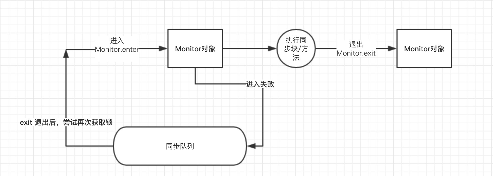
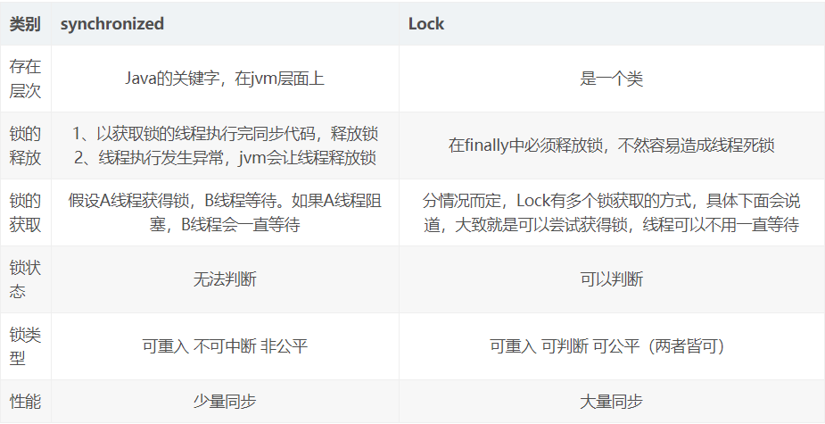

#### synchronized

（1）是如何实现的？

```shell
## 原理
JVM 是通过进入、退出对象监视器( Monitor )来实现对方法、同步块的同步的。
## 具体实现
在编译之后的同步方法(块)上，在调用前加入一个 monitor.enter 指令，在退出方法和异常处插入 monitor.exit 的指令。
## 本质
对一个对象监视器(Monitor)进行获取，而这个获取过程具有 排他性 从而达到了同一时刻只能一个线程访问的目的。而对于没有获取到锁的线程将会阻塞到方法入口处，直到获取锁的线程 monitor.exit 之后才能尝试继续获取锁。
## 锁信息存放位置
锁信息存在对象头中，任何对象都可以作为锁
对象头中的信息： Mark Word    Class MetaData Address
## 不同java版本间
jdk1.6以前 synchronized是基于重量锁实现的，即每次遇到同步代码都要获取锁，然后释放锁，
jdk1.6之后对其优化，根据不同场景使用不同的策略，偏向锁、轻量锁、重量锁
```



（2）作用

> 1）确保线程互斥的访问同步代码
>
> 2）保证共享变量的修改能够及时可见
>
> 3）有效解决重排序问题。

（3）synchronized的实现机制

```powershell
1.Java对象头:两部分数据：Mark Word（标记字段）、Klass Pointer（类型指针）。
## Klass Point是对象指向它的类元数据的指针，虚拟机通过这个指针来确定这个对象是哪个类的实例;
## Mark Word用于存储对象自身的运行时数据，如哈希码（HashCode）、GC分代年龄、锁状态标志、线程持有的锁、偏向线程 ID、偏向时间戳等等,它是实现轻量级锁和偏向锁的关键.

2.Monitor：同步工具or一种同步机制，它通常被描述为对象监视器。
当多个线程同时请求某个对象监视器时，对象监视器会设置几种状态用来区分请求的线程：
    Contention List：所有请求锁的线程将被首先放置到该竞争队列
    Entry List：Contention List中那些有资格成为候选人的线程被移到Entry List
    Wait Set：那些调用wait方法被阻塞的线程被放置到Wait Set
    OnDeck：任何时刻最多只能有一个线程正在竞争锁，该线程称为OnDeck
    Owner：获得锁的线程称为Owner
    !Owner：释放锁的线程
```

（4）java1.6之后synchronized的优化

```shell
## 引入了大量的优化，如自旋锁、适应性自旋锁、锁消除、锁粗化、偏向锁、轻量级锁
## 自旋锁：
让该线程等待一段时间，不会被立即挂起，看持有锁的线程是否会很快释放锁。
引入原因：线程的阻塞和唤醒需要CPU从用户态转为核心态，频繁的阻塞和唤醒对CPU来说是一件负担很重的工作，势必会给系统的并发性能带来很大的压力。
## 适应自旋锁
自旋的次数不再是固定的，它是由前一次在同一个锁上的自旋时间及锁的拥有者的状态来决定。自旋时间多，次数少
## 锁消除
JVM检测到不可能存在共享数据竞争，JVM会对这些同步锁进行锁消除。
锁消除的依据是逃逸分析的数据支持。
## 锁粗化
将多个连续的加锁、解锁操作连接在一起，扩展成一个范围更大的锁。

```

（5）锁的比较

|    锁    |                             优点                             |                      缺点                      |             适用场景             |
| :------: | :----------------------------------------------------------: | :--------------------------------------------: | :------------------------------: |
|  偏向锁  | 加锁和解锁不需要额外的消耗，和执行非同步方法比仅存在纳秒级的差距 | 如果线程间存在锁竞争，会带来额外的锁撤销的消耗 | 适用于只有一个线程访问同步块场景 |
| 轻量级锁 |           竞争的线程不会阻塞，提高了程序的响应速度           |  如果始终得不到锁竞争的线程使用自旋会消耗CPU   |   追求响应时间,锁占用时间很短    |
| 重量级锁 |               线程竞争不使用自旋，不会消耗CPU                |             线程阻塞，响应时间缓慢             |    追求吞吐量,锁占用时间较长     |

（6）可重入性

```shell
从互斥锁的设计上来说，当一个线程试图操作一个由其他线程持有的对象锁的临界资源时，将会处于阻塞状态，但当一个线程再次请求自己持有对象锁的临界资源时，这种情况属于重入锁，请求将会成功，

在java中synchronized是基于原子性的内部锁机制，是可重入的，因此在一个线程调用synchronized方法的同时在其方法体内部调用该对象另一个synchronized方法，也就是说一个线程得到一个对象锁后再次请求该对象锁，是允许的，这就是synchronized的可重入性。
```

（7）区别synchronized和lock：

```shell
## 用法
synchronized：在需要同步的对象中加入此控制，synchronized可以加在方法上、代码块中，括号中表示需要锁的对象。
 
lock：需要显示指定起始位置和终止位置。一般使用ReentrantLock类做为锁，多个线程中必须要使用一个

ReentrantLock类做为对象才能保证锁的生效。且在加锁和解锁处需要通过lock()和unlock()显示指出。所以一般会在finally块中写unlock()以防死锁。

## 性能
synchronized是托管给JVM执行的，原始采用的是CPU悲观锁机制，即独占锁。只能依靠阻塞来等待线程释放锁。
lock是java写的控制锁的代码。用的是乐观锁方式

Java1.5，synchronize是性能低效的。是一个重量级操作，需要调用操作接口，导致有可能加锁消耗的系统时间比加锁以外的操作还多。使用Java提供的Lock对象，性能更高一些。
Java1.6。synchronize进行优化，有适应自旋，锁消除，锁粗化，轻量级锁，偏向锁等。在Java1.6上synchronize的性能并不比Lock差。官方也更支持synchronize

## 用途区别
synchronized原语和ReentrantLock在一般情况下没有什么区别，
在非常复杂的同步应用中，请考虑使用ReentrantLock，特别是遇到下面需求的时候。
1.某个线程在等待一个锁的控制权的这段时间需要中断
2.需要分开处理一些wait-notify，ReentrantLock里面的Condition应用，能够控制notify哪个线程
3.具有公平锁功能，每个到来的线程都将排队等候
```

synchronized：依赖JVM实现锁，因此在这个关键字作用对象的作用范围内是同一时刻只能有一个线程进行操作；
LOCK：是JDK提供的代码层面的锁，依赖CPU指令，代表性的是ReentrantLock。



synchronized 和 lock 之间关系、不使用 synchronized 如何实现一个线程安全的单例

synchronized 和原子性、可见性和有序性之间的关系

<https://www.cnblogs.com/mingyao123/p/7424911.html>