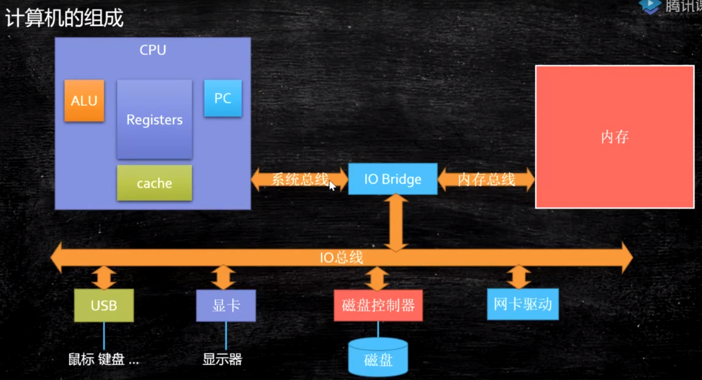
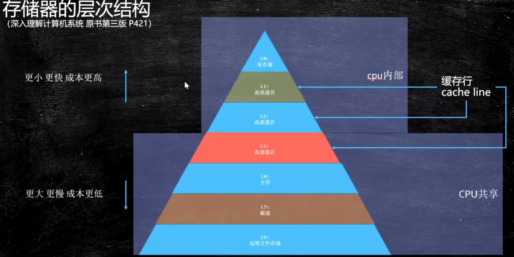
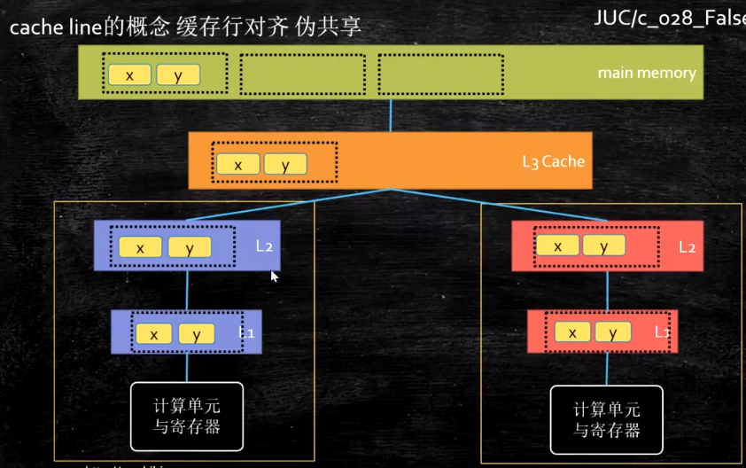
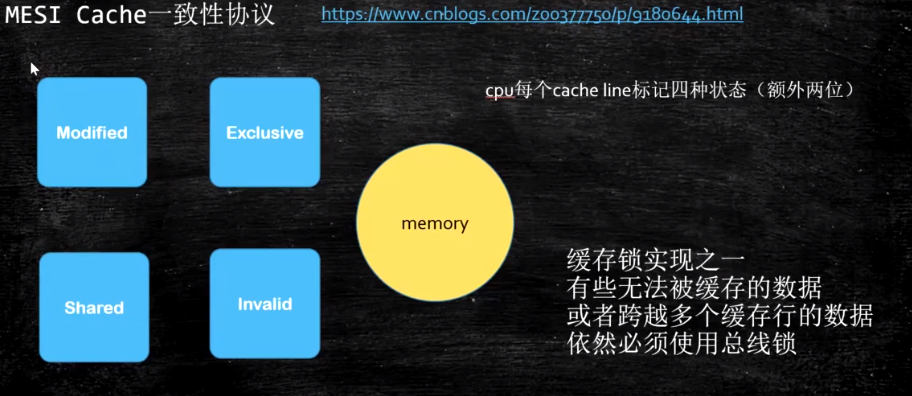

1、保证线程可见性

2、cache line缓存行概念

cpu在读数据时候是以块为单位读，

volatile也是对数据以块来处理，64字节为一缓存行，以行为单位

3、MESI

4、乱序执行

指令重排

系统底层如何实现数据一致性

1、MESI如果能解决，使用MESI

2、如果不能，就锁总线

系统底层如何保证有序性

1、sfence mfence Ifence等系统原语（内存屏障）

2、锁总线

volatile如何解决指令重排序