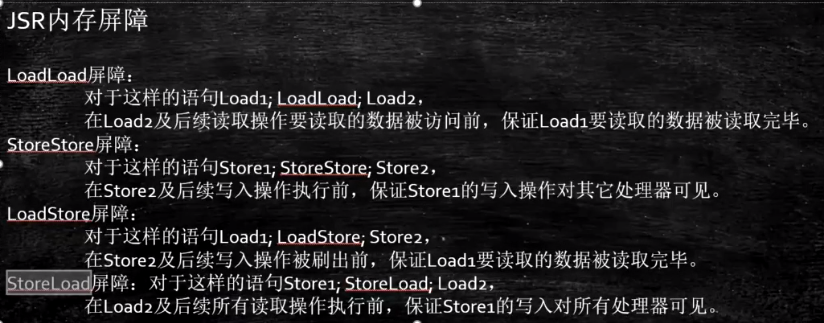

##### 1、保证线程可见性

##### 2、防止指令重排

问题：DCL（double check lock）单例需不需要加volatile


​		没有加volatile，会导致指令重排，半初始化状态的对象被使用


**volatile如何解决指令重排序**

1、volatile i

2、ACC_VOLATILE（class字节码）

3、JVM的内存屏障：屏障两边的指令不能重排



```
StoreStoreBarrier	  LoadLoadBarrier
volatile写操作			volatile读操作
StoreLoadBarrier	  LoadStoreBarrier
```

4、hotspot实现


5、乱序执行


指令重排


系统底层如何实现数据一致性

1、MESI如果能解决，使用MESI

2、如果不能，就锁总线


系统底层如何保证有序性

1、sfence mfence Ifence等系统原语（内存屏障）

2、锁总线


