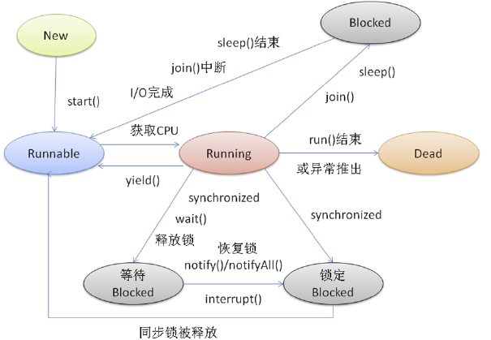

#### 1、线程的基本概念

##### （1）线程的定义：

​		进程中的一个执行任务（控制单元），负责当前进程中程序的执行。一个进程至少有一个线程，一个进程可以运行多个线程，多个线程可共享数据。

​		同一进程的线程共享本进程的地址空间和资源

##### （2）线程状态转化



##### （3）线程的分类

守护线程和用户线程

```
用户 (User) 线程：运行在前台，执行具体的任务，如程序的主线程、连接网络的子线程等都是用户线程，daemon = false

守护 (Daemon) 线程：运行在后台，为其他前台线程服务。也可以说守护线程是 JVM 中非守护线程的 “佣人”。一旦所有用户线程都结束运行，守护线程会随 JVM 一起结束工作，daemon = true

main 函数所在的线程就是一个用户线程
```

注意事项：

1、setDaemon(true)必须在start()方法前执行，否则会抛出 IllegalThreadStateException 异常

2、在守护线程中产生的新线程也是守护线程

3、守护 (Daemon) 线程中不能依靠 finally 块的内容来确保执行关闭或清理资源的逻辑。守护线程会随 JVM 一起结束工作，所以守护 (Daemon) 线程中的 finally 语句块可能无法被执行。

**当所有用户线程都执行完，只存在守护线程在运行时，JVM 就退出**。

```java
底层实现
// 当非守护线程数量大于 1 时，就一直等待，直到剩下一个非守护线程时，就会在线程执行完后，退出 JVM。
bool Threads::destroy_vm() {
  JavaThread* thread = JavaThread::current();
#ifdef ASSERT
  _vm_complete = false;
#endif
/**
 * 等待自己是最后一个非守护线程条件
 */
// Wait until we are the last non-daemon thread to execute
{ MonitorLocker nu(Threads_lock);
    while (Threads::number_of_non_daemon_threads() > 1)
    /**
     * 非守护线程数大于 1，则一直等待
     */
    // This wait should make safepoint checks, wait without a timeout,
    // and wait as a suspend-equivalent condition.
    nu.wait(0, Mutex::_as_suspend_equivalent_flag);
}
/**
 * 下面代码是关闭 VM 的逻辑
 */
EventShutdown e;
if (e.should_commit()) {
   e.set_reason("No remaining non-daemon Java threads");
   e.commit();
}
  ...... 省略余下代码
}
```

（4）Java的优先级

Java中线程优先级用1~10来表示，分为三个级别：

```
低优先级：1~4，其中类变量Thread.MIN_PRORITY最低，数值为1；

默认优先级：如果一个线程没有指定优先级，默认优先级为5，由类变量Thread.NORM_PRORITY表示；

高优先级：6~10，类变量Thread.MAX_PRORITY最高，数值为10。
```

注意：

1、不是高优先级的线程就一定先比低优先级执行完，而是高优先级线程先执行的概率比低优先级的线程高。

2、具有相同优先级的多个线程，若它们都为高优先级Thread.MAX_PRORITY，则每个线程都是独占式的，也就是这些线程将被顺序执行；若它们优先级不是高优先级，则这些线程将被同时执行，可以说是无序执行。


（3）多线程：

```
线程是进程内的执行单元，多线程是这个程序（一个进程）运行时产生了不止一个线程
```

（3）并行与并发：

```shell
并行：多个cpu实例或者多台机器同时执行一段处理逻辑，是真正的同时。
并发：指两个或多个事件在同一时间间隔内发生，即交替做不同事的能力，通过cpu调度算法，让用户看上去同时执行，实际上从cpu操作层面不是真正的同时。

`并发往往在场景中有公用的资源，那么针对这个公用的资源往往产生瓶颈，我们会用TPS或者QPS来反应这个系统的处理能力。`
```

（4）同步与异步

```shell
同步：指的发出一个调用时，如果没有得到结果就不返回，直到有结果后再返回。
异步：指的是发出一个调用时就立即返回而不在乎此时有没有结果。
```

（5）线程安全

```
指在并发的情况之下，该代码经过多线程使用，线程的调度顺序不影响任何结果。
一个对象被多个线程同时访问，还能保持其内部属性的顺序性及同步性，则认定为线程安全
```


#### 2、线程安全

什么是线程安全？

（1）如何保证线程安全？

```shell
①原子性：提供互斥访问，同一时刻只能有一个线程对数据进行操作，（atomic,synchronized，lock，atomic类）；
②可见性：一个线程对主内存的修改可以及时地被其他线程看到，（synchronized,volatile）；
③有序性：一个线程观察其他线程中的指令执行顺序，由于指令重排序，该观察结果一般杂乱无序，（happens-before原则）。
可以通过volatile、synchronized、lock保证有序性。
```

（2）线程安全级别

```shell
①不可变的——也就是有final修饰的类，例如String、Long，它们就不用外部同步。
②无条件的线程安全——这个类没有final修饰，但其内部已经保证了线程安全，例如并发包中的并发集合类，同样它们无需外部同步。
③有条件的线程安全——这个有的方法需要外部同步，而有的方法则和“无条件的线程安全”一样无需外部同步。
④非线程安全——这就是最“普通”的类了，内部的任何方法想要保证安全性就必须要外部同步。
```

→ 线程安全
死锁、死锁如何排查、Java线程调度、线程安全和内存模型的关系


1、什么是线程安全

2、如何确保线程安全

3、线程安全的实现


（1）线程安全

“线程安全”也不是指线程的安全，而是指内存的安全。

进程：为了保证安全，每个进程只能访问分配给自己的内存空间，而不能访问别的进程的，这是由操作系统保障的。

堆（内存）：每个进程的内存空间中都会有一块特殊的公共区域，通常称为堆（内存）。进程内的所有线程都可以访问到该区域，进程中的公共变量都在堆里

栈内存：操作系统会为每个线程分配属于它自己的内存空间，局部变量会在每个线程的栈内存中都分配一份。由于线程的栈内存只能自己访问，所以栈内存中的变量只属于自己，其它线程根本就不知道


保证线程安全：

1、每个线程里都copy一份数据：

ThreadLocal就是，把一个数据复制N份，每个线程在运行时都会拷贝一份存储到自己的本地，互不影响。

2、只能读取，不能修改。

其实就是常量或只读变量，final

3、数据只有某个线程会使用，其它线程不能操作也不需要操作，这些数据就可以放入线程的栈内存中。局部变量

4、并发量大，变量需要多个线程操作时，使用锁

为了保证数据的一致性，需要在每次操作前先获取锁，操作完成后再释放锁。相当于悲观锁

Lock、synchronize

5、在并发很小的情况下，数据被意外修改的概率很低，但是又存在这种可能性，此时就用CAS

在修改前检查，被修改后替换，相当于乐观锁


#### 4、

happens-before、内存屏障、编译器指令重排和 CPU 指令重
volatile 的实现原理
volatile 和原子性、可见性和有序性之间的关系
有了 symchronized 为什么还需要 volatile
不使用synchronized如何实现一个线程安全的单例


#### 5、线程的一些概念


→ sleep 和 wait
→ wait 和 notify
→ notify 和 notifyAll

守护线程
守护线程和非守护线程的区别以及用法

→ 什么是线程，与进程的区别
线程的实现、线程的状态、优先级、线程调度、创建线程的多种方式、守护线程
线程与进程的区别

#### 6、线程池

自己设计线程池、submit() 和 execute()、线程池原理
为什么不允许使用 Executors 创建线程池


→ ThreadLocal
→ 写代码来解决生产者消费者问题
→ 并方包
写代码来解决生产者消费者问题


**什么是上下文切换?**

背景：一个 CPU 核心在任意时刻只能被一个线程使用

目的：为了执行更有效率

策略：CPU 采取的策略是为每个线程分配时间片并轮转的形式

一次上下文切换：当一个线程的时间片用完的时候就会重新处于就绪状态让给其他线程使用

概括来说就是：当前任务在执行完 CPU 时间片切换到另一个任务之前会先保存自己的状态，以便下次再切换回这个任务时，可以再加载这个任务的状态。任务从保存到再加载的过程就是一次上下文切换。

上下文切换通常是计算密集型的。

时间：纳秒级

上下文切换对系统来说意味着消耗大量的 CPU 时间，事实上，可能是操作系统中时间消耗最大的操作。

Linux 相比与其他操作系统（包括其他类 Unix 系统）有很多的优点，其中有一项就是，其上下文切换和模式切换的时间消耗非常少。