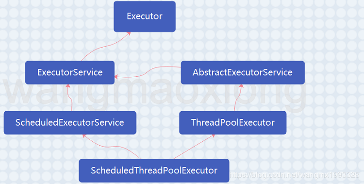

Executor类图：



```java
// 调用方法
// 创建并执行在给定延迟后启用的单次操作
public ScheduledFuture<?> schedule(Runnable command, long delay, TimeUnit unit);

// 创建并执行在给定的初始延迟之后，以给定的时间间隔执行周期性动作。即在 initialDelay 初始延迟后，initialDelay+period 执行第一次，initialDelay + 2 * period  执行第二次，依次类推。
ScheduledFuture<?> scheduleAtFixedRate(Runnable command, long initialDelay, long period, TimeUnit unit)

// 创建并执行在给定的初始延迟之后首先启用的定期动作，随后上一个执行的终止和下一个执行的开始之间给定的延迟。
ScheduledFuture<?> scheduleWithFixedDelay(Runnable command, long initialDelay, long delay, TimeUnit unit)

```

**简述：**

1、public interface ScheduledExecutorService extends ExecutorService 延迟或定期执行任务。 

2、schedule 方法使用各种延迟创建任务，并返回一个可用于取消或检查执行的任务对象

3、scheduleAtFixedRate 和 scheduleWithFixedDelay 方法创建并执行某些在取消前一直定期运行的任务

4、所有的 schedule 方法都接受相对延迟和周期作为参数，而不是绝对的时间或日期

5、SheduleExecutorService 是JDK 1.5出来的，比以前的 Timer 性能好


**scheduleAtFixedRate方法：**

（1）执行任务的时间与任务执行过程花费的时间无关，只与period有关

（2）如果任务的任何一个执行遇到异常，则后续执行都会被取消

（3）执行要花费比其周期更长的时间，则将推迟后续执行，但不会同时执行


```java
// Executors 工具创建
ScheduledExecutorService service = Executors.newSingleThreadScheduledExecutor();
// 实现类ScheduledThreadPoolExecutor
public ScheduledFuture<?> scheduleAtFixedRate(Runnable command, 
               long initialDelay, long period, TimeUnit unit) {
    if (command == null || unit == null)
        throw new NullPointerException();
    if (period <= 0)
        throw new IllegalArgumentException();
    ScheduledFutureTask<Void> sft =
        new ScheduledFutureTask<Void>(command,
                                      null,
                                      triggerTime(initialDelay, unit),
                                      unit.toNanos(period));
    RunnableScheduledFuture<Void> t = decorateTask(command, sft);
    sft.outerTask = t;
    delayedExecute(t);
    return t;
}
```

主要流程：

（1）根据initTime和period时间计算出第一次执行的时间差，

（2）调ReentrantLock.newCondition().awaitNanos(long nanosTimeout)方法，到指定的时间进行唤醒，分配线程进行执行。

对于后续的周期性执行的await时间为period.

```java
// ScheduledThreadPoolExecutor
public RunnableScheduledFuture<?> take() throws InterruptedException {
    final ReentrantLock lock = this.lock;
    lock.lockInterruptibly();
    try {
        for (;;) {
            RunnableScheduledFuture<?> first = queue[0];
            if (first == null)
                available.await();
            else {
                long delay = first.getDelay(NANOSECONDS);
                if (delay <= 0)
                    return finishPoll(first);
                first = null; // don't retain ref while waiting
                if (leader != null)
                    available.await();
                else {
                    Thread thisThread = Thread.currentThread();
                    leader = thisThread;
                    try {
                        available.awaitNanos(delay);
                    } finally {
                        if (leader == thisThread)
                            leader = null;
                    }
                }
            }
        }
    } finally {
        if (leader == null && queue[0] != null)
            available.signal();
        lock.unlock();
    }
}
```

