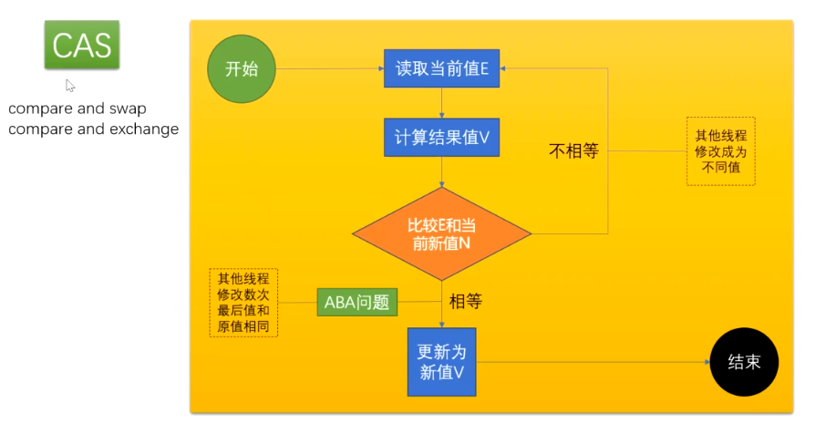
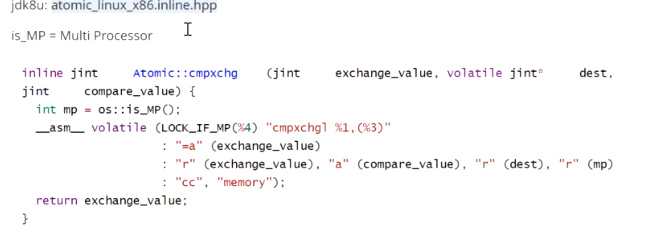

### 乐观锁的实现方式

`版本号机制` 

`CAS（Compare-and-Swap，即比较并替换）`

**1、版本号机制**

版本号机制是在数据表中加上一个 `version` 字段来实现的，表示数据被修改的次数，当执行写操作并且写入成功后，version = version + 1，当线程A要更新数据时，在读取数据的同时也会读取 version 值，在提交更新时，若刚才读取到的 version 值为当前数据库中的version值相等时才更新，否则重试更新操作，直到更新成功。

例子：

事务一开启，男柜员先执行读操作，取出金额和版本号，执行写操作

```
begin
update 表 set 金额 = 120,version = version + 1 where 金额 = 100 and version = 0
```

此时金额改为 120，版本号为1，事务还没有提交

事务二开启，女柜员先执行读操作，取出金额和版本号，执行写操作

```
begin
update 表 set 金额 = 50,version = version + 1 where 金额 = 100 and version = 0
```

此时金额改为 50，版本号变为 1，事务未提交

现在提交事务一，金额改为 120，版本变为1，提交事务。理想情况下应该变为 金额 = 50，版本号 = 2，但是实际上事务二 的更新是建立在金额为 100 和 版本号为 0 的基础上的，所以事务二不会提交成功，应该重新读取金额和版本号，再次进行写操作。

这样，就避免了女柜员 用基于 version = 0 的旧数据修改的结果覆盖男操作员操作结果的可能。


**2、CAS**

```java
// 全称是 compare and swap，是一种用于在多线程环境下实现同步功能的机制。

// 包含 3 个参数 CAS（V，E，N），V表示要更新变量的值，E表示预期值，N表示新值。
// 仅当 V值等于E值时，才会将V的值设为N，如果V值和E值不同，则说明已经有其他线程做两个更新，则当前线程则什么都不做。最后，CAS 返回当前V的真实值

public final int incrementAndGet() {
    for (;;) {
        int current = get();
        int next = current + 1;
        if (compareAndSet(current, next))
            return next;
    }
}
// 最终实现
cmpxchg=cas修改变量值
lock cmpxchg 指令（lock是当前cpu在执行此命令时候其他cpu不能打断该操作）
// 硬件
lock执行时候是锁定了一个北桥信号而非总线
```

CAS是英文单词CompareAndSwap的缩写，中文意思是：比较并替换。CAS需要有3个操作数：内存地址V，旧的预期值A，即将要更新的目标值B。

CAS指令执行时，当且仅当内存地址V的值与预期值A相等时，将内存地址V的值修改为B，否则就什么都不做。整个比较并替换的操作是一个原子操作。



linux源码：




（1）aba问题

```
线程 1 从内存位置V中取出A。
线程 2 从位置V中取出A。
线程 2 进行了一些操作，将B写入位置V。
线程 2 将A再次写入位置V。
线程 1 进行CAS操作，发现位置V中仍然是A，操作成功。
```

（2）aba问题解决

```
如何解决CAS中的ABA问题
	ABA问题的解决思路就是使用版本号。在变量前面追加上版本号，每次变量更新的时候把版本号加一，那么A－B－A 就会变成1A-2B－3A。

在java中可以使用AtomicStampedReference 这个类解决ABA问题，内部维护了对象值，和一个状态值。
当AtomicStampedReference对应的数值被修改时，除了更新数据本身外，还必须要更新状态值。
当AtomicStampedReference设置对象值时，对象值以及状态值都必须满足期望值，写入才会成功。
因此，即使对象值被反复读写，写回原值，只要状态值发生变化，就能防止不恰当的写入。
```


什么是ABA问题？ABA问题怎么解决？

如果内存地址V初次读取的值是A，并且在准备赋值的时候检查到它的值仍然为A，不能说它的值没有被其他线程改变过，

如果在这段期间它的值曾经被改成了B，后来又被改回为A，那CAS操作就会误认为它从来没有被改变过。这个漏洞称为CAS操作的“ABA”问题

Java并发包为了解决这个问题，提供了一个带有标记的原子引用类“AtomicStampedReference”，它可以通过控制变量值的版本来保证CAS的正确性。


（3）CAS引发的问题

```gfm
## 1、ABA问题
解决：加版本号解决。

## 2、循环时间长开销大
自旋CAS长时间不成功，给CPU带来非常大的开销。
解决：JVM 能支持处理器提供的pause指令

【pause指令有两个作用】
第一它可以延迟流水线执行指令（de-p ip eline）,使CPU不会消耗过多的执行资源，延迟的时间取决于具体实现的版本，在一些处理器上延迟时间是零。
第二它可以避免在退出循环的时候因内存顺序冲突（memory order violation）而引起CPU流水线被清空（CPU pipeline flush），从而提高CPU的执行效率。

## 3、只能保证一个共享变量的原子操作
解决：可以用锁，或者把多个共享变量合并成一个共享变量来操作（如：AtomicReference）。
```


CAS与synchronized的使用情景

- 对于资源竞争较少（线程冲突较轻）的情况，使用 Synchronized 同步锁进行线程阻塞和唤醒切换以及用户态内核态间的切换操作额外浪费消耗 cpu 资源；而 CAS 基于硬件实现，不需要进入内核，不需要切换线程，操作自旋几率较少，因此可以获得更高的性能。
- 对于资源竞争严重（线程冲突严重）的情况，CAS 自旋的概率会比较大，从而浪费更多的 CPU 资源，效率低于 synchronized。