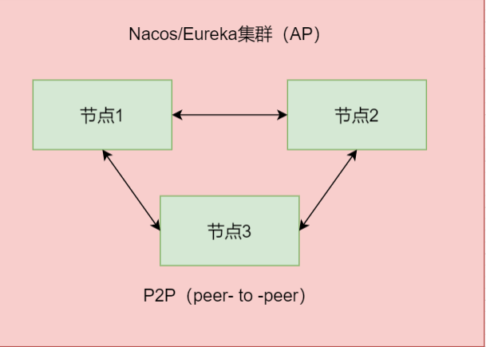
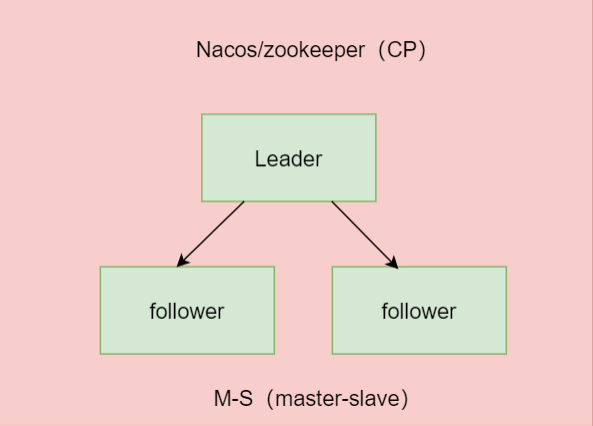

AP架构

满足AP的系统在一定程度上也可以说是符合BASE原则的，比如eureka集群,三个节点挂了两个,系统还是基本能用的 (BA)，此时如果有系统来注册了，因为挂了两个节点，这时整个系统的各节点间的数据是不—致的，但是等另外两 个节点恢复了，数据会同步过去(E).对于中间暂时的数据不—致状态可以称为软状态(S) 

CP架构

脑裂：集群(M-S的情况)的脑裂通常是发生在节点之间通信不可达(分区)的情况下，集群会分裂成不同的小集群，小 

集群各自选出自己的master节点，导致原有的集群出现多个master节点的情况。