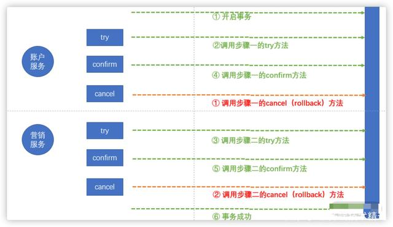

一、业务场景：

使用积分换折扣券时，需要实现扣除用户积分、生成一张折扣券给用户这 2 个步骤。如果我们还是使用最终一致性方案的话，有可能出现用户积分扣除了而折扣券还未生成的情况，此时用户进入账户一看，积分没了也没有折扣券，立马就会投诉。

解决：

一、两阶段提交

MySQL 有一个两阶段提交的分布式事务方案（MySQL XA），但是存在严重的性能问题。

问题

一个数据库的事务与多个数据库间的 XA 事务性能可能相差 10 倍。

在 XA 的事务处理过程中它会长期占用锁资源

二、TCC 模式（流行）

一个接口分为 Try 接口、Confirm 接口、Cancel 接口。

- Try 接口用来检查数据、预留业务资源。
- Confirm 接口用来确认实际业务操作、更新业务资源。
- Cancel 接口是指释放 Try 接口中预留的资源。

1. 我们需要保证每个服务的 Try 方法执行成功后，Confirm 方法在业务逻辑上能够执行成功；
2. 可能会出现 Try 方法执行失败而 Cancel 被触发的情况，此时我们需要保证正确回滚；
3. 可能因为网络拥堵出现 Try 方法的调用被堵塞的情况，此时事务控制器判断 Try 失败并触发了 Cancel 方法，后来 Try 方法的调用请求到了服务这里，此时我们应该拒绝 Try 请求逻辑；
4. 所有的 Try、Confirm、Cancel 都需要确保幂等性；
5. 整个事务期间的数据库数据处于一个临时的状态，其他请求需要访问这些数据时，我们需要考虑如何正确被其他请求使用，而这种使用包括读取和并发的修改。

注意：每个业务代码的工作量 X3 之外，出错的概率也高

三、Seata 中 AT 模式的自动回滚

只需要在触发整个事务的业务发起方的方法中加入@GlobalTransactional 标注，且使用普通的 @Transactional 包装好分布式事务中相关服务的相关方法即可。

（一）一阶段

1. 解析每个服务方法执行的 SQL，记录 SQL 的类型（Update、Insert 或 Delete），修改表并更新 SQL 条件等信息；
2. 根据前面的条件信息生成查询语句，并记录修改前的数据镜像；
3. 执行业务的 SQL；
4. 记录修改后的数据镜像；
5. 插入回滚日志：把前后镜像数据及业务 SQL 相关的信息组成一条回滚日志记录，插入 UNDO_LOG 表中；
6. 提交前，向 TC 注册分支，并申请相关修改数据行的全局锁 ；
7. 本地事务提交：业务数据的更新与前面步骤生成的 UNDO LOG 一并提交；
8. 将本地事务提交的结果上报给事务控制器。

（二）二阶段-回滚

收到事务控制器的分支回滚请求后，我们会开启一个本地事务，并执行如下操作：

1. 查找相应的 UNDO LOG 记录；
2. 数据校验：拿 UNDO LOG 中的后镜像数据与当前数据进行对比，如果存在不同，说明数据被当前全局事务之外的动作做了修改，此时我们需要根据配置策略进行处理；
3. 根据 UNDO LOG 中的前镜像和业务 SQL 的相关信息生成回滚语句并执行；
4. 提交本地事务，并把本地事务的执行结果（即分支事务回滚的结果）上报事务控制器。

（三）二阶段-提交

1. 收到事务控制器的分支提交请求后，我们会将请求放入一个异步任务队列中，并马上返回提交成功的结果给事务控制器。
2. 异步任务阶段的分支提交请求将异步地、批量地删除相应 UNDO LOG 记录。