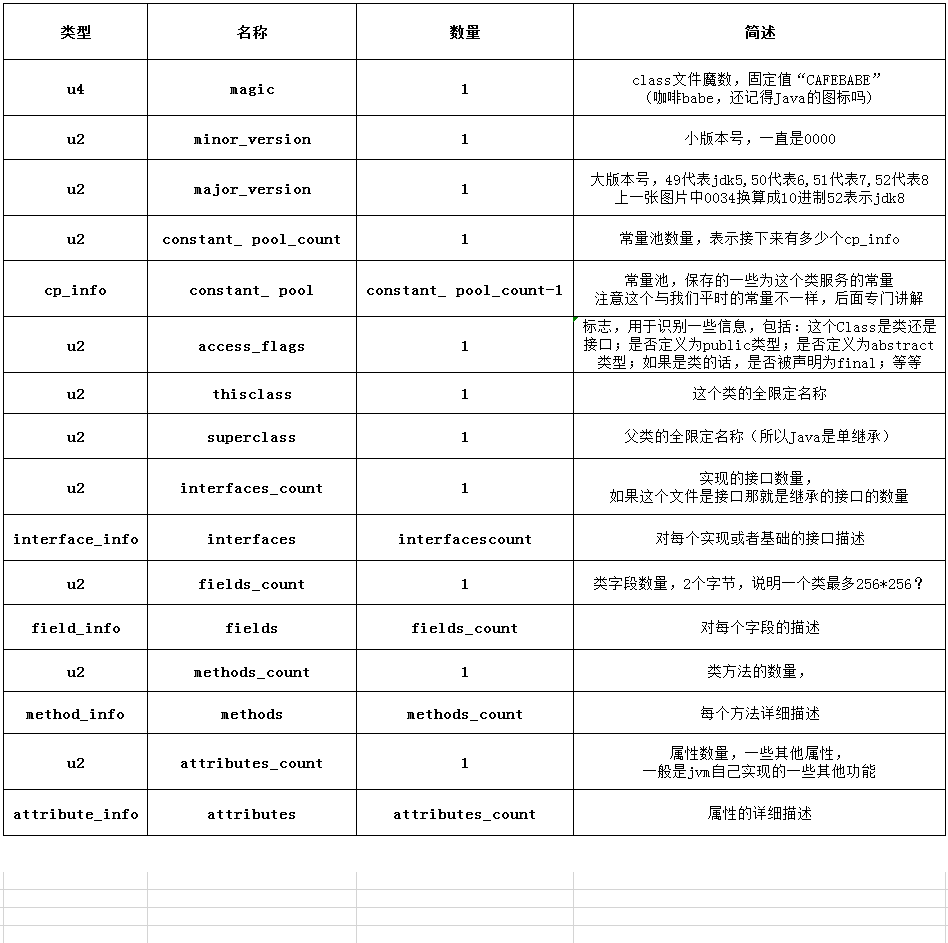
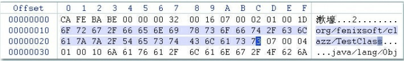

CLASS文件结构图



**class文件中的内容按上图严格排列，其中类型u1、u2、u4、u8来分别代表1个字节、2个字节、4个字节和8个字节。\*_info则表示有层次关系的复合结构的数据，每一种都有独立的结构，在每种数据的第一步都会标记占用的字节数。**



##### (1）魔数（Magic Number）

头4个字节CA FE BA BE

它的唯一作用是确定这个文件是否为一个能被虚拟机接受的Class文件


##### (2）版本号

00 00 00 32

第5和第6个字节是次版本号（Minor Version），第7和第8个字节是主版本号（Major Version）

版本号从45开始，jdk8为52


##### (3）常量池

位于主、次版本号之后

常量池中主要存放两大类常量：字面量（Literal）和符号引用（Symbolic References）

主要包括下面几类常量： 

```
·被模块导出或者开放的包（Package） 
·类和接口的全限定名（Fully Qualified Name） 
·字段的名称和描述符（Descriptor） 
·方法的名称和描述符 
·方法句柄和方法类型（Method Handle、Method Type、Invoke Dynamic） 
·动态调用点和动态常量（Dynamically-Computed Call Site、Dynamically-Computed Constant）
```


##### (4）访问标志（access_flags）

常量池后，紧接着的2个字节