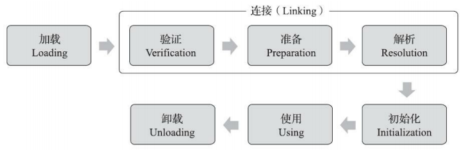

##### 一、类的生命周期

加载（Loading）、验证（Verification）、准备（Preparation）、解析（Resolution）、初始化 （Initialization）、使用（Using）和卸载（Unloading）七个阶段



##### 二、初始化时机

有且只有六种情况必须立即对类进行“初始化”

（1）遇到new、getstatic、putstatic或invokestatic这四条字节码指令时，如果类型没有进行过初始 

化，则需要先触发其初始化阶段。

能够生成这四条指令的典型Java代码场景有： 

​		·使用new关键字实例化对象的时候。 

​		·读取或设置一个类型的静态字段（被final修饰、已在编译期把结果放入常量池的静态字段除外） 

的时候。

​		·调用一个类型的静态方法的时候。 

（2）使用java.lang.reflect包的方法对类型进行反射调用的时候，如果类型没有进行过初始化，则需要先触发其初始化。

（3）当初始化类的时候，如果发现其父类还没有进行过初始化，则需要先触发其父类的初始化。 

（4）当虚拟机启动时，用户需要指定一个要执行的主类（包含main()方法的那个类），虚拟机会先初始化这个主类。 

（5）当使用JDK 7新加入的动态语言支持时，如果一个java.lang.invoke.MethodHandle实例最后的解 析结果为REF_getStatic、REF_putStatic、REF_invokeStatic、REF_newInvokeSpecial四种类型的方法句柄，并且这个方法句柄对应的类没有进行过初始化，则需要先触发其初始化。 

（6）当一个接口中定义了JDK 8新加入的默认方法（被default关键字修饰的接口方法）时，如果有这个接口的实现类发生了初始化，那该接口要在其之前被初始化。


注意：

```
常量在编译阶段会存入调用类的常量池中，本质上没有直接引用到定义常量的类，因此不会触发定义常量的类的初始化

通过子类引用父类的静态字段，不会导致子类初始化

通过数组定义来引用类，不会触发此类的初始化
```


##### 三、类加载过程

**（1）加载**

1）通过一个类的全限定名来获取定义此类的二进制字节流。 

2）将这个字节流所代表的静态存储结构转化为方法区的运行时数据结构。 

3）在内存中生成一个代表这个类的java.lang.Class对象，作为方法区这个类的各种数据的访问入口。

**（2）验证**

连接阶段的第一步，这一阶段的目的是确保Class文件的字节流中包含的信息符合《Java虚拟机规范》的全部约束要求，保证这些信息被当作代码运行后不会危害虚拟机自身的安全。 

四个阶段的检验动作：

文件格式验证、元数据验证、字节码验证和符号引用验证

**（3）准备**

是正式为类中定义的变量（即静态变量，被static修饰的变量）分配内存并设置类变量初始值的阶段

```java
// value在准备阶段过后的初始值为0而不是123，这时尚未开始执行任何Java方法，而把value赋值为123的putstatic指令是程序被编译后，存放于类构造器<clinit>()方法之中，所以把value赋值为123的动作要到类的初始化阶段才会被执行。
public static int value = 123;
// 编译时Javac将会为value生成ConstantValue属性，在准备阶段虚拟机就会根据Con-stantValue的设置 将value赋值为123
public static final int value = 123;
```

**（4）解析** 

是Java虚拟机将常量池内的符号引用替换为直接引用的过程


·符号引用（Symbolic References）：符号引用以一组符号来描述所引用的目标，符号可以是任何形式的字面量

·直接引用（Direct References）：直接引用是可以直接指向目标的指针、相对偏移量或者是一个能间接定位到目标的句柄。


**（5）初始化**

初始化阶段就是执行类构造器<clinit>()方法的过程。

<clinit>()方法是由编译器自动收集类中的所有类变量的赋值动作和静态语句块（static{}块）中的语句合并产生的

```java
// 静态语句块中只能访问 到定义在静态语句块之前的变量，定义在它之后的变量，在前面的静态语句块可以赋值，但是不能访问
public class Test { 
    static { 
        i = 0; // 给变量复制可以正常编译通过 
        System.out.print(i); // 这句编译器会提示“非法向前引用” 
    }
    static int i = 1; 
}
```

同一个类加载器下，一个类型只会被初始化一次