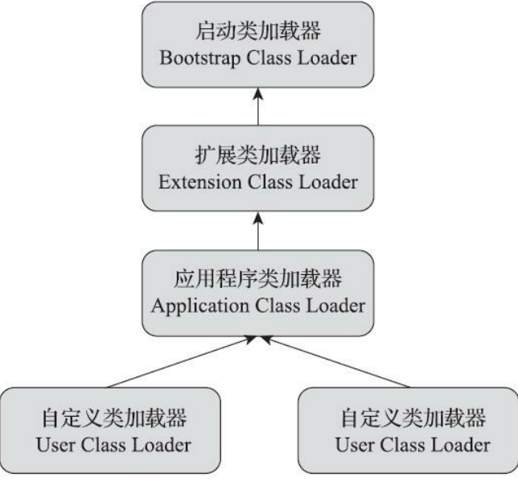

1、双亲委派模型



**工作过程：**

如果一个类加载器收到了类加载的请求，它首先不会自己去尝试加载这个类，而是把这个请求委派给父类加载器去完成，

每一个层次的类加载器都是如此，因此所有的加载请求最终都应该传送到最顶层的启动类加载器中，

只有当父加载器反馈自己无法完成这个加载请求（它的搜索范围中没有找到所需的类）时，子加载器才会尝试自己去完成加载。

```java
protected Class<?> loadClass(String name, boolean resolve)
    throws ClassNotFoundException 
    synchronized (getClassLoadingLock(name)) {
        // 首先，检查请求的类是否已经被加载过了
        Class<?> c = findLoadedClass(name);
        if (c == null) {
            long t0 = System.nanoTime();
            try {
                // 有父加载器用父加载器加载，没有用Bootstrap
                if (parent != null) {
                    c = parent.loadClass(name, false);
                } else {
                    c = findBootstrapClassOrNull(name);
                }
            } catch (ClassNotFoundException e) {
                // 如果父类加载器抛出ClassNotFoundException 
                // 说明父类加载器无法完成加载请求
            }

            if (c == null) {
                // 在父类加载器无法加载时 
                // 再调用本身的findClass方法来进行类加载
                long t1 = System.nanoTime();
                c = findClass(name);

                // this is the defining class loader; record the stats
                sun.misc.PerfCounter.getParentDelegationTime().addTime(t1 - t0);
                sun.misc.PerfCounter.getFindClassTime().addElapsedTimeFrom(t1);
                sun.misc.PerfCounter.getFindClasses().increment();
            }
        }
        if (resolve) {
            resolveClass(c);
        }
        return c;
    }
}
```