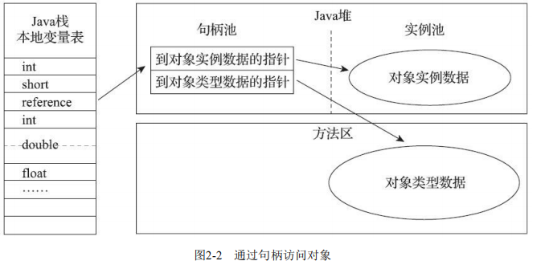
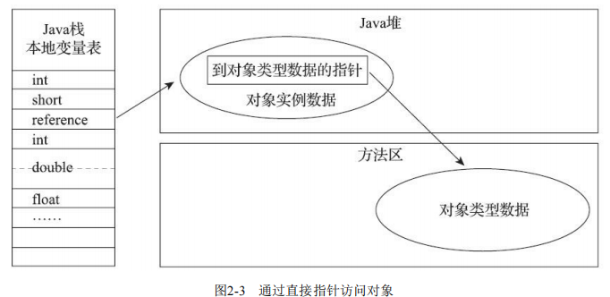

一、简述

1、Java程序会通过栈上的reference数据来操作堆上的具体对象。

2、reference类型在《Java虚拟机规范》里面只规定了它是一个指向对象的引用，并没有定义这个引用应该通过什么方式去定位、访问到堆中对象的具体位置，

3、对象访问方式也是由虚拟机实现而定的，

二、访问方式

主流的访问方式主要有使用句柄和直接指针两种

（1）句柄访问，Java堆中将可能会划分出一块内存来作为句柄池，reference中存储的就是对象的句柄地址，而句柄中包含了对象实例数据与类型数据各自具体的地址信息

（2）直接指针访问，Java堆中对象的内存布局就必须考虑如何放置访问类型数据的相关信息，reference中存储的直接就是对象地址，如果只是访问对象本身的话，就不需要多一次间接访问的开销

