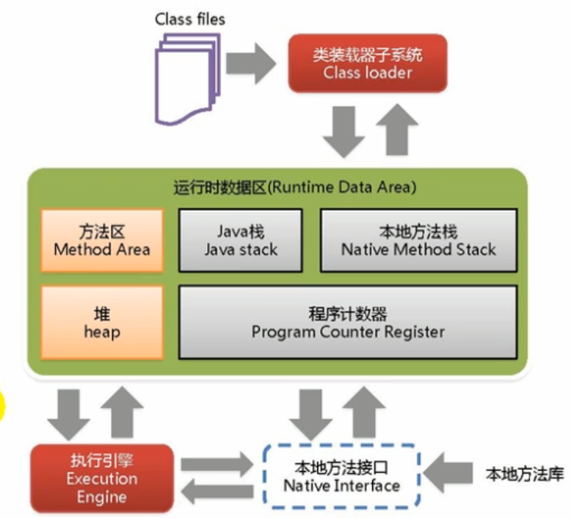

#### 1、Java虚拟机（JVM Java Virtual Machine）

##### （1）简述

Java技术核心是`Java虚拟机`，`Java`所有程序都在`Java虚拟机`内部运行，Java虚拟机就是二进制字节码的运行环境

JVM运行在操作系统之上，没有与硬件有直接交互

##### （2）特点：

一次编译到处运行

自动内存管理

自动垃圾回收功能


#### 2、JVM整体结构



JVM的基本组成

（1）指令集：JVM指令集

（2）类加载器：在jvm启动时或者类在运行时将需要的class加载到JVM中

（3）执行引擎：负责执行class文件中的字节码指令，相当于CPU

（4）运行时数据区：将内存划分成若干个区，分别完成不同的任务

（5）本地方法区：调用C或C++实现的本地方法代码返回的结果


#### 3、Java代码执行流程

Java源码（.java）---> Java编译器（编译）---> Java字节码 ----> jvm虚拟机执行 --->  操作系统


#### 4、JVM架构模型

（1）栈指令集架构

可移植性强，使用零地址指令

```c++
// 2+3
iconst_2	// 常量2入栈
istore_1
iconst_3	// 常量3入栈
istore_2
iload_1
iload_2
iadd		// 常量2,3出栈执行相加
istore_0	// 结果5入栈
```

（2）寄存器指令集架构

高效，可移植性差，指令更少

```java
// 常量2入栈
mov eax,2	// 将eax寄存器的值设置为2
mov add,3	// 将eax寄存器的值加3
```


#### 5、JVM的生命周期

（1）启动

引导`类加载器`创建一个`初始类`来完成，该类由虚拟机具体实现指定

（2）运行

执行java程序，程序开始运行，虚拟机也运行，程序结束虚拟机也结束

执行一个java程序，真正执行的是java虚拟机的进程

（3）退出

* 正常退出

* 遇到错误或异常而异常终止

* 操作系统错误导致虚拟机进程终止

* Runtim类或System类的exit（），Runtim类的halt（）


