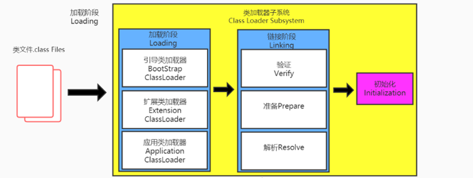
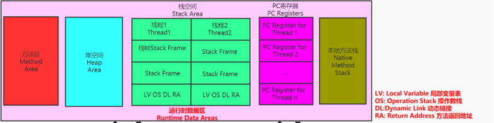
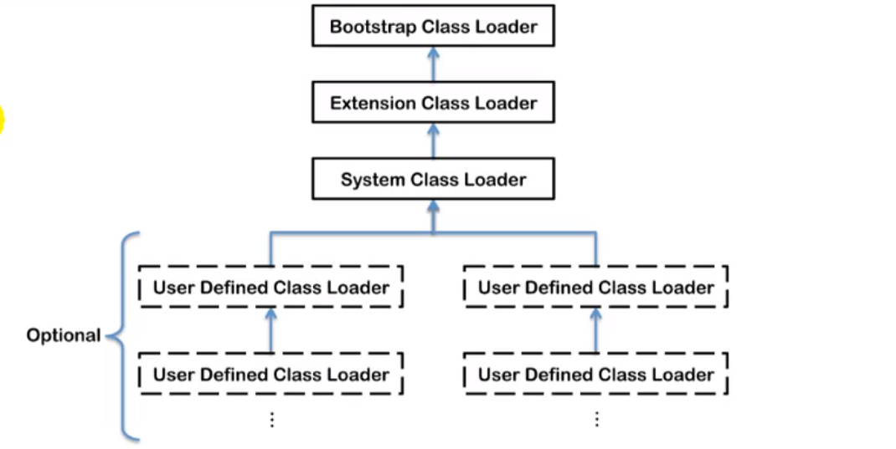

uClassLaoder只负责class文件的加载

Execution Engine

类加载过程：

#### 一、类加载过程：

##### （1）加载（loading）

1、通过类的全限定名获取该类的二进制字节流

2、将此字节流所代表的的静态存储数据结构转化为方法区的运行时数据结构

3、内存中生成一个代表该类的java.lang.class对象，作为方法区此类的各种数据的访问入口

加载.class 文件的方式

本地文件、网络、zip包获取、等等

##### （2）链接（linking）

验证（verification）---> 准备（preparation）-----> 解析（resolution）

1、验证（verification）：

确保class文件包含的信息符合虚拟机要求，保证类加载的正确性，不会危害虚拟机

包含：文件格式验证、元数据验证，字节码验证、符号引用验证

2、 准备（preparation）

为类变量分配内存，并设置类变量默认默认值，即0值

不包含final static修饰的，final编译时就分配，准备阶段显示初始化

3、解析（resolution）

将常量池中的符号引用转化为直接引语的过程

解析针对类或接口，字段，类方法，接口方法，接口类型

##### （3）初始化（initialication）

执行类构造器方法 <clinit>()的过程

构造器方法中指令按照语句在源文件中的顺序执行

一个类的 <clinit>()在多线程下同步加锁

#### 二、类加载器分类

##### （1）分类

引导类加载器（Bootstrap Classloader）、自定义类加载器（UserDefined ClassLoader）

四种加载器之间是：包含关系

##### （2）Bootstrap Classloader

c语言实现，在jvm内部

加载Java的核心库（jre/lib下的rt.jar、resource.jar， sun.boot.class.path下的）

只加载java，javax，sun等开头的类

不继承java.class.Classloader 无父类加载器

##### （3）Extension Classloader 扩展类下载器

派生于Classloader 类

父类加载器是启动类加载器

##### （4）AppClassloader 系统类加载器

父类加载器是扩展类加载器

派生于Classloader 类

是程序中默认的类加载器

##### （5）为何要自定义类加载器

隔离加载类

修改类加载方式

扩展加载源

防止代码泄露

#### 三、双亲委派机制

类加载按需加载，使用时才会将class文件加载到内存生产class对象，采用双亲委派模式加载

（1）原理：

1、类加载器收到类加载请求，不会立即加载，而是将请求委托给父类加载器去加载

2、父类加载器还有父类加载器，则依次递归，进一步往上委托

3、父类加载器可以完成类加载，则成功返回，如果不能，则子加载器尝试自己加载

（2）优势：

避免类重复加载

保护程序安全，防止核心api类被篡改

（3）两个class类对象是否为同一个类的必要条件

类的完整类名一致，包括包名

同一个类加载器加载