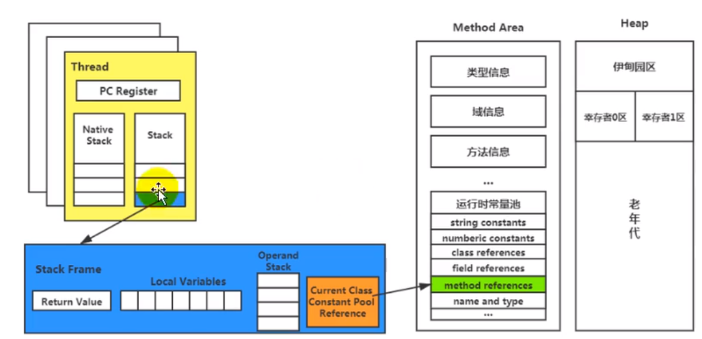

栈是运行时的单位，即程序如何执行

堆是存储的单位， 即数据怎么放，放在哪


Java虚拟机栈（Java Virtual Machine Stack）


#### 一、基础内容

##### 1、是什么

​	每个线程创造时都会创造一个虚拟机栈，内部保存一次次的栈帧，对应一次次的java方法调用

##### 2、生命周期

​	与线程一致

##### 3、作用：

​	管理java方法的调用，主管java程序运行，保存方法的局部变量、部分结果，并参与方法的调用和返回

##### 4、特点：

* 栈是一种快速有效的分配存储方式，访问速度仅次于程序计数器

* JVM直接对JAVA栈的操作有两个：

  每个方法执行，伴随着进栈（入栈，压栈）

  执行结束后的出栈工作

* 对栈来说不存在垃圾回收问题

##### 5、栈中可能出现的异常：

JVM虚拟机规范允许栈的大小是固定不变的也可以是动态的

（1）固定大小：线程请求分配的栈容量超过java虚拟机允许的最大值，报StackOverFlowError

（2）动态扩展：无法申请到足够的内存时，报OutOfMenoryError

##### 6、设置栈大小

-Xss

栈大小直接决定程序调用的深度


#### 二、栈的存储结构

##### 1、栈帧

栈中数据以栈帧格式存在

线程中每个正在执行的一个方法对应一个栈帧

栈帧是一个内存区块，是一个数据集


##### 2、栈运行原理

（1）jvm直接对java栈的操作有压栈和出栈，遵循先进后出，后进先出原则

（2）一条活动线程，一个时间点只有一个活动的栈帧

（3）执行引擎运行的所有字节码指令只对当前栈帧进行操作

（4）不同线程之间的栈帧不允许互相调用


##### 3、栈帧的内部结构

每个栈帧中包含：局部变量表（Local Variables）、方法返回地址（Return Address）、操作数栈（Operand Stack）、动态链接（Dynamic Linking）


#### 三、局部变量表

又称局部变量组或本地变量表


（1）定义：为一个数字数组，用于存储方法参数和定义在方法体内的局部变量（数据类型包含基本数据类型，引用类型，以及returnAddress类型）

（2）建立在线程栈上，是线程私有的，不存在`线程安全性问题`

（3）局部变量表的`容量`在编译期就确定下来

（4）`方法嵌套的次数`由栈的大小决定，栈越大，方法嵌套调用次数越多（参数与局部变量越多，栈帧越大，占用更多栈空间，影响嵌套调用次数）

（5）局部变量表中的变量只在当前方法调用有效，调用结束，随方法栈帧销毁

（6）局部变量表最基本的存储单位是slot（变量槽），32位占用一个slot，64位占用2个slot

（7）局部变量必须赋值

```java
// 变量表有两次初始化机会
1、准备阶段，系统执行初始化，给类变量赋0值
2、初始化阶段，由程序员在代码中定义初始化值
public void test() {// 代码错误
	int i;
	System.out.printIn(i);
}
```

（8）只要被局部变量表直接或间接引用的对象都不会被垃圾回收


#### 四、操作数栈

（1）存储：主要用于保存计算过程中的中间结果，同时作为计算过程中变量临时的存储空间

（2）深度：操作数栈的深度在编译期即定义好，保存在方法code属性的max_tack中

（3）数据访问：操作数栈并非采用访问索引的方式进行数据访问，只能通过标准的入栈出栈的操作来完成一次数据访问

（4）被调用的方法有返回值，其返回值会被压入当前栈帧的操作数栈


#### 五、动态链接

概念：每个栈帧都保存了 一个 可以指向当前方法所在类的 运行时常量池, 

目的: 当前方法中如果需要调用其他方法的时, 能够从运行时常量池中找到对应的符号引用, 然后将符号引用转换为直接引用,然后就能直接调用对应方法


常量池的作用：提供一些常量和符号，便于指令的识别

符号引用：所有变量和方法的引用




#### 六、方法的调用

（1）


