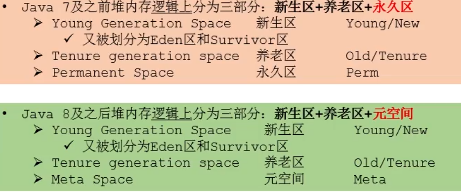
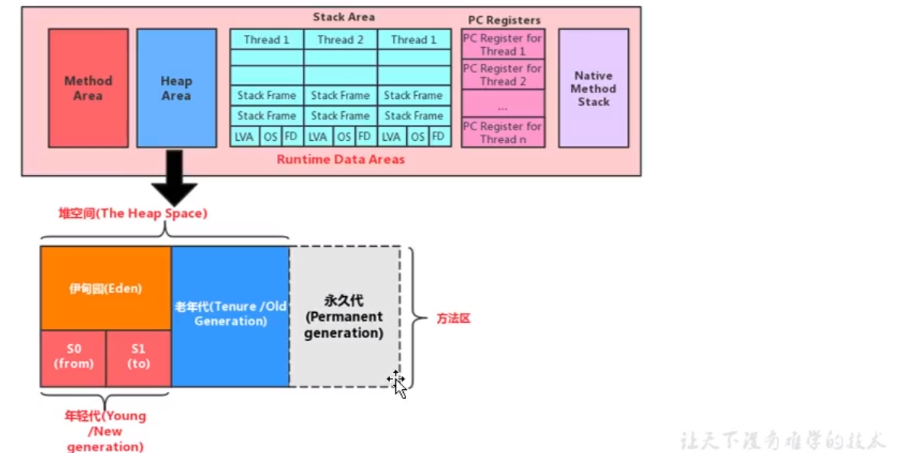
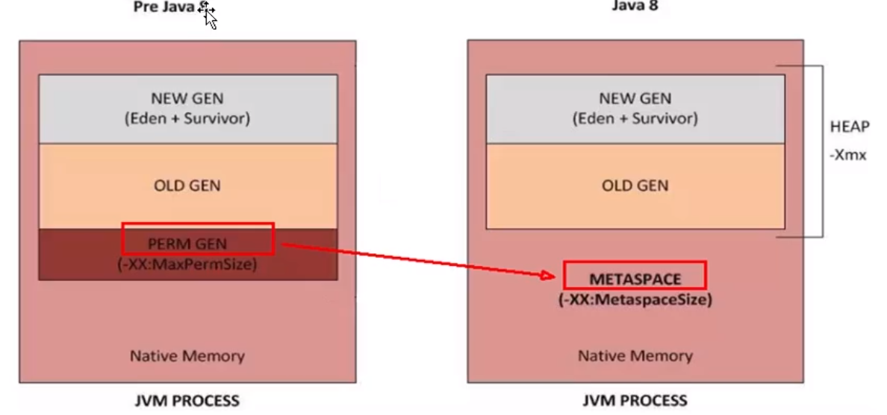
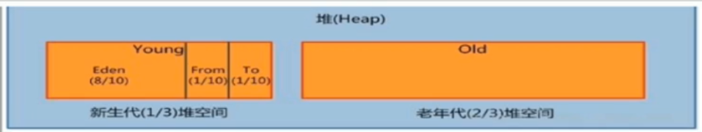
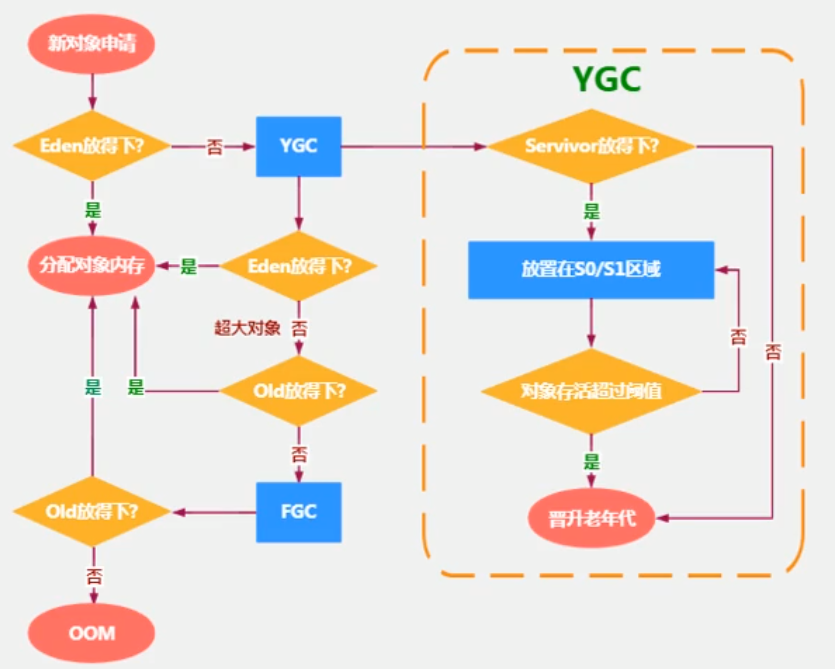

#### 一、核心概念

1、存储：存放对象实例

《Java虚拟机规范》中对Java堆的描述是：“所有的对象实例以及数组都应当在堆上分配

2、Java堆是垃圾收集器管理的内存区域

3、Java堆既可以被实现成固定大小的，也可以是可扩展的

（通过参数-Xmx和-Xms设定）

4、异常：会抛出OutOfMemoryError异常。 


#### 二、堆空间细分



##### （1）jdk7及以前



##### （2）jdk8




#### 三、堆大小设置

1、通过选项"-Xmx"和"-Xms"来进行设置。

```java
-Xms：表示堆区的起始内存，等价于-XX: InitialHeapsize“

-Xmx：表示堆区的最大内存，等价于一XX:MaxHeapsize

## 超过“-Xmx"所指定的最大内存时，将会抛出outOfMemoryError异常
```

2、通常会将-Xms和—Xmx两个参数配置相同的值，其目的是为了能够在java垃圾回收机制清理完堆区后不需要重新分隔计算堆区的大小，从而提高性能。

3、默认值

```
初始内存大小:物理电脑内存大小/ 64
最大内存大小:物理电脑内存大小/ 4
```


#### 四、堆空间参数

-XX:+PrintFlagsInitial :查看所有的参数的默认初始值

-XX:+PrintFlagsFinal :查看所有的参数的最终值（可能会存在修改,不再是初始值)

-Xms:初始堆空间内存（默认为物理内存的1/64)

-Xmx:最大堆空间内存（默认为物理内存的1/4)

-Xmn:设置新生代的大小。(初始值及最大值)

-XX:NewRatio:配置新生代与老年代在堆结构的占比

-XX:SurvivorRatio:设置新生代中Eden和s0/s1空间的比例

-XX:MaxTenuringThreshold:设置新生代垃圾的最大年龄

-XX:+PrintGCDetails:输出详细的Gc处理日志

​		打印gc简要信息:① -XX:+PrintGc 2-verbose: gc

-XX:HandlePromotionFailure:是否设置空间分配担保


#### 五、年轻代和老年代

##### 1、划分

（1）年轻代(YoungGen）：生命周期较短的瞬时对象，对象的创建和消亡都非常迅速

年轻代又可以划分为Eden空间、survivor0空间和survivor1空间（有时也叫做from区、to区）。

（2）老年代（oldGen)：对象的生命周期却非常长，在某些极端的情况下还能够与JVM的生命周期保持一致。




##### 2、配置堆结构的占比。

（1）-XX:NewRatio=2，

表示新生代占1，老年代占2，新生代占整个堆的1/3

（2）-XX:SurvivorRatio=8

表Eden空间、survivor0空间和survivor1空间比例8:1:1


##### 3、垃圾回收

新生代：Minor GC

老年代：Major GC

配置进入老年代次数：-XX:MaxTenuringThreshold=<N>进行设置。


#### 六、GC

##### 1、流程图




##### 2、分类

Gc按照回收区域分为两大种类型：一种是部分收集(Partial Gc） ，一种是整堆收集（Fu1l Gc)

（1）部分收集：不是完整收集整个ava堆的垃圾收集。其中又分为:

```
1、新生代收集(Minor Gc / Young Gc):只是新生代的垃圾收集

2、老年代收集（Major Gc / old Gc):只是老年代的垃圾收集。
	√目前，只有CMS Gc会有单独收集老年代的行为。
	√注意，很多时候Major GC会和Full GC混淆使用，需要具体分辨是老年代回收还是整堆回收。

3、混合收集（Mixed Gc):收集整个新生代以及部分老年代的垃圾收集
	√目前，只有G1 Gc会有这种行为
```

（2）整堆收集（Ful1 GC):收集整个java堆和方法区的垃圾收集。


##### 3、触发条件

（1）年轻代GC(Minor GC)触发机制:

```
1、年轻代（Eden）空间不足，触发Minor Gc；Survivor满不会引发Gc。(每次Minor Gc会清理年轻代的内存。)

2、Java对象朝生夕灭，Minor Gc非常频繁，一般回收速度也比较快。

3、Minor GC会引发STW，暂停其它用户的线程，等垃圾回收结束，用户线程才恢复运行。
```


（2）老年代GC (Major GC / Full GC）触发机制:

```
1、老年代的Gc，对象从老年代消失时，发生“Major Gc”或“Full Gc”。

2、出现了Major Gc，经常会伴随至少一次的Minor GC（但非绝对的，在Parallel scavenge收集器的收集策略里就有直接进行Major Gc的策略选择过程)
	√ 即老年代空间不足时，先尝试触发Minor GC。如果空间还不足，则触发Major Gc

3、Major GC的速度一般会比Minor Gc慢10倍以上，STW的时间更长。

4、如果Major GC后，内存还不足，就报OOM了。
```


（3）Fu1l Gc触发机制:

```
触发Full GC执行的情况有如下五种:

(1）调用system.gc()时，系统建议执行Full Gc，但是不必然执行
(2）老年代空间不足
(3）方法区空间不足
(4）通过Minor GC后进入老年代的平均大小大于老年代的可用内存
(5)由Eden区、 survivor spaceB (From Space)区向survivor space1 (ToSpace）区复制时，对象大小大于To Space可用内存，则把该对象转存到老年代，且老年代的可用内存小于该对象大小

说明: full gc是开发或调优中尽量要避免的。这样暂时时间会短一些。
```


