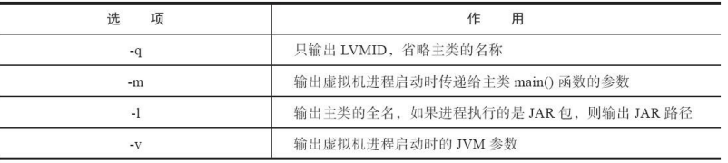

一、功能

可以列出正在运行的虚拟机进 程，并显示虚拟机执行主类（Main Class，main()函数所在的类）名称以及这些进程的本地虚拟机唯一 ID（LVMID，Local Virtual Machine Identifier）


二、jps命令格式： 

```powershell
jps [ options ] [ hostid ] 

#例子
$ jps -l 
2388 D:\Develop\glassfish\bin\..\modules\admin-cli.jar 
2764 com.sun.enterprise.glassfish.bootstrap.ASMain 
3788 sun.tools.jps.Jps
```


三、jps工具主要选项



