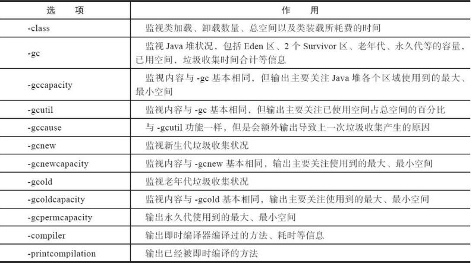

一、功能

监视虚拟机各种运行状态信息的命令行工具。

它可以显示本地或者远程[1]虚拟机进程中的类加载、内存、垃圾收集、即时编译等运行时数据


二、命令

jstat命令格式为： 

```powershell
jstat [ option vmid [interval[s|ms] [count]] ] 

$ jstat -gc 2764 250 20 // 每250 毫秒查询一次进程2764垃圾收集状况，共查询20次
Survivor0 Survivor1 Eden区 Old老年代   永久代   Young GC   Full GC  Full GC Time   GC Time
S0        S1        E      O         P       YGC  YGCT   FGC      FGCT           GCT 
0.00      0.00      6.20   41.42     47.20   16   0.105  3        0.472          0.577
```


三、jstat工具主要选项.png



