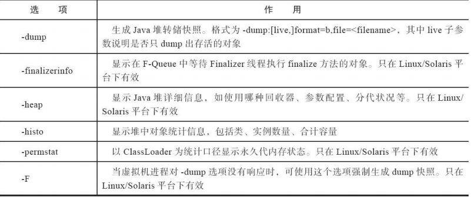

一、功能

用于生成堆转储快照（一般称为heapdump或dump文件）


二、命令

jmap命令格式为： 

```powershell
jmap [ option ] vmid

$ jmap -dump:format=b,file=eclipse.bin 3500 
Dumping heap to C:\Users\IcyFenix\eclipse.bin ... 
Heap dump file created
```


三、工具主要选项

