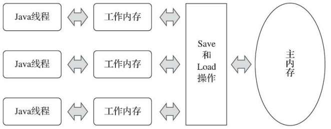

Java内存模型的主要目的是定义程序中各种变量的访问规则，即关注在虚拟机中把变量值存储到内存和从内存中取出变量值这样的底层细节。




主内存与工作内存之间具体的交互协议，即一个变量如何从主内存拷贝到工作内存、如何从工作内存同步回主内存这一类的实现细节，

Java内存模型中定义了以下8种操作来完成

```
·lock（锁定）：作用于主内存的变量，它把一个变量标识为一条线程独占的状态。 
·unlock（解锁）：作用于主内存的变量，它把一个处于锁定状态的变量释放出来，释放后的变量 才可以被其他线程锁定。
·read（读取）：作用于主内存的变量，它把一个变量的值从主内存传输到线程的工作内存中，以 便随后的load动作使用。
·load（载入）：作用于工作内存的变量，它把read操作从主内存中得到的变量值放入工作内存的 变量副本中。
·use（使用）：作用于工作内存的变量，它把工作内存中一个变量的值传递给执行引擎，每当虚 拟机遇到一个需要使用变量的值的字节码指令时将会执行这个操作。 
·assign（赋值）：作用于工作内存的变量，它把一个从执行引擎接收的值赋给工作内存的变量， 每当虚拟机遇到一个给变量赋值的字节码指令时执行这个操作。 
·store（存储）：作用于工作内存的变量，它把工作内存中一个变量的值传送到主内存中，以便随 后的write操作使用。
·write（写入）：作用于主内存的变量，它把store操作从工作内存中得到的变量的值放入主内存的 变量中。
```


规则

```
·不允许read和load、store和write操作之一单独出现，即不允许一个变量从主内存读取了但工作内存不接受，或者工作内存发起回写了但主内存不接受的情况出现。 

·不允许一个线程丢弃它最近的assign操作，即变量在工作内存中改变了之后必须把该变化同步回 主内存。

·不允许一个线程无原因地（没有发生过任何assign操作）把数据从线程的工作内存同步回主内存 中。

·一个新的变量只能在主内存中“诞生”，不允许在工作内存中直接使用一个未被初始化（load或 assign）的变量，换句话说就是对一个变量实施use、store操作之前，必须先执行assign和load操作。 

·一个变量在同一个时刻只允许一条线程对其进行lock操作，但lock操作可以被同一条线程重复执 行多次，多次执行lock后，只有执行相同次数的unlock操作，变量才会被解锁。 

·如果对一个变量执行lock操作，那将会清空工作内存中此变量的值，在执行引擎使用这个变量 前，需要重新执行load或assign操作以初始化变量的值。 

·如果一个变量事先没有被lock操作锁定，那就不允许对它执行unlock操作，也不允许去unlock一个 被其他线程锁定的变量。 

·对一个变量执行unlock操作之前，必须先把此变量同步回主内存中（执行store、write操作）。
```

