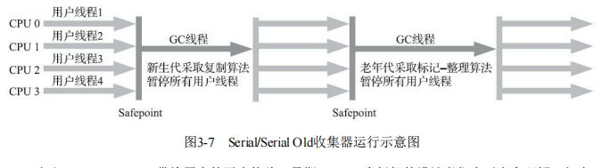
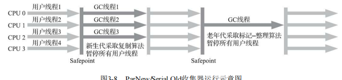
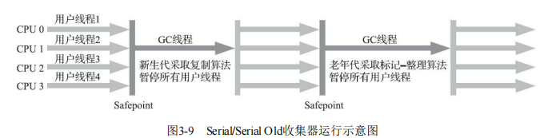
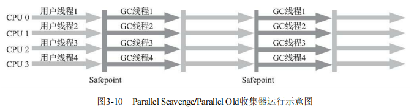
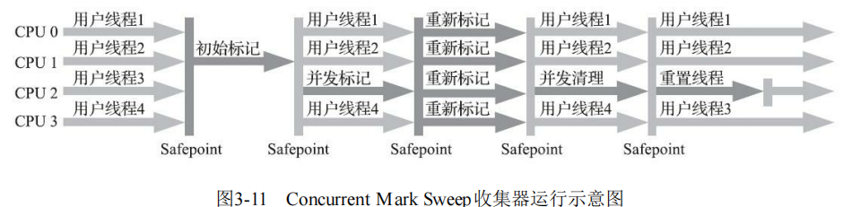
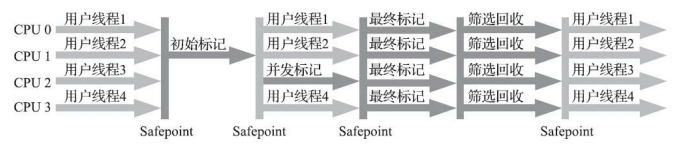
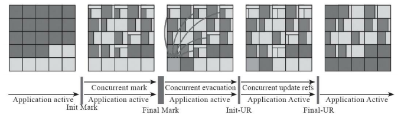
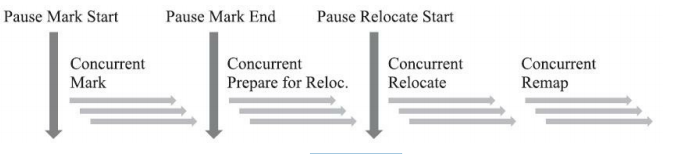

衡量垃圾收集器的三项最重要的指标是：

内存占用（Footprint）、吞吐量（Throughput）和延迟 （Latency）

#### 一、Serial收集器 

1、最基础、历史最悠久的收集器，曾经（在JDK 1.3.1之前）是HotSpot虚拟机新生代收集器的唯一选择。

2、单线程收集器，进行垃圾收集时，必须暂停其他所有工作线程，直到它收集结束

3、示意图：



#### 二、ParNew收集器

1、实质上是Serial收集器的多线程并行版本

2、默认开启的收集线程数与处理器核心数量相同

3、JDK 9开始，ParNew加CMS收集器的组合就不再是官方推荐的服务端模式下的收集器解决方案了

4、示意图：




#### 三、Parallel Scavenge收集器

1、基于标记-复制算法实现、多线程并行

2、目标则是达到一个可控制的吞吐量（Throughput）。

​				吞吐量 = 处理器用于运行用户代码的时间  / 处理器总消耗时间

3、参数：

-XX：MaxGCPauseMillis 控制最大垃圾收集停顿时间 

-XX：GCTimeRatio 设置吞吐量大小

-XX：+UseAdaptiveSizePolicy


#### 四、Serial Old收集器

1、Serial收集器的老年代版本，单线程收集器，使用标记-整理算法


#### 五、Parallel Old收集器

1、Parallel Scavenge收集器的老年代版本，支持多线程并发收集，基于标记-整理算法实现。




#### 六、CMS收集器

1、以获取最短回收停顿时间为目标的收集器，基于于“标记-清除”算法实现（JDK 5中）

2、回收过程

```
1）初始标记（CMS initial mark） 

2）并发标记（CMS concurrent mark） （耗时长，不需要停顿）

3）重新标记（CMS remark） （停顿时间小于并发标记）

4）并发清除（CMS concurrent sweep） 
```



3、缺点

对处理器资源非常敏感（占用一部分线程，cpu核心数少有影响）

无法处理“浮动垃圾”（Floating Garbage）

有大量空间碎片产生

4、解决并发扫描时的对象消失问题

采用算法：增量更新（Incremental Update）


#### 七、Garbage First收集器

与cms一样注重停顿时间，比cms消耗更多的运算资源

1、始于jdk7，完善于JDK 8 Update 40，是面向服务端应用的垃圾收集器

JDK 9发布之日，G1宣告取代Parallel Scavenge加Parallel Old组合，成为服务端模式下的默认垃圾收集器

2、特点：

G1没有固定大小数量的分代区域划分，而是把连续的Java堆划分为多个大小相等的独立区域（Region），

每一个Region都可以根据需要，扮演新生代的Eden空间、Survivor空间，或者老年代空间。收集器能够对扮演不同角色的 Region采用不同的策略去处理

3、解决并发扫描时的对象消失问题

采用算法：原始快照（Snapshot At The Beginning， SATB）。

4、默认的回收策略是

优先处理回收价值最大的 Region

5、回收过程

```
·初始标记（Initial Marking）：仅仅只是标记一下GC Roots能直接关联到的对象，并且修改TAMS 指针的值，让下一阶段用户线程并发运行时，能正确地在可用的Region中分配新对象。这个阶段需要 停顿线程，但耗时很短，而且是借用进行Minor GC的时候同步完成的，所以G1收集器在这个阶段实际 并没有额外的停顿。

·并发标记（Concurrent Marking）：从GC Root开始对堆中对象进行可达性分析，递归扫描整个堆 里的对象图，找出要回收的对象，这阶段耗时较长，但可与用户程序并发执行。当对象图扫描完成以 后，还要重新处理SATB记录下的在并发时有引用变动的对象。 

·最终标记（Final Marking）：对用户线程做另一个短暂的暂停，用于处理并发阶段结束后仍遗留 下来的最后那少量的SATB记录。 

·筛选回收（Live Data Counting and Evacuation）：负责更新Region的统计数据，对各个Region的回 收价值和成本进行排序，根据用户所期望的停顿时间来制定回收计划，可以自由选择任意多个Region 构成回收集，然后把决定回收的那一部分Region的存活对象复制到空的Region中，再清理掉整个旧 Region的全部空间。这里的操作涉及存活对象的移动，是必须暂停用户线程，由多条收集器线程并行 完成的
```




低延迟垃圾收集器

#### 八、Shenandoah收集器 

Shenandoah是一款只有 OpenJDK才会包含，OracleJDK里反而不存在的收集器

默认的回收策略是优先处理回收价值最大的 Region



* 在回收阶段进行并发收集：

1）收集器线程复制了新的对象副本； 

2）用户线程更新对象的某个字段； 

3）收集器线程更新转发指针的引用值为新副本地址。

* 并发操作带来线程安全性问题：

Shenandoah收集器是通过比较并交换（Compare And Swap，CAS）操作[8]来保证并发时对象的访问正确性的

#### 九、ZGC收集器

由Oracle公司研发

基于Region的堆内存布局，分成大中小可变大小region

采用的染色指针技术



#### 

