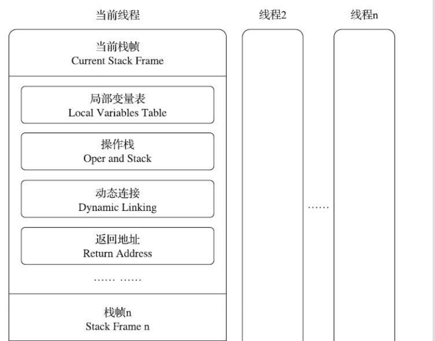
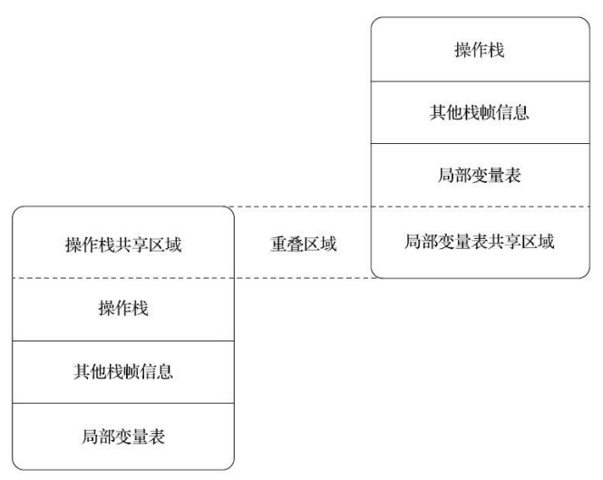

“栈帧”（Stack Frame）则是用于支持虚拟机进行方法 调用和方法执行背后的数据结构，它也是虚拟机运行时数据区中的虚拟机栈（Virtual Machine Stack）的栈元素。

**栈帧结构：**

局部变量表、操作数栈、动态连接、方法返回地址、一些额外的附加信息

一、局部变量表（Local Variables Table）

是一组变量值的存储空间，用于存放方法参数和方法内部定义的局部变量。

局部变量表的容量以变量槽（Variable Slot）为最小单位

一个变量槽可以存放一个 32位以内的数据类型，变量槽都应该能存放一个boolean、byte、char、short、int、float、reference或returnAddress类型的数据

（long和double是64位，分割存储2个曹， 原子性操作）

二、操作数栈（Operand Stack）

后入先出（Last In First Out，LIFO）栈

一个方法刚刚开始执行的时候，这个方法的操作数栈是空的，在方法的执行过程中，会有各种字节码指令往操作数栈中写入和提取内容，也就是出栈和入栈操作。

两个栈帧之间的数据共享：

三、动态连接（Dynamic Linking）

每个栈帧都包含一个指向运行时常量池中该栈帧所属方法的引用，持有这个引用是为了支持方法调用过程中的动态连接（Dynamic Linking）

四、方法返回地址 

方法执行后，只有两种方式退出：

第一种方式是执行引擎遇到任意一个方法 返回的字节码指令，这时候可能会有返回值传递给上层的方法调用者

另一种退出方式是在方法执行的过程中遇到了异常，并且这个异常没有在方法体内得到妥善处理