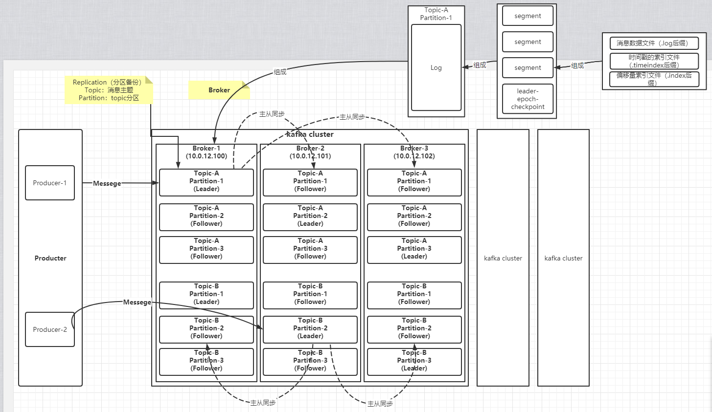

文件存储机制

kafka中主题（Topic）是一个逻辑上的概念，分区（partition）是物理上的存在的。

每个partition对应一个log文件，该log文件中存储的就是Producer生产的数据。

Producer生产的数据会被不断追加到该log文件末端。

为防止log文件过大导致数据定位效率低下，kafka采用了分片和索引机制，将每个partition分为多个segment，每个segment包括.index文件、.log文件和.timeindex等文件

这些文件位于文件夹下，该文件命名规则为：topic名称+分区号。

