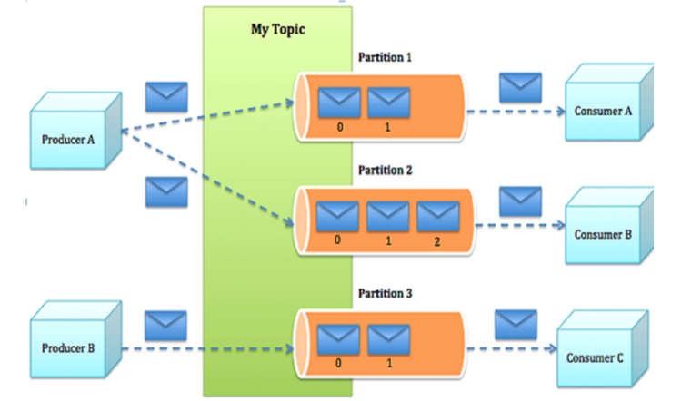
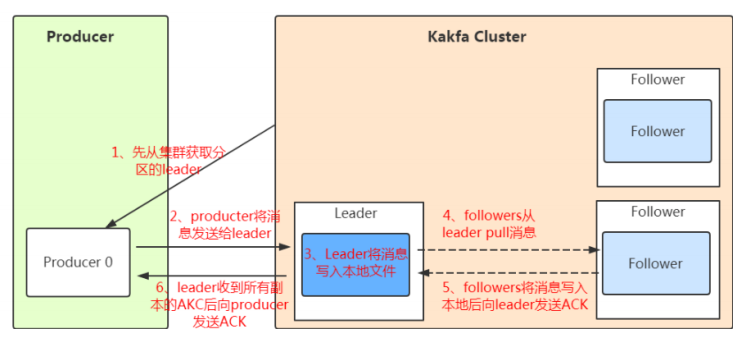

工作流程分析

#### 一、发送数据：

​		生产者发送消息找leader，不能发送给follower

​				1、先从集群获取leader（其实是从zookeeper元数据中去获取）

​				2、生产者将消息发送给leader分区

​				3、leader分区将消息写入本地文件

​				4、follower分区从leader分区 pull消息

​				5、follower分区将消息写入本地并且ack发送给leader分区

​				6、leader分区根据配置来决定什么时候向producer发送写入ack

Producer在写入数据的时候**永远的找****leader**，不会直接将数据写入follower！

follower是主动的去leader进行同步的！

producer采用push模式将数据发布到broker，每条消息追加到分区中，顺序写入磁盘，保证**同一分区**内的数据

是有序的！

producer如何该将数据发往哪个partition呢？

kafka中有几个原则：

1、 在写入的时候可以指定需要写入的partition，如果有**指定**，则写入对应的partition。 

2、 如果没有指定partition，但是设置了数据的key，则会**根据key的值hash**出一个partition。 

3、 如果既没指定partition，又没有设置key，则会**轮询**选出一个partition。

保证消息不丢失？

通过ACK应答机制！在生产者向队列

写入数据的时候可以设置参数来确定是否确认kafka接收到数据，这个参数可设置的值为**0**、**1**、**all（-1）**。

分区和副本的数量根据默认配置都是1，server.properties文件设置

#### 二、保存数据：

Partition在服务器上的表现形式就是一个一个的文件夹，每个partition的文件夹下面会有多组segment文件，

每组segment文件又包含.index文件、.log文件、.timeindex文件

​	保存三个文件：

​			index(配合topic等信息路由到具体的消息),

​			log（存储消息）,

​			timeindex（备份还原）
​			
​	存储策略：

​			基于时间：默认是保存7天 ----》----log.retention.hours=168

​			基于大小：默认是1G   》----》log.segment.bytes=1073741824
​	

#### 三、消费数据：

​	1、一般建议消费者数量和分区数据保持一致（可以达到最高吞吐）		
​			
​	2、消费的原理：segment（topic+分区） + index（offset）+二分查找+顺序查找
​			
0000000000000.log
​			
0000000000009.log
​			
0000000000018.log	