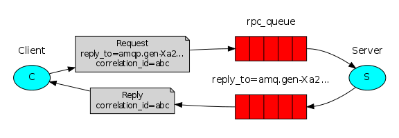

远程过程调用（RPC）

```java
// 新建客户端，call发送RPC请求并阻塞，直到收到答案为止
FibonacciRpcClient fibonacciRpc = new FibonacciRpcClient();
String result = fibonacciRpc.call("4");
System.out.println( "fib(4) is " + result);
```

RPC的说明

```
滥用RPC可能会导致无法维护的意大利面条代码，而不是简化软件。

牢记这一点，请考虑以下建议：

确保明显的是哪个函数调用是本地的，哪个是远程的。
记录您的系统。明确组件之间的依赖关系。
处理错误案例。RPC服务器长时间关闭后，客户端应如何反应？
如有疑问，请避免使用RPC。如果可以的话，应该使用异步管道-代替类似RPC的阻塞
```

Callback queue

```java
callbackQueueName = channel.queueDeclare().getQueue();
BasicProperties props = new BasicProperties
                            .Builder()
                            .replyTo(callbackQueueName)
                            .build();
channel.basicPublish("", "rpc_queue", props, message.getBytes());
// ... then code to read a response message from the callback_queue ...
```

Message properties

```
AMQP 0-9-1协议预定义了消息附带的14个属性集。除以下内容外，大多数属性很少使用：

- deliveryMode：将消息标记为持久性（值为2）或瞬态（任何其他值）。
- contentType：用于描述编码的mime类型。例如，对于经常使用的JSON编码，将此属性设置为application / json是一个好习惯。
- replyTo：通常用于命名回调队列。
- relatedId：用于将RPC响应与请求相关联。
```




```java
// 如何工作
*对于RPC请求，客户端发送一条消息，该消息具有两个属性： replyTo（设置为仅为该请求创建的匿名互斥队列）和correlationId（设置为每个请求的唯一值）。

*该请求被发送到rpc_queue队列。

*RPC工作程序（又名：服务器）正在等待该队列上的请求。出现请求时，它会使用replyTo字段中的队列来完成工作并将带有结果的消息发送回客户端。

*客户端等待答复队列中的数据。出现消息时，它会检查correlationId属性。如果它与请求中的值匹配，则将响应返回给应用程序。
```


优点：

1、如果RPC服务器太慢，则可以通过运行另一台RPC服务器来进行扩展。尝试在新控制台中运行第二个RPCServer。
2、在客户端，RPC只需要发送和接收一条消息。不需要诸如queueDeclare之 类的同步调用。结果，RPC客户端只需要一个网络往返就可以处理单个RPC请求。