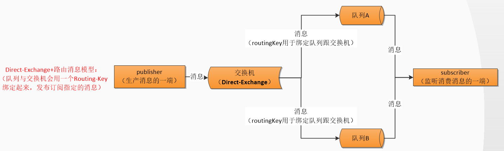

MQ是为什么而使用

高效性体现在哪

有哪几类


RabbitMQ 是实现 AMQP，即 Advanced Message Queuing Protocol，高级消息队列协议，是应用层协议的一个开放标准，为面向消息的中间件设计

AMQP 的主要特征是面向消息、队列、路由（包括点对点和发布/订阅）、可靠性、安全。

```powershell
基本概念：
Broker： 简单来说就是消息队列服务器实体
Exchange： 消息交换机，它指定消息按什么规则，路由到哪个队列
Queue： 消息队列载体，每个消息都会被投入到一个或多个队列
Binding： 绑定，它的作用就是把exchange和queue按照路由规则绑定起来
Routing Key： 路由关键字，exchange根据这个关键字进行消息投递
VHost： vhost 可以理解为虚拟 broker ，即 mini-RabbitMQ server。其内部均含有独立的 queue、exchange 和 binding 等，但最最重要的是，其拥有独立的权限系统，可以做到 vhost 范围的用户控制。当然，从 RabbitMQ 的全局角度，vhost 可以作为不同权限隔离的手段（一个典型的例子就是不同的应用可以跑在不同的 vhost 中）。
Producer： 消息生产者，就是投递消息的程序
Consumer： 消息消费者，就是接受消息的程序
Channel： 消息通道，在客户端的每个连接里，可建立多个channel，每个channel代表一个会话任务
```

2、使用场景

（1）服务间异步通信

（2）顺序消费

（3）定时任务

（4）请求削峰


队列服务有发消息者、队列、收消息者，但rabbit mq又抽象出交换机概念，在发消息者和 队列之间, 加入了交换器 (Exchange). 这样发消息者和队列就没有直接联系, 转而变成发消息者把消息给交换器, 交换器根据调度策略再把消息再给队列。

```
生产者：发送消息的程序
消费者：监听接收消费消息的程序
消息：一串二进制数据流
队列：消息的暂存区/存储区
交换机：消息的中转站，用于接收分发消息。其中有 fanout、direct、topic、headers 四种
路由：相当于密钥/第三者，与交换机绑定即可路由消息到指定的队列！
```

*概念有 4 个，分别为：虚拟主机，交换机，队列，和绑定*

```
虚拟主机：一个虚拟主机持有一组交换机、队列和绑定。为什么需要多个虚拟主机呢？很简单， RabbitMQ 当中，用户只能在虚拟主机的粒度进行权限控制。 因此，如果需要禁止A组访问B组的交换机/队列/绑定，必须为A和B分别创建一个虚拟主机。每一个 RabbitMQ 服务器都有一个默认的虚拟主机“/”。

交换机：Exchange 用于转发消息，但是它不会做存储 ，如果没有 Queue bind 到 Exchange 的话，它会直接丢弃掉 Producer 发送过来的消息。

路由键：消息到交换机的时候，交互机会转发到对应的队列中，那么究竟转发到哪个队列，就要根据该路由键。

绑定：也就是交换机需要和队列相绑定，这其中如上图所示，是多对多的关系。
```





