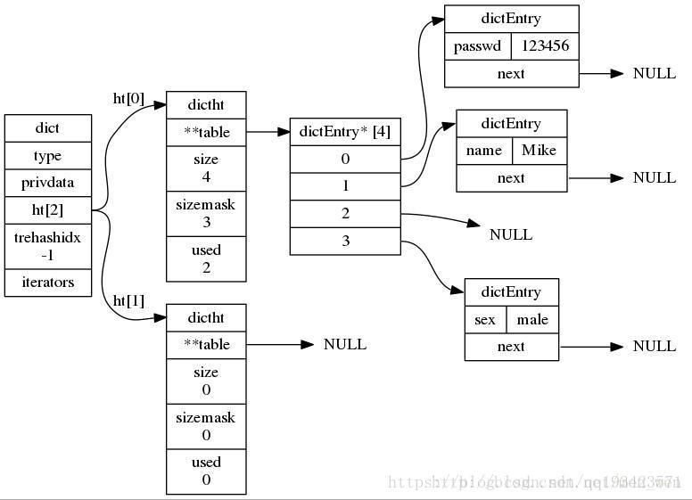

#### 1、哈希表
​	哈希表（Hash table）的初衷是为了将数据映射到数组中的某个位置，这样就能够通过数组下标访问该数据，提高数据的查找速度，又称为散列表
​	查找的平均期望时间复杂度是O(1)的。

结构：

```
typedef struct dictht {
    dictEntry **table;             // 哈希表数组
    unsigned long size;            // 哈希表数组的大小
    unsigned long sizemask;        // 用于映射位置的掩码，值永远等于(size-1)
    unsigned long used;            // 哈希表已有节点的数量
} dictht;
```

**字典**

```
 字典又称为符号表（symbol table）、关联数组（associative array）或映射（map），是一种用于保存键值对（key-value pair）的抽象数据结构。
​ Redis的数据库就是使用字典作为底层实现的，通过key和value的键值对形式，代表了数据库中全部数据。而且，所有对数据库的增、删、查、改的命令，都是建立在对字典的操作上。
```

**编码方式**

```java
// Redis目前使用的编码方式
/* Objects encoding. Some kind of objects like Strings and Hashes can be
 * internally represented in multiple ways. The 'encoding' field of the object
 * is set to one of this fields for this object. 
 */
#define OBJ_ENCODING_RAW      /* Raw representation */ 简单动态字符串
#define OBJ_ENCODING_INT      /* Encoded as integer */ 整数
#define OBJ_ENCODING_HT       /* Encoded as hash table */ 字典
#define OBJ_ENCODING_ZIPLIST  /* Encoded as ziplist */ 压缩列表
#define OBJ_ENCODING_INTSET   /* Encoded as intset */ 整数集合
#define OBJ_ENCODING_SKIPLIST /* Encoded as skiplist */ 跳跃表
#define OBJ_ENCODING_EMBSTR   /* Embedded sds string encoding */ embstr编码的简单动态字符串
#define OBJ_ENCODING_QUICKLIST  /* Encoded as linked list of ziplists */
```


**四种结构体**

```json
/Redis定义了dictEntry(哈希表结点)，dictType(字典类型函数)，dictht(哈希表)和dict(字典)四个结构体来实现字典结构，下面来分别介绍这四个结构体。/
/
/ dictEntry(哈希表结点)
// 哈希表的table指向的数组存放这dictEntry类型的地址。定义在dict.h/dictEntryt中
typedef struct dictEntry {// 字典的节点
    void *key;
    union {// 使用的联合体
        void *val;
        uint64_t u64;// 这两个参数很有用
        int64_t s64;
    } v;
    struct dictEntry *next;// 指向下一个hash节点，用来解决hash键冲突（collision）
} dictEntry;

/ dictType(字典类型函数)
// dictType类型保存着 操作字典不同类型key和value的方法 的指针
typedef struct dictType {
    unsigned int (*hashFunction)(const void *key);      //计算hash值的函数
    void *(*keyDup)(void *privdata, const void *key);   //复制key的函数
    void *(*valDup)(void *privdata, const void *obj);   //复制value的函数
    int (*keyCompare)(void *privdata, const void *key1, const void *key2);  //比较key的函数
    void (*keyDestructor)(void *privdata, void *key);   //销毁key的析构函数
    void (*valDestructor)(void *privdata, void *obj);   //销毁val的析构函数
} dictType;

/ dictht(哈希表)
//redis中哈希表定义dict.h/dictht
typedef struct dictht { // 哈希表
    dictEntry **table;      // 存放一个数组的地址，数组存放着哈希表节点dictEntry的地址。
    unsigned long size;     // 哈希表table的大小，初始化大小为4
    unsigned long sizemask; // 用于将哈希值映射到table的位置索引。它的值总是等于(size-1)。
    unsigned long used;     // 记录哈希表已有的节点（键值对）数量。
} dictht;

/ dict(字典)
// 字典结构定义在dict.h/dict
typedef struct dict {
    dictType *type;     //指向dictType结构，dictType结构中包含自定义的函数，这些函数使得key和value能够存储任何类型的数据。
    void *privdata;     //私有数据，保存着dictType结构中函数的参数。
    dictht ht[2];       //两张哈希表。
    long rehashidx;     //rehash的标记，rehashidx==-1，表示没在进行rehash
    int iterators;      //正在迭代的迭代器数量
} dict;
```



**Redis 对象头结构体**

```java
redis每个对象都有对象头结构体
## 数据结构：
typedef struct redisObject {
    unsigned type:4;            // 对象的类型，包括 /* Object types */
    unsigned encoding:4;        // 底部为了节省空间，一种type的数据，可以采用不同的存储方式
    unsigned lru:REDIS_LRU_BITS; /* lru time (relative to server.lruclock) */
    int refcount;         		// 引用计数
    void *ptr;					// 8bytes，64-bit system 
} robj;

​ 不同的对象具有不同的类型 type(4bit)，同一个类型的 type 会有不同的存储形式 encoding(4bit)。

​ 为了记录对象的 LRU 信息，使用了 24 个 bit 的 lru 来记录 LRU 信息。

​ 每个对象都有个引用计数 refcount，当引用计数为零时，对象就会被销毁，内存被回收。ptr 指针将指向对象内容 (body) 的具体存储位置。

​ 一个 RedisObject 对象头共需要占据 16 字节的存储空间。
```


**Redis的三种哈希算法**

```java
// Thomas Wang’s 32 bit Mix函数，对一个整数进行哈希，该方法在dictIntHashFunction中实现
// 用于计算int整型哈希值的哈希函数
unsigned int dictIntHashFunction(unsigned int key)      
{
    key += ~(key << 15);
    key ^=  (key >> 10);
    key +=  (key << 3);
    key ^=  (key >> 6);
    key += ~(key << 11);
    key ^=  (key >> 16);
    return key;
}

// MurmurHash2哈希算法，该方法在dictGenHashFunction中实现
// 用于计算字符串的哈希值的哈希函数
unsigned int dictGenHashFunction(const void *key, int len) {  
    /* 'm' and 'r' are mixing constants generated offline.
     They're not really 'magic', they just happen to work well.  */
    // m和r这两个值用于计算哈希值，只是因为效果好。
    uint32_t seed = dict_hash_function_seed;
    const uint32_t m = 0x5bd1e995;
    const int r = 24;

    /* Initialize the hash to a 'random' value */
    uint32_t h = seed ^ len;    //初始化

    /* Mix 4 bytes at a time into the hash */
    const unsigned char *data = (const unsigned char *)key;

    //将字符串key每四个一组看成uint32_t类型，进行运算的到h
    while(len >= 4) {
        uint32_t k = *(uint32_t*)data;

        k *= m;
        k ^= k >> r;
        k *= m;

        h *= m;
        h ^= k;

        data += 4;
        len -= 4;
    }

    /* Handle the last few bytes of the input array  */
    switch(len) {
    case 3: h ^= data[2] << 16;
    case 2: h ^= data[1] << 8;
    case 1: h ^= data[0]; h *= m;
    };

    /* Do a few final mixes of the hash to ensure the last few
     * bytes are well-incorporated. */
    h ^= h >> 13;
    h *= m;
    h ^= h >> 15;
    
    return (unsigned int)h;
}
// 基于djb哈希的一种简单的哈希算法，该方法在dictGenCaseHashFunction中实现。
// 用于计算字符串的哈希值的哈希函数
unsigned int dictGenCaseHashFunction(const unsigned char *buf, int len) {   
    unsigned int hash = (unsigned int)dict_hash_function_seed;
    while (len--)
        hash = ((hash << 5) + hash) + (tolower(*buf++)); /* hash * 33 + c */
    return hash;
}
```

**skiplist与平衡树、哈希表的比较**

```shell
## 有序
【skiplist和各种平衡树】（如AVL、红黑树等）的元素是有序排列的，而哈希表不是有序的。
【哈希表】只能做单key查找，不适宜做范围查找。所谓范围查找，指的是查找那些大小在指定的两个值之间的所有节点。

## 范围查找
【平衡树】，指定范围的小值之后，以中序遍历的顺序继续寻找其它不超过大值的节点。如果进行了改造，中序遍历并不容易实现。
【skiplist】只需找到小值后，对第1层链表进行若干步的遍历就即可。

## 插入和删除
【平衡树】的插入和删除操作可能引发子树的调整，逻辑复杂
【skiplist】的插入和删除只需要修改相邻节点的指针，操作简单又快速。

## 内存占用
skiplist比平衡树更灵活。
【平衡树】每个节点包含2个指针（分别指向左右子树）
【skiplist】每个节点包含的指针数目平均为1/(1-p)，具体取决于参数p的大小。如果像Redis里的实现一样，取p=1/4，那么平均每个节点包含1.33个指针，比平衡树更有优势。

## 查找单个key
【skiplist和平衡树】的时间复杂度都为O(log n)，大体相当
【哈希表】在保持较低的哈希值冲突概率的前提下，查找时间复杂度接近O(1)，性能更高一些。

​ 所以我们平常使用的各种Map或dictionary结构，大都是基于哈希表实现的。
从算法实现难度上来比较，skiplist比平衡树要简单得多。
```

