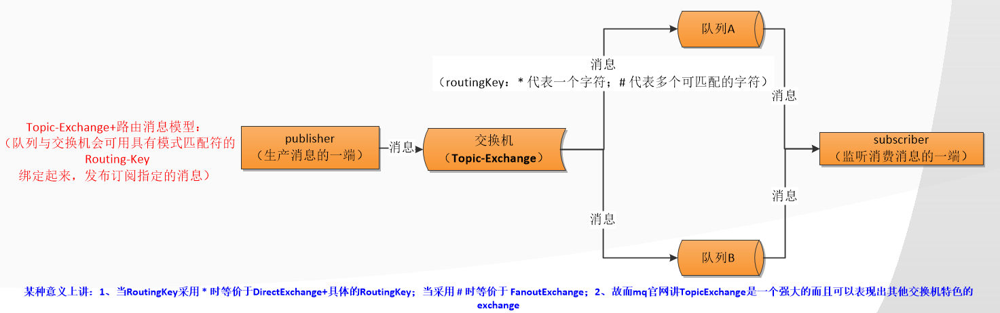

MQ是为什么而使用

高效性体现在哪

有哪几类


RabbitMQ 是实现 AMQP，即 Advanced Message Queuing Protocol，高级消息队列协议，是应用层协议的一个开放标准，为面向消息的中间件设计

AMQP 的主要特征是面向消息、队列、路由（包括点对点和发布/订阅）、可靠性、安全。


队列服务有发消息者、队列、收消息者，但rabbit mq又抽象出交换机概念，在发消息者和 队列之间, 加入了交换器 (Exchange). 这样发消息者和队列就没有直接联系, 转而变成发消息者把消息给交换器, 交换器根据调度策略再把消息再给队列。

```
生产者：发送消息的程序
消费者：监听接收消费消息的程序
消息：一串二进制数据流
队列：消息的暂存区/存储区
交换机：消息的中转站，用于接收分发消息。其中有 fanout、direct、topic、headers 四种
路由：相当于密钥/第三者，与交换机绑定即可路由消息到指定的队列！
```

*概念有 4 个，分别为：虚拟主机，交换机，队列，和绑定*

```
虚拟主机：一个虚拟主机持有一组交换机、队列和绑定。为什么需要多个虚拟主机呢？很简单， RabbitMQ 当中，用户只能在虚拟主机的粒度进行权限控制。 因此，如果需要禁止A组访问B组的交换机/队列/绑定，必须为A和B分别创建一个虚拟主机。每一个 RabbitMQ 服务器都有一个默认的虚拟主机“/”。

交换机：Exchange 用于转发消息，但是它不会做存储 ，如果没有 Queue bind 到 Exchange 的话，它会直接丢弃掉 Producer 发送过来的消息。

路由键：消息到交换机的时候，交互机会转发到对应的队列中，那么究竟转发到哪个队列，就要根据该路由键。

绑定：也就是交换机需要和队列相绑定，这其中如上图所示，是多对多的关系。
```


**交换机的功能**

主要是接收消息并且转发到绑定的队列，交换机不存储消息，在启用ack模式后，交换机找不到队列会返回错误


**交换机有四种类型：**

```shell
Direct, topic, Headers and Fanout

## Direct：direct 类型的行为是"先匹配, 再投送". 即在绑定时设定一个 routing_key, 消息的routing_key 匹配时, 才会被交换器投送到绑定的队列中去.
Direct Exchange 是 RabbitMQ 默认的交换机模式，也是最简单的模式，根据key全文匹配去寻找队列

## Topic：按规则转发消息（最灵活）
主要是根据通配符。路由键必须是一串字符，用句号（.） 隔开，比如说 agreements.us，路由模式必须包含一个 星号（*），主要用于匹配路由键指定位置的一个单词

## Headers：设置 header attribute 参数类型的交换机
根据规则匹配, 相较于 direct 和 topic 固定地使用 routing_key , headers 则是一个自定义匹配规则的类型.
在队列与交换器绑定时, 会设定一组键值对规则, 消息中也包括一组键值对( headers 属性), 当这些键值对有一对, 或全部匹配时, 消息被投送到对应队列.

## Fanout：转发消息到所有绑定队列
消息广播的模式，不管路由键或者是路由模式，会把消息发给绑定给它的全部队列，如果配置了 routing_key 会被忽略。
```





